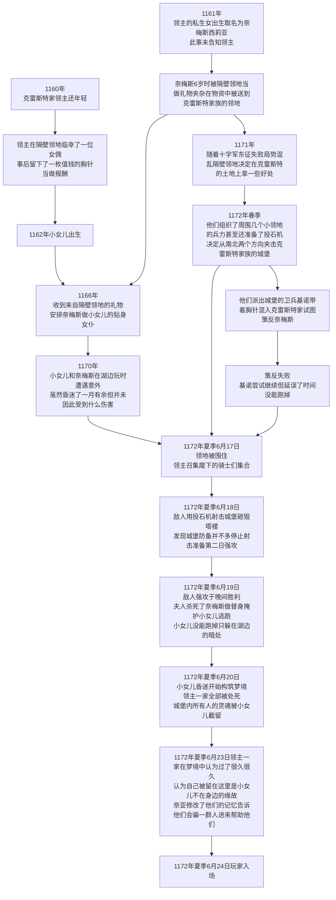
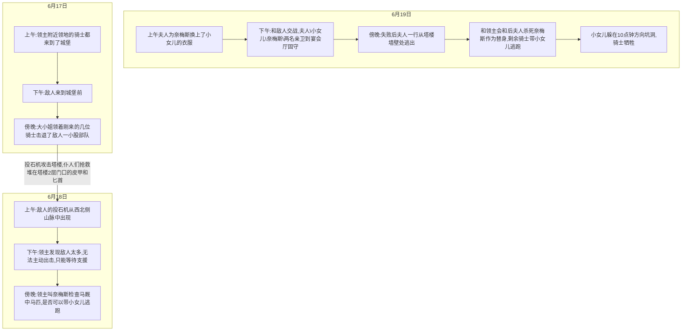

# Ullswater

> 前言：最初的灵感来自于失落的黑莱尔视频中，新旧酒店同时出现的一幕。这给作为多年wow玩家，又刚刚决定AFK的我很大触动。我开始想要基于wow经典的内外场结构写一个模组，并强调团队间的配合。刚接触coc不久的我可能还没有融入coc特有的绝望、背叛、冷漠的氛围，我希望在剧本中找一种遵循良知的感觉。抱歉题外话说的太多了……
>
> 故事大概发生于1172年的英国北部，那时王权与神权正在交锋的结尾。平民们虽然无知但也不傻，贵族们更是在时代的末路中谈不上谁是善意谁是恶意。没有任何一个人是纯粹的愚蠢、邪恶、善良、聪慧的。希望kp尽可能抱着每个N玩家们都是有血有肉的活人这个观点去扮演每一个人，不要有脸谱化的好人或者坏人。
>
> （虽然我个人能力问题导致可能还是有很多NPC塑造不丰满，个别NPC还是存在脸谱化，但还请各位kp尽可能的表演填充，感谢！）

---


## 开团信息

```
【模组名】:ullswater
【kp】：斯塔尼亚（450609203）
【平台】：QQ。
【规则】：COC 7版。
【人数】：4人。
【时代】：1172年英国北部
【购点以及上限】：R5，或480购点不含幸运，属性上限职业70/兴趣50，如购点基础属性上限80，下限30。
【身份限制】需要3名扈从与1名骑士。骑士信誉高于50正面职业，扈从信誉低于30任意职业。
【物品限制】任何人不得携带装甲、武器。骑士进本后配发中型佩剑·锁子甲
【特殊规则】：1到5大成功，96到100大失败。无燃运，有孤注一掷。
【时间】：晚10点-12点开。文字团大约5-7天。
【ps】：推理为主
【背景】：1172年，英国。你们是一群生活在小镇里的人，一名普通的骑士统治着你们，日子还算过得去。但随着东征的失败，战火波及到你们的家园，你们几乎是提着裤子跑了出来。但手头没有钱、更没有食物，你们在荒原上游荡了许久，上一次还能吃到正常的食物是10天前，上一次还能找到干净的泥巴吃进肚子是5天前。但现在，你们实在坚持不下去了，不过还好，隔壁一位领主突然派人找到了你们，说有一件事要交给你们。为此，他会给你们一点足够填饱肚子的东西，并许诺事成之后给你们一笔足够在他乡活下去的钱。
要求玩家一天内到克雷斯特家族的城堡报道，否则算为任务失败。
```

## 剧情梗概

1172年的英国，北部湖ullswater边，屹立着一座城堡。

  城堡原本的主人是一家四口，包括领主、领主夫人、姐姐、妹妹（外带加起来30个左右的卫兵和仆人、7-8个领主家内骑士），生活在这里。

相邻的领地为了讨好本地的侯爵，赠送了很多金银珠宝、食物、仆人。其中包括一位小女仆：她是领主早年间在外风流的结果，夫人靠着自己的路子得知了这件事，一直对这位小女仆的存在心怀不满，但她又担心她的存在会影响到自己的家庭，因此故意瞒着自己的丈夫不让他得知真相。

小女仆因为与这家的小女儿年龄相仿，便成了要好的玩伴，从小一起长大的她们宛如亲姐妹一般和睦。这种关系直到她们一起在湖边经历了一场神秘事件（时间原因、经过未知）后也没有改变。她们在湖边被人发现，昏迷近一月才苏醒，令人欣慰的是两人都没在这次事件中身亡，相反还都获得了一些能力。小女儿的意志力和体质大幅增长，女仆的智力和外貌则有显著提高。当然这些增长都不是一蹴而就的。

又过了几年，随着局势混乱，隔壁的领地得到了一笔资助，对方要求他们攻陷领主的领地以实现自己的政治需求。他们组织了庞大的联军杀向城堡，力求杀死城堡内的所有人，措手不及的领主带领卫兵和仆从英勇奋战，但最终寡不敌众，一家人磕磕绊绊地逃到了湖边，已是无路可退。

一家人在危难关头，亲情反而战胜了人性。虽然名声在外的大女儿无论如何都无法逃走了，但女主人为了保护自己的小女儿毅然决定将小女仆当做替身杀死，以图让自己的小女儿逃出生天。她掐死了小女仆，并将她抱在怀中，装作安慰吓坏了的小女儿的样子。指示亲卫将小女儿带离。最终小女儿没能逃得太远，只得藏在岸边的一处小洞里，在恐惧与不甘中一日一日的虚弱下去。

很显然，这一家人没能逃过被杀死的厄运，被尽数杀死，匪徒没有怀疑那被抱在女主人怀中的女孩是不是小女儿温莱尔，便没再检查。

只可惜，温莱尔最终也没能找到机会逃走，她在那小洞中失去意识，其强大的精神力作为主导，诱使城堡内所有被杀死的人包括自己的家人在内共同构筑了两个巨大的梦境。一个梦境复现了他们还和平生存的时候，一个梦境则不断地在战争发生的当日循环往复。

一家人被杀死后，他们发掘自己来到了一个间于现实和冥界之间的世界，这里没有匪徒，但也没有其它人。让他们感到不安的是，他们发现被自己杀死的小女仆的灵魂跟着他们一起到了这个世界，还真的把自己当成了温莱尔，并忘记了追杀最后时刻发生的事情。领主一家都对这个“小女儿”又怕又恨，却无法泯灭她的灵魂，只能把她关在漆黑的塔楼里，不知道真相的小女仆奈梅斯感觉非常委屈。

与此同时，他们对小女仆无可奈何，只得将其关在塔楼中，唯有大女儿温蒂尔会去送饭并看望她。

领主一家人坚信自己被困在这里是因为温莱尔没和他们在一起，只要把温莱尔找回来就可以前往天堂。同时也也为了摆脱奈梅斯灵魂的纠缠，他们开始祈祷能否得到帮助，这种委托影响到了外界，让商人以为那是真实的委托。而在寻求救赎的期间，三人又产生了巨大的分期：

- 领主本着一不做二不休的态度，既然他们已经利用了这个女孩一次，就未尝不可利用第二次，只要能把自己的女儿找回来，什么都是可以做的。
- 夫人认为自己做的事情有愧，既然死都死了，也希望加倍的偿还对奈梅斯的亏欠。但与此同时，她认为自己的女儿没有来到这里也意味着她可能还活着，她并不希望自己的丈夫计划成功，但又不敢直接反对他，更不愿意再去伤害被哄骗来的人，只能不断地试图赶走、拖延他们的调查。
- 温蒂尔既同情奈梅斯的遭遇，又渴望着升入天堂。她决定脱离自己的父母单独寻找出路，她既会在女仆的问题上显得善意、忍让。又会在能解决问题的关键点上显得激进、强势。

但事实上，外面的温莱尔耗费如此心力构筑一个梦境，只是想让自己的家人反省，让奈梅斯得救，仅此而已。

> 注意，温莱尔在现实中其实只维持了4-5天的梦境，但梦境内时间流速非常快，在领主他们眼中，已经一百多年了。

## 前置时间线：

图描述:



## 游戏内需要安排的事件或者说支线

## 仆人支线

仆人根据自己和周围人的情况，惊恐地推断出所有人其实已经死了，他们误认为自己现在在地狱，希望能够升入天堂。

某位仆人打扫图书馆时，从一堆很久很久没人翻看的旧书堆中，发现了一本邪教徒的典籍（领主祖上有邪教徒的经历），在这个时代的仆人将高贵的领主视为天神派下凡间统治他们的天使，根本没有去想会是一本邪恶的书。于是他们将书偷偷藏了起来，拿给仆人中唯一一个勉强认识一点字的仆人:哈利去辨识，他们在字里行间看懂了神、祭品、获得等字眼，于是他们认为这是天使大人给他们的考验，要让他们自发的献祭自己才可以去天堂。

于是，几个仆人开始了自己的计划，他们偷偷瞒着其他所有人在地窖绘制出了一个法阵，在第二天晚上开始准备献祭，于第三天下午行动轮结束时完成献祭。献祭的形式是用含有`回归、晋升`的饰品铺满房间，辅以大量的葡萄酒、硬面饼来代表圣子的血肉，最终把自己绑在十字架上焚烧。

很显然他们的献祭并没有用，错误的仪式最多只是令邪神向这个小小的梦境一撇便不再理会，然而仅仅是一道目光，也使梦境压力骤然加大，温莱尔不再有能力维持足够稳定的梦境，每天玩家们的掉血量都会因此翻倍

如果玩家成功用非暴力手段阻止了这一次愚昧的献祭，虽然仆人不会将这件事告知领主，但是玩家将会得到城堡内所有仆人和卫兵的好感和帮助，因此在接下来的时间里可以随意前往城堡任意地点。

如果玩家没有自行解决这件事情，而是把献祭一事告知了领主，领主会亲自派卫兵解决这样一场事情，并在仆人中严查邪教。仆人会认为是玩家剥夺了自己通过试炼的可能性，也将不再与玩家进行必要之外的交流。

这场献祭发生在地窖之中，在献祭结束之前，仆人会试图阻止玩家进入地窖（地窖入口位于杂物间，非常黑暗，需要主动对地面使用技能才能发现）。

如果扈从玩家在与仆人交流的时候，表现出了自己神秘学或者宗教方面的能力或兴趣，仆人会于第二天下午，主动邀请扈从前往地窖参与仪式，玩家如果未能及时阻止仪式完成，会感受到自己身边的世界犹如崩塌一般，`sc1/1d6`。

## 女仆身世支线

是领主的私生女，醉酒后的露水情缘而已。对方是个普通的女佣，领主扔下了一个镶金的宝石胸针便不再理睬这个被他当作玩物的女人了。直到后来奈梅斯被接进城堡，他也不是很清楚这件事。毕竟他只是个战争领主，心思都在打仗上。反而是夫人依靠贵妇们的八卦网知道了这件事，一直瞒在心里对奈梅斯也心怀芥蒂。

后来随着战争临近，那个女佣也早就已经去世了，但敌方领地的领主想起了这个事情，派了一个士兵带着胸针来这里试图奈梅斯搭上线，却被奈梅斯干脆的拒绝了。

## 温蒂尔的调查行动暗线

温蒂尔也经历了这一切并持有了所有记忆，只是因为母亲的态度不希望自己的女儿灵魂回归而一直未能动手，随着调查员到来她终于可以开始自己的行动了。

她既不站在玩家这边，也不站在父亲那边。她对玩家不是很信任，又对父亲的行为感到失望，因此她决定自己解决这一切。

相反，如果调查员展现出足够的能力，她会辅助调查员尽力提供帮助，如果调查员表现的过于愚蠢，她会窃取调查员的本应获得、已经获得的线索、信息尝试自己查证。

任何玩家的信息都将触发温蒂尔暗地里的行动，详情见训练场部分。

## 预设调查员动机

因为失去了家园，穷困潦倒已经快饿死了。只能前往侯爵的领地碰碰运气看能否拿到那笔钱。不然就直接饿死在荒原上了

## 导入

### 提示

由于玩家们外界的肉体一直昏迷，所以玩家们每过一天，需要掉rd2的生命，若第四天未能阻止献祭，掉血从原本的每日`rd2`变成`r2d2`（这里kp可以酌情减少量，但由于剧本设计为4-8天，因此每天掉血不可少于1点。可以随着剧情推进适当增加或减少掉血量），且精神分析、医疗无论成功等级都未能生效，形容为虽然睡了一晚但完全没感到体力恢复，还是极其劳累。

但此副本中非自杀死亡均视为脱离，不过脱离这件事务必到结团后再说。

### 导入内容

#### 第一日:到达城堡

对玩家朗读下段内容：

```
  经过半天的车马劳顿，你们终于在狂风暴雨中看到了城堡的轮廓，不幸的是，通往城堡的那一条道路旁的山壁因为暴雨冲刷发生了坍塌，虽然你们都有惊无险地经过了这条小道，但是那可怜的马和车夫估计是没救了（sc0/1d3），看着马车的残骸和堵死的道路，你们认清了一个现实，你们估计是很难回去了。
```

大雨滂沱，调查员唯一的去向就是前往城堡（如果拖延时间过长可能掉血，这里kp用于平稳血线，血高的掉）

```
你们在⾬幕中看到⼀个有些残破的城堡，但还算气派而且肯定没有荒废掉。这城堡共有三层，一层没有窗子，二层三层都两者灯光，你可以从灯光中看到一些人影。正门是个沉重的木门，它现在关着。（侦查：城堡有一些经历过战火的痕迹，城堡西北侧有个塔楼，塔楼已经坍塌了。）
```

`聆听`：听到守卫的交谈：他们提到领主吩咐过，会有一批人在今晚来到城堡，但他们对此很不确信

在轻轻敲门后，城堡大门打开。卫兵会以非常强硬的态度和仆人说话，又以谦和的态度和骑士说话。众人简单交涉后进入城堡，可以看到卫兵非常强壮（给玩家们不敢搞事的压力）

此时为玩家展示以下地图：

大厅：


你们看到有个衣着华丽的女人从二楼匆匆走过，她看到了你们但没有搭话，而是叫了一位仆人过来吩咐了几句便离开了，过了一会玛莎迎了过来“夫人看到你们浑身湿透了很冷的样子，特地命我给你们送来一些衣物，我先带你们去各自的房间，换下湿衣服来暖和一下，领主大人在宴会厅等着你们”

---

##### 此外一位亲卫会下来带骑士前往二楼房间。

此时为玩家展示以下地图：

一层：


> 这里还要做修改，仆人房的部分重新画，仆人的位置重新安排，安排杂物间的位置

二层：


---

##### 仆人们从楼梯后的暗门进入

你们到了一个狭小的走廊，这里虽然打扫的很干净，但由于过于简陋还是给人一种很寒酸的感觉。走廊非常窄显得很压抑。

玛莎带着你们你一路向右拐走到尽头处说“三位先生，真是不好意思。我们没想到除了骑士大人外还有这么多人，我们一时间没有那么多空房间，可能还有一位先生要委屈一下和我们的人同住了。另外，尽头的这个房间虽然是空的，但里面的被褥也许久没有清洗了。等各位宴会结束回来时，能否来一趟我的房间，到时我为各位打理床铺。”

选择同住的人推开门回来到右侧第二个房间（哈利的房间）这是一个有着两张床、两个柜子、一张桌子的小宿舍，一个矮个子的棕发男人正躺在床上。

> 若玩家有女性且执意要求女性单独睡，则汉娜会从左侧第3个房间搬到杂物间睡。若玩家要求自己去杂物间，仆人会以不太方便为由劝阻，一个`极难的社交技能可以`让玩家可以睡在杂物间，但仆人们都不会太喜欢他。仆人们会持续劝阻他离开，如果第二天夜晚他仍不离开，则可能遭到攻击。

他起初对你是谁感到非常好奇与戒备，但一听是领主找来的人，便恍然大悟的催促你尽快换好衣服别让领主多等，领主本来就不太喜欢仆人，若是等的不耐烦了可是大大的不好。

> 玩家们此时可以进行简单的行动，一位仆人会在房间中遇到哈利进行简单对话，骑士来到二层后亲卫会离开，他可以简单的换好衣服后走走看看。

#### 第一日:宴会

等待了一小会后，领主亲自过来请你们前往宴会厅，在进宴会厅时，看到仆人搬着箱子（食材）走进厨房，若玩家向带他们来的亲卫追问“这些箱子中是什么？”，领主还是会接过话题。他犹豫了一会，便如实相告“以前都是通过塔楼运送，现在塔楼出了些问题，只能绕远路，让客人看到实在不好意思。”而后问到如何坍塌，却是无论如何也不再回答了。

亲卫打开门，玩家可以看到宴会厅内部，kp应向玩家朗诵以下内容：

```
你可以看到明亮的黄色琉璃吊灯将整个房间照的明亮温馨，一条长长的宴会桌摆在中央，洁白的餐布、宴会桌上装饰性的金质的烛台闪花了你们的眼睛，红色的幕布如花瓣般将大厅托在中央。显然，哪怕对于骑士来说这也是难得一见的场面。

大约十来张椅子摆在宴会桌两侧，看上去使用的次数并不多，仅仅是用于招待尊贵的客人使用
```

这里主要用于第一天晚上领主招待，后续便不再开放，但并不锁门。

```
宴会厅只有一个正门，你们可以看到另一侧有一扇小木门，它虽然并不难看，但比起这大厅来可逊色太多了。

进入宴会厅后，一位大约30岁出头的老领主领主坐在宴会厅的正席，他头发是极深的棕黑色，眼睛则是海蓝色的。一位穿着优雅的贵妇人（领主夫人）坐在旁边，你们看到她金发金眼华美异常。领主没有看其它人，而是单纯的邀请了骑士落座，骑士需坐在主宾位置，其余人靠着骑士坐一排。

领主见你们落座后，眼神放在宴会厅的门上几秒似乎在等待什么，但稍后他打消了念头抬起手来。很快，菜陆续被仆人们从那扇小门中端了出来。就在此时，一位英姿飒爽的女骑士自顾自的推开门走进来，她用感兴趣的眼神扫视了玩家们几秒，露出一个玩味的笑容，目光在领主和玩家们之间游弋了几秒，便坐到了玩家们旁边打量着你们（侦查：她似乎刚刚运动完，还有未干的汗渍），领主皱起了眉头（心理学：对大女儿这反常的表现有些奇怪）。
```

在宴会上，领主向你们表示，非常感谢你们接受他们的委托。

“说来惭愧”老领主低沉着声音“我征战十几年，名声在外。但老了老了，却教女无方。坐在那边的，是我的大女儿温蒂尔，她虽然性子有些莽撞但也算是合我心意，一直以来都以继承这片领地为目标跟在我身边学习。不过，我还有一个小女儿名叫温莱尔。她出生的很晚，我们一家一直对她关爱有加，但这也搞得她太过顽皮，竟在三天前赌气出走了！我和温蒂尔在这种时候不便离开城堡，手下的骑士们又只懂得打仗，这几日苦寻也没能找回她来。还好你们来了，我希望你们尽早动身，将这周围仔细的搜查一遍，将我那女儿带回来”

当他说完后，会正常的回答玩家们的提问

可能的以下问题：

1. 问他有没有找过：他派仆人简单找过但是没有找到）（为什么不派人地毯式搜索：因为战乱频繁，他没法分出太多人手出去，而且他手下的人打仗有一手，但其他方面，就太过无能
2. 会不会走远了：进城堡只有你们进来的那一条路，那条路上有卫兵把守，没有看到小女儿出去
3. 继续询问: 会告诉你们，如果你们尽力去找了，我会给你们合适的报酬
4. 谈到路堵了：领主并没有太过担心，甚至松了口气，说这样这里可能还安全些
5. 问到残破：前不久刚经历了一场战火，详细问下去会露出不悦的神色
6. 问有没有大致的方向：他的小女儿喜欢往湖那边跑，可以看看是不是在那边
7. 问时隔这么长时间，温莱尔她会不会饥饿：这似乎是一次有所准备的离家出走，因为发现杂物间的食物大量丢失
8. 你对你的女儿了解吗？：很抱歉，我的精力都放在温蒂尔身上。也许我的……（你看到他的眼神停在夫人身上片刻，但犹豫了一下还是移开了）大女儿会和她妹妹比较熟悉，你们去问她吧。

大概玩家问4-5个问题后，夫人会尝试规劝你们今天先休息，明天在做搜寻。这会引起领主和大女儿的轻微不满，但他们还是同意了。

> 宴会结束后安排玩家进行游戏内10-15分钟的行动内容，kp尽可能将时间缩短。

------

## 自由探索部分:1号场

### 城堡内:一楼

#### 杂物间

杂物间就在塔楼的门边上，都是一扇没有锁的小木门横在那个拐角处。里面除了摆放着各种各样的食物、葡萄酒外还有个地窖。地窖被简单的锁死了需要钥匙才能打开。（这里玩家若没带开锁工具是不允许徒手开锁的）

这里不会有专门的人看管，但因为距离塔楼的门很近，附近往往也会有守卫。当试图进去时会被守卫适当劝阻并提到：玛莎特地嘱咐我，里面放着很多物资，不适合外人进入。其实也就是些食材、工具之类的东西，地方不大。

> 如果是骑士可以直接进去(其它人通过话术之类的技能也可以进去)，`侦查`发现这里只有蔬菜和面食。找不到那天的肉类和葡萄酒。`极难侦查`可以找到很黑暗的一角有一块地板可以掀起来，下面是地窖。里面堆着成袋的肉干，还有一些直径10-15cm粗的木桩，它们有长有短。据玛莎描述，那是因为城堡有些老旧，有时支撑使用。

##### 第3日

第3日开始，塔楼的门会由4名亲卫看守。且他们也会试图阻止其它人进入杂物间，理由和守卫一样。

如果玩家依靠说服，或者骑士身份进入，会看到很多木箱堆在一起。远看就只是箱子堆而已，但仔细观察可以发现它们只是围成一圈。要搬开箱子需要至少2个人过`联合力量`或一个人`力量极难`成功。
搬开箱子后看到里面不过是块空地，但简单的搜索（不一定过`侦查`）即可发现地窖的入口。

#### 塔楼（木门）

##### 第0天晚上

晚上有一个守卫坐在木门边打瞌睡，他睡的不沉，手里抱着一柄长矛。塔楼门口有个铁栓，虽然没锁但显然打开是要发出声响的。

如果趴在塔楼门口观看，可以得到以下情报

- 里面很黑，似乎是因为1楼没有窗户的缘故
- 听不到任何声音，就连小动物的声音也没有
- 就着窗口的那一丁点光亮，可以隐约看到地上有蜘蛛网
- 如果询问地上是否有积水，可以得知是完全没有积水的，很干燥

##### 第1天晚上

所有仆人睡觉后过一个聆听，成功后听到以下内容。

```
夫人：玛莎，你来这做什么？
玛莎：夫……夫人？！实在抱歉，我晚上有些睡不着。考虑到老爷许诺骑士大人找到小小姐后会给他一笔财富。我想其中应该也有吃的，就想去地窖清点一下，需要时便可直接交出。
夫人：想的倒是挺好……成吧，你也别太晚了。
玛莎：倒是夫人您这么晚了为什么从那废塔楼里……
……
玛莎：啊对不起对不起！我多嘴了，夫人您慢走！
夫人：无妨。这塔楼我年轻时候经常和丈夫一起上去观景，这虽然塌了，但我还有些想念。哪怕上不去，站在一层看看也好。不过到底年纪大了呀，天有些凉，我就先回去了。
```

这时如果你们出来，可以发现这里**没有守卫**

##### 第2天白天

发现木门边站着4个亲卫。询问可得知早上维尔斯塔来岗时发现塔楼的门被打开了，领主很生气，所以让他们看守。

如果玩家和温蒂尔提起了这4个亲卫的事情，温蒂尔会将这两个守卫调走恢复到没有守卫的状态，但只有一次。

#### 各个仆人的房门前

第一天经过仆人房偷听仆人聊天，`聆听`可以得到以下内容：

```
“他就是老爷找来的人吗？”
“恩是呀，希望他能找到小小姐”
“嗯，小小姐太可怜了，但愿她能平安无事”
“咱们要不要晚上也去帮帮他们？”
“歇歇吧，咱们还有自己的事要做呢，而且今天不是还有人看着过道呢吗”
“反正就这一天”
“好吧，但愿他们不要惹出什么事来才好，咱们还得靠哈利呢”
```

##### 玛莎的房间

和玛莎对话的话,她会用和善的态度向玩家询问，是否需要什么帮助。当玩家的问题较多时，会被请到屋里说话，因为门外有卫兵

你进了房间，看到这个房间非常简陋，只有两张床、三个衣柜、一个小桌子

此外，如果玩家们中没有女性，拉帕亚应该也在房间里，她正在用藤条编织不知什么东西，玛莎搬来了凳子坐到小桌旁

对话线索，自动接进屋前的内容：

```
“之前呀，小小姐还有个玩伴”
“那孩子据说是很小就被送过来当做仆役的，因为和二小姐她很合得来，就一直在贴身照顾二小姐”
“但后来的一次战争中，她失踪了。打那之后二小姐就一直不太高兴，私自往外跑的次数也变多了，不过每次都是跑的不远，我们几个做仆人的也能找到”
“但谁也没想到，这次她跑的谁也找不到了，偏偏还赶在这种不安稳的时候，唉……希望主可以庇护二小姐呀”
```

场景线索

- 在左侧的仆人房（奈梅斯曾经的屋子，现在住着其他仆人）中可以找到一个旧柜子
- 柜子里有一些破旧的小号女仆装，明显和屋里住的几个仆人体型不符
- 柜子里有很多绷带，质地两极分化严重，绝大部分绷带都很破旧脏污是很低等的人才会用的东西连下人都不想用。甚至于一些脏乱的绷带堆在下层看起来和垃圾堆一样。不过。有一两卷绷带质地特别好，完全不像是下人用得起的东西。
- 在绷带堆的深处，几乎一团乱麻像是垃圾的绷带中，你可以摸到一个硬硬的东西，拿出来后你可以看到一个镶金的宝石胸针，上面有一个领主的徽记，徽记看起来有些旧了。

##### 哈利的房间

他有些多疑，会对玩家过多的询问产生反感，并试图反问玩家查找的进度，如果玩家不回答或者虚假的回答被拆穿，那么哈利之后的回答也会有较多隐瞒或虚假。他的能提供的信息大多是奈梅斯自身的信息，因此玩家若不主动提起奈梅斯来，他所知甚少。

询问后可以得到的线索：

- 奈梅斯是由领主领回来的
- 夫人好像不太喜欢奈梅斯，经常责骂她，因为这里只有她是从小被领过来抚养的，所以夫人偶尔会骂她野种。
- 她人很好，有着紫色的头发和眼睛非常漂亮，性格乖巧善良乐于照顾人。
- 她以前有什么奇怪的事情吗？（NPC过一个`灵感`）：最奇怪的……就是以前她消失了快一个月，回来后呢又被赶回了我们这边一起住，那段时间她好像精神也不是很好。不过没过太久就又搬回三楼了，剩下的事情就不太清楚了。

可以`侦察`到的线索：

他的衣柜衣服下方塞着一本书，很普通的讲花草园艺的，但这也反映了他可能识字。

第二天晚上，他会在玩家睡着后离开房间，玩家需要过一个`聆听`来察觉他的动作，玩家可以跟踪他来到杂物间门前看到他进去后没有出来。

##### 汉娜的房间

她好像一个人住。说话有些尖酸刻薄但为人并不恶毒，只要好言相谈就可以较为轻松地得到以下信息，她对离开城堡的人去什么方向记得比较清楚，但去做什么了就不太确定。

- 奈梅斯和温蒂尔平时都去哪玩？有没有跑远过？：不太清楚，但一般也就是在城堡附近，最多就是湖边玩玩。不过具体在湖边哪里，也许艾尔伯特应该知道。
- 奈梅斯后来去哪了？：听说在战争中走失了，许是死了吧？那孩子人还蛮不错的。（这里一定要扈从来问才有下面这一段）但说来也奇怪，温蒂尔明明和奈梅斯那么要好，就算走丢了领主他们也应该派人找一下，否则二小姐肯定要闹起来的。
- 她以前有过这样的行为吗？：经常有呀，她还是蛮调皮的，以前不打仗的时候闹这么一出我们出去找找也就算了，非赶这个节骨眼上，唉。

##### 基利安的房间

他和守卫维尔斯塔住在一起，房间略显杂乱但没什么值得注意的地方。唯一不同之处在于：由于维尔斯塔对仪式一事毫不知情，所以基利安的房间内床下灰尘很多，任何时候去他房间都不会看到他在编织饰品。

他会根据自己的见闻和猜测糅合后给玩家半真半假的消息，但所有的消息他自己都是发自内心相信的。他所知道的信息有点偏城堡上层一些，因为他是城堡内的大厨偶尔会和领主一家打交道，在二层走动也比较多。

- 二小姐有什么亲近的人吗？：二小姐和我们接触的很少，除了家人之外，似乎也就和她的贴身女仆关系比较近了。
- 那奈梅斯平时都和你们一样穿着仆人的装扮吗？（这个一定要主动问才给）：不一定吧，好像二小姐给过她一些旧衣服，穿着应该比女仆装舒服多了
- 之前这边打过仗吗？：打过呀，可吓人了塔楼都被砸塌了，那天夜里我还去灭火了呢。不过具体打得如何了……我就不太清楚了，那是领主老爷和骑士大人的事情嘛

##### 艾尔伯特的房间

房间内放着很多木枝条，可以认出都是修剪下来的。此外还有很多园艺的器械堆满了房间的一角，让这房间没法再住下第二个人了。

艾尔伯特在房间中时不会允许玩家四处查看

侦查那些枝条可以发现，他们长短较为整齐而且毛刺都被小心的修剪过，应该是故意收集有作他用的。

若傍晚进入艾尔伯特的房间，会发现他在编织一种奇异的饰品，生活在那个时代的玩家可以得知那个饰品包含：回归、晋升方面的含义，当然也可以朴素的解释为祈祷离家的人归来，自己的生活状态可以变好这样。

`神秘学`可以得知这个饰品确实是有神秘学功效的。

##### 玩家的房间

为玩家安排的房间，两张床，一张桌子，两个柜子。

两个柜子都是空的，但有一个柜子中可以找到一些墨水遗撒留下的痕迹。

------

### 城堡内:二楼

#### 二楼大厅

骑士和领主客人吃饭的地方，和骑士交流，得知战乱方面的信息（提到塔楼的时候，痛心疾首视为荣誉上的污点，这里给一个信息：当时他们错误的把那些杂物堆在塔楼，现在想想肯定是不合适的），在第二天及以后去餐厅吃饭的话，会被大女儿堵住，邀请前往她练剑的地方比划比划

#### 客房

领主给骑士预备的房间，虽然到不了奢侈的等级，但也相当的体现了一个贵族侯爵的财力。天鹅绒的大床四周垂着红色的帷幕，书桌上还放着纸笔以供骑士随时使用。

房间有两个窗子，向北的窗子可以看到巨大的ullswater，湖面宁静祥和让人由衷的感到安心、温暖。东边的窗户可以看到下方的训练场和远处的树林，树林稀稀拉拉的。（过一个`灵感`可以感觉到，那些树木从远处看相似度很高。）

#### 宴会厅

```
你可以看到明亮的黄色琉璃吊灯将整个房间照的明亮温馨，一条长长的宴会桌摆在中央，洁白的餐补、宴会桌上装饰性的金质的烛台、红色的幕布如花瓣般将大厅托在中央。
大约十来张椅子摆在宴会桌两侧，看上去使用的次数并不多，仅仅是用于招待尊贵的客人使用
```

这里主要用于第一天晚上领主招待，后续便不再开放，但并不锁门。

你们可以看到有仆人搬着木箱走进了里侧的一个小门，但如果你问木箱是做什么的，领主只是尴尬的一笑把话题接了过去。

宴会厅只有一个正门，一侧有个小门通向宴会厅专属的厨房。第一天晚上你们作为宾客被邀请过来是不可能独自进入厨房的。

#### 宴会厅厨房


```
  你可以看到这是一个蛮宽敞的厨房，可以允许5-6个仆役在这里做菜，不过旁边堆着很多很多木箱显得非常突兀、杂乱。一侧有一个木门看起来有段时间没有使用过了。
```

  PC尝试推一下的话会发现木门已经从背后被堵死，只能推开一条小缝，从小缝看过去可以看到塔楼的一层。也可以看到一层的地面很干燥。在第一次前往厨房的时候，若已了解到东西丢了，询问厨师基利安，他会向你表示的确丢了东西，他猜测是二小姐离家出走前带走的。（`心理学`得知有所隐瞒，且没有说实话，to kp：实际是他们挪用作为祭品）

#### 图书馆


```
  一个小型的贵族领主自家的读书室，放满了领主的私人藏书，大女儿学习贵族教育也是在这个地方，书拜访很整齐但是没有分类，大部分是贵族礼仪、艺术、兵法一类书籍。
  图书馆深处有一些积灰已久的旧书，许久没人翻过了，由于过于古老大多都是未装订的羊皮纸卷轴，数量极大对玩家的检索产生了极大困难
```

简单的RP或一个`图书馆`可以看到《贝奥武夫》（300多年历史了）、《高文爵士和绿衣骑士》（还很新）之类的书籍，此外还有大部分的浪漫传奇故事，主要都是歌颂英雄们的勇敢、美德、忠贞的。

如果要求寻找旧书堆会因为太多而被当时在的NPC拦住“我女儿/妹妹从不看那些东西我很清楚，你们没必要去浪费时间”（2惩罚投，或需要至少2天时间的检索）

旧书堆处，通过`极难图书馆`可以得到一本旧书，书名已模糊看不清楚,序章用玩家能看懂的语言写了这么一段话`“希望，是有代价的”`

> 这本书kp动态调整难度，应该是1号场玩家血量都接近底线时才发放

书的效果：

```
- 献祭2人以上，把这些人所有剩余的属性、技能、血量、san值交给某一个人（kp只把这一条给PC）
- 如果是PC间一致要求某个人留下来，他不会死。
- 被献祭的人灵魂被吸进书里，还能通过意念和最后的一个人进行思维交流。
- 值得注意的是，书必须由被先献祭者启动，目标人是无法启动的。
- 如果只有2个人想献祭，另一个人不同意的话，献祭成功后，不同意的那个人仍将被杀死，且直接撕卡不算做脱离。
- 如果最后的那个人完成了副本得到了非bad end，则主动献祭的所有人复活。
```

##### 玩家上午过来

温蒂尔上午会出现在这里读书，这时骑士见到她也会触发下午一起去练习的邀请。

对话可能得到的线索：

- 您知道您妹妹经常去哪里玩吗：经常去湖边玩，但我很少跟着，毕竟你看我为了继承领地每天要学要练习的东西很多。一直以来我都选择做一个好女儿，却忽略了做一个好姐姐。
- 问起奈梅斯：那孩子是从小被送到这里来，当时我妹妹和她年龄相仿。我父亲觉得一个小孩子不懂事没什么可担心的，就让她陪着我妹妹做贴身女仆。一直以来她都在照顾我妹妹。说来惭愧，也许在温莱尔眼中，那孩子才是她真正的姐姐吧。

##### 玩家下午过来

夫人会在图书馆独自看书，她会关心玩家的身体状况、环境是否满意等，但绝口不提找人的事情。若玩家主动提起也只是含糊其辞，并告知玩家某几个书架是她女儿经常看的故事，其中也许会有可以找到的东西。

若玩家进行`图书馆`则难度+1，搜查则需要2个行动轮时间，事实上这里毫无线索。

对话可能得到的线索：

- 问起奈梅斯：那个孩子……我之前不是很喜欢她，她来路不明就陪在我女儿身边，明明是个下人却和我女儿这么亲近，我很难对她抱有好感。更何况她还天天拉着我的女儿向湖那边跑每天脏兮兮的回来。不过既然人已经没了……仔细想想之前我对她也有些过分，如果你们真的想问她的事，也许那群下人会了解的更多一些。
- 听说奈梅斯消失过一个多月，当时发生什么了您知道吗：她以前和我的女儿在湖边晕倒了，两个人都昏迷了接近一个月才醒过来，我气不过就把她赶回下等人该去的地方了。不过耐不住温蒂尔……就只能让她再上来了。
- 这个胸针：（夫人的脸色有些难看）好了没事的，我知道。那是我丈夫给那个……那个女人的，我知道，放心，不干这次的事。你拿着吧，我不喜欢它，没有为什么，你拿着吧。

------

### 城堡内:三楼


#### 三层书房

##### 白天前来

领主处理公务的地方，在PC需要领主帮助的时候，领主会在书房接见PC。

领主可能回答的问题：

- 温莱尔长什么样？：棕色长发，淡紫色的大眼睛，大约1米2左右的身高。平时总喜欢白色红边的上衣。
- 为什么您的妻子和大女儿都是金发蓝眼，您的小女儿却是棕发紫眼？：我自己是棕发紫眼，不过年纪大了头发白了。
- 她平时喜欢去哪？：平时喜欢在城堡后的湖那里玩，但也就是坐在草地上唱歌画画那样。极偶尔沿着湖边往远一点的地方去，但那一定是有人跟着的情况。
- 她以前有这种突然跑丢的经历吗？：有的，不过因为我们有个贴身女仆一直跟着她，所以以前跑远一点到晚饭也就回来了。
- 那个贴身女仆是谁我们可以找到吗？：很抱歉，这个贴身女仆在之前的一次战斗中走失了，多半是没命了，我也猜测她就是因为这件事才离家出走的。
- 您为什么不亲自去寻找她呢？：最近这边局势一直有些紧张，我担心离开城堡亲自寻找的话这边会危险。但我的骑士们打架是把好手，找人就一个比一个蠢。
- 她会不会去找那个奈梅斯了？：有可能，但不可能跑太远，你们也都看到了，我这个地方的几个主要出入口都有卫兵把守，她不可能跑出去的，而且她这点分寸还是有的。更何况，那奈梅斯也未必还活着了呀。
- 这个奈梅斯怎么来的？：是隔壁领地送过来的，很小就送过来了，才刚刚懂事。
- 这个胸针：（你看到那个钢铁一般的男人第一次流露出一丝温情）…………那不关你的事，你给我……不，不，还是算了，你留着吧。……奈梅斯？是的，她……她是应该有这东西，不过没关系，我知道，我都知道，你记得不要对别人说就行了。

> 因为领主知道这个世界不对，所以对玩家的到来也很重视。即使玩家有口头上轻微的冒犯，他也会适当的忍让，不会轻易对玩家4人下死手。

##### 晚上前来

晚上的行动轮，领主会离开这里回房间休息，PC来可以通过一个`侦查`在领主办公桌左下方的第二个抽屉里找到一本日记，前面都是写的一些普通的政务，最后一页写了如下内容：

```
6月18日：那群卑劣的渣滓在我们的门口叫嚣，一群贪得无厌的老鼠！凭几段故事就胆敢诋毁我和我的家人，我会真的送他们去见那个什么神！
6月19日：愿撒旦带走他们！那群愚蠢的老鼠拿着他们肮脏主子给的攻城器械玷污我光荣的堡垒！不过没关系，他们的鲜血将是我们洗清污点的最好手段，明天就见分晓了。
```

#### PC队友掉进湖里后

领主则是说：我不让你们上去，是因为城堡的塔楼被摧毁是我能力不足导致的，这是一个污点。我不希望你们去看那里，但你们还是违背我的命令去了，我很不高兴。那人我已经抓起来关进地窖了，但看在你的面子上我不会杀死他，只要你解决了这次事件，我就放他出来。

#### PC去了2场回来后

用那边的信息逼问领主，领主会逐渐透露信息：

他只记得自己打了一场败仗，但最后的部分自己也不记得自己做了些什么，再清醒过来时发现自己还在城堡中但出不了城堡，他怀疑自己已经死了，这里就是冥界，但死后本应上天堂的，他不知自己为什么被困住了。

后来城堡里来了一个人，他说自己是因为全家不齐才无法让灵魂继续前进，那个人说他会介绍一批可以帮自己的人，他起初有些将信将疑，于是只和你们说自己的小女儿走丢了

但现在看来你们确实很有能力，他询问你们有没有找到他的小女儿。

- 如果你们说找到了，他会说“既然你们已经找到了，我就不问具体细节了，我希望你们可以将她带回来这里或者告诉她这里一家人都需要她回来。如果你们能做到的话，我可以给你们一大笔财富（每个人2D6的信用评级）”
- 如果你们说没找到，他会显得很不高兴，并认为你们在骗他，拒绝和你们继续谈这件事，并认定你们已经拿到了线索只是不愿意说。

后续问温莱尔和梅奈斯的歌谣，他说他不清楚这些，他是希望你们找他女儿而不是来学什么唱歌。

#### 三层温莱尔的房间

```
这是一个用粉色布匹细细贴过的温馨房间，非常少女。一个带着莎帐的公主床摆在中央，旁边还有个小桌子上面整齐的码放着染色的蜡笔，房间一侧立着一个大大的衣橱。
```

房间看起来非常整洁（极难侦查：看上去已经很久没有使用过了），里面是一些女孩日用之物，可以通过`侦查`或rp，在桌子的抽屉底部找到一些小女孩的涂鸦，看上去有两个人的笔迹。

##### 衣橱

里面有很多华美的衣服，里面绝大部分的衣服都是白底红边的外衣，看起来温莱尔十分中意这个款式，一个`侦查`可以在衣橱后面发现还有一件藏起来的女仆装，看起来上面有些脏污不是温莱尔玩闹穿的而是真正仆人穿过的，女仆装看起来不大也像是个小孩子穿的类型。

##### 书桌

在温莱尔失踪后已经被领主夫人检查过一遍，领主夫人收走了她的日记。

桌子上可以看到一瓶墨水、还有羽毛笔，看起来有使用的痕迹，但没看到任何可以书写的纸、本。

#### 三层奈梅斯的房间

```
在温莱尔房间旁边有一扇小门，里面是奈梅斯的房间。里面比较简陋，一张床一个柜子再无他物。
```

床底也有着和温莱尔房间内类似的涂鸦，可以看出是出自同样两人之手。

这边也有柜子，可以从里面找到一些质地较好的衣服，大多是深色的。此外也有一些绷带，但量比楼下的少了很多很多，而且质地都非常好。

#### 三层温蒂尔的房间

  门口一直有守卫，几乎无法进入。是一个正常的年轻女士的房间，有一些贵族修养方面的书籍，也藏了一些青春期女孩喜欢看的冒险故事。

  如果温蒂尔拿走了那副画，这幅画应该在温蒂尔房间里。

## 隐藏区域

### 地窖

地窖隐藏在杂物间，是一扇沉重的铁门开关都会发出声响。因为杂物间很黑且有很多东西，默认是一眼看不到的。

有名字的仆从和艾尔米亚斯会在第三日凌晨进入这里，第三天他们都在这里度过。第三天下午行动轮结束时献祭成功，所有人都把自己绑在了木桩上点燃了自己。旁边摆着葡萄酒和手工制作的硬面饼，地上画着一个奇怪的法阵，它不属于教会祈祷时可能用到的东西。

#### 阻止献祭

你们看到，那些木桩被拼成了十字架的形状。所有人都在试图把自己绑在木桩上，房间周围摆着大量的用灌木枝条编制的饰品，同时还有大量的硬面饼、葡萄酒摆在十字架周围。一个奇异的图案画在地窖中央，上面有一张纸摆在图案中心。

玛莎她们似乎没有意识，机械的试图将自己绑在十字架上，并试图用火把点燃自己。如果PC试图靠近他们或试图攻击，他们会进行反击，但因为自己被绑在十字架上，他们无法追击。

如果玩家对法阵过神秘学，会感觉到法阵确实有一种奇异的力量，不过那力量是从那张纸中传递过去的。

---

玩家若拿起纸后立刻会被控制，KP应按照如下顺序对阅读纸张者进行判定

- 判断对方是否识字（如骑士，或*简单读过哈利房间书的人*），若识字，则增加`1奖励投`
- 若对方识字，判断对方识字量（如骑士，或*花费了一个回合阅读哈利房间中书的人*），若通过，则增加`1奖励投`
- 对方过教育鉴定，若通过则获得`1奖励投`

使用以上方法`意志鉴定`：

- 若通过则接触疯狂，并意识到这纸张是控制这些人的源头。
- 若未通过，则进入心控状态
  - 优先试图抢夺纸张
  - 若抢夺纸张失败则立刻咬舌自尽。

若玩家以任何形式撕毁纸张，则所有还活着的人恢复意识。

---

玛莎她们会这样说

```
“天啊我……我这是怎么了？那书……难道？
所有人都显得惊惧异常
“哦先生，真是万分感谢您！如果没有您的话我们恐怕就死定了”
```
PC若上前询问究竟发生了什么，她们会回忆许久后回答

```
“我也不记得了，我记得是……是哈利！他提出找到了个办法可以找到二小姐，为此从图书馆中带来了一本旧书。”
旁边哈利也气若游丝“我……我觉得如果我们能找到二小姐的话，也许日子会好过一点。自从二小姐离开后，领主大人就对我们越来越严苛了。”
他喘息了好久才没有昏过去“书上都说领主大人是神派到人间的天使，我以为图书馆里的书也都是神圣的……我认的字不多，只看到这本书提到了向神……我不记得了，后面的我就都不记得了”
```

所有人都状态不太好，他们知道的也不是很多，他们请求PC暂时不要告发他们，先让他们回到房间休息一下。只要PC不告发他们，什么他们都愿意做。

> 若玩家确实没有告发他们，他们可以自行离开。整个晚上的行动轮都在自己房间中昏睡。
> 第四天上午，他们会找到玩家，提出愿意提供力所能及的一切帮助。玩家因此可以不限人数、不限时间的上二楼，并且每回合可以有一个人在仆人的掩护下前往三楼。
> 仆人会为玩家寻找到奈梅斯的吊坠、图书馆的献祭书。玩家主动提出后他们虽然也会找，但只会按照书>吊坠的顺序提供一样物品。

#### 献祭成功

如果献祭后来到这里，并进行`侦查`的话，可以得到几封信，里面都写着这样的话

```
我们这是要祈求父的原谅，我们身上有罪，所以我们才会来到这里。但我们会向主祈祷、奉献。敬圣子的血肉到神的面前祷告，向他祈求，这样主就会赦免我们，从今以后收留我们作他的儿子，坚固我们的信心，使我们不再离开他。
```

`极难成功的侦查`可以发现，他们是自愿献祭自己的，但献祭的过程中他们似乎又反悔了有剧烈的挣扎。

### 塔楼


> 这里KP注意，不单人剧情，就超游让其他人知道，但不允许其它人使用这里得到的线索

```
塔楼上去后发现反而没有雨水的痕迹，从一层向上看去黑漆漆的。塔楼中间有根立柱，楼梯绕着立柱右旋向上。
```

当PC来到大约2层的高度时，发现这里有很多箱子，大概是这样的


```
它们摞了4-5层高，完全堵住了后面的门。而靠近立柱的一侧仅有一条小缝，你们再三尝试发现无法举着火把挤过这么小的缝隙。
```

玩家熄灭火把后，`kp暗骰操作`，只能有一个人上去，PC非要孤注一掷，可以让最多两个人上去，建议kp选一个比较有能力但不是骑士的人上去

玩家成功上去后，可以看到三楼开始有窗户，窗户没有任何格挡，从窗户可以看到外面天完全黑了，天上有很多星星（回忆下午的天气是阴天没有星星），此外没有其它任何线索，从三楼到五楼每一层都有窗户，且探出头向上看去可以看到完整的塔楼，有高度变化。

玩家来到5层，可以看到这里有一扇小木门，门缝中隐约透出光亮，窗子应该在门那边。如果对门过一个`聆听`，可以听到门后有轻微的呼吸声。


玩家推开门后，可以看到是一个牢房，牢房非常坚固以玩家的装备无法破坏，虽然有锁但锁极其复杂无论如何也不可能打开。牢房中坐着一个棕黑色头发、紫色眼睛、身着白底红边、大约12岁左右、1米2身高的女孩，她醒着而且注意到了玩家。

- 你是谁？：她用和善的语气自我介绍“我是温莱尔·克雷斯特，你们是谁？”
- 你父亲说你走丢了，你为什么在这里？：我父亲他在那场战斗后不知为什么就好像变了一个人，他把我关在这里很少理我，就连妈妈来给我送饭时也很害怕我的样子。姐姐极偶尔也来看我，但也总是一副害怕我的样子。
- 你的贴身女仆呢？：妈妈说梅奈斯她跑丢了，她明明那么聪明，平时总带着我去周围玩对附近很熟悉，怎么可能呢。
- 我们带着你去见领主说清楚好不好？：我……我不敢见他，爸爸每次见到我脸色都非常可怕，非常吓人的样子。
- 对之前那场战斗的最后时刻有印象吗？：没……没有印象（心理学可以得知她谈及这个问题内心非常迷茫，但又有种害怕。当然她现在自己都不知道这种恐惧感来自哪里）

玩家准备离开时，她会和玩家说她很担心奈梅斯的情况，她不相信奈梅斯会失踪。因此她委托玩家帮助她寻找奈梅斯，如果能够找到的话，她愿意去见自己父亲。

玩家结束后准备回去，走到四楼时会强制被一个硬质的细东西捅在背部进而推出塔楼（实际是温蒂尔）。掉到湖中后不但没有感到窒息和死亡，反而被一种温暖的力量包裹着渐渐失去了意识。

PC体验完一周目，回来和她说起试图唤醒她记忆的话，确实可以让她的记忆有些松动，但她还是坚信自己是温莱尔，并对那天父母做的事情极为不满。并要求PC说：想证明他们确实有能力回到那一刻，或者是证明自己真的见过奈梅斯、温蒂尔之一的话，就唱一首只有她们两人会唱的歌。

> 当玩家第二天晚上进入塔楼后，与哈利同住的玩家过聆听，通过后可以感觉到哈利离开了起来了，如果跟过去，可以看到仆人们进入了杂物间，靠近可以听到祈祷声。祈祷的内容是正规但有些遗漏的教会祷文，一般在文化水平不高的仆人身上很常见这种错误。

如玩家就此事去找领主，参见书房部分

------

## 城堡外


### Ullswater

```
你从岸边看过去，发现这是很大、很深的一座胡，平静祥和，优美的让你不忍挪开视线，你甚至从湖水中隐约感受到一丝阳光的温暖。湖边有一圈灌木，大概到你胸口这么高，借助这湖水的生命力沿着湖岸逐渐远去。
除了城堡这一侧之外，其它大部分的湖岸都在山脚下，群山环绕，而且你可以明显看出这些山壁很陡峭成年人都几乎不可能爬上去，遑论小孩子了
```

#### 上午

上午艾尔伯特会在这里修剪灌木丛，他看到玩家到来还算热情“先生，您来到这边是有二小姐的线索了吗？也许您应该向西北方走远一些，我经常看到小小姐她们向那个方向去。具体哪里？这我就不知道了呀。不过我建议您，也许骑上一匹马会更方便一些，毕竟您看到这湖挺大的。”

但无论玩家如何询问，他都会试图将玩家支走。如果玩家靠近灌木丛强行`侦查`，可以看到有很多剪下来的枝条用布包好整理在一起，艾尔伯特对此比较不满，他说自己是基于一些爱好收集这些枝条的。

#### 下午

下午艾尔伯特和米奇都会在这里，你看到他们沿着湖岸一路修剪出去将灌木丛剪得很低。（这种过度的修剪是为了获取材料）

### 湖边树屋

PC跑到湖的10钟方向时，给一个灵感，感觉周围的草丛似乎有些低矮

若PC过去查看，翻开草丛看到有很多枝条折断的痕迹，他跟着痕迹一路追到一个奇怪的地方

这里有一个小小的空地，可以看到熄灭的篝火`一个成功的侦查可以在篝火里看到半块劣质的干粮`。此外旁边还有一大堆树枝，明显超过了扎个营所需的量。这些树枝堆在一起很高，隐隐的展现出一些规律。


仔细查看，发现那原本是个小木屋，搭建的手法非常稚嫩不像是大人搭建的。

`侦查`可以看到一个残缺的画着十一条横线中间点缀着点与勾的奇怪纸张，歪歪扭扭会用炭笔写的，但因为过于残缺，你完全无法唱出里面的内容。一个`乐理`你看到这几个音符之间的排列非常杂乱，和你以前所知的乐理完全不符，很难唱出来。

> 这是一种乐谱，是五线谱的雏形，在十六世纪才定型成现在常见的五线谱，目前为十二世纪x

`极难成功的侦查`可以找到一个小木盒，打开后可以找到一副画

```
画上有两个女孩，一个穿着粉红连衣裙一个穿着女仆装，她们坐在湖边眺望湖中心，在湖中心有音符冒出来，女孩们的头顶也有音符冒出来，穿着女仆装的女孩头顶上的音符明显更多一些。天上很多星星，但星星中还用线条画着很多胡乱的痕迹。
```

在湖岸边`侦查`可以找到坑洞

#### 坑洞

在湖岸下凹陷进去，站在岸边是几乎看不到的。

洞不深，大概也就刚好够一个小孩子藏进去的大小。`侦查`可以看到洞底有小孩子的脚印，似乎在里面呆了很长一段时间。


### 树林

因为温蒂尔霸占了最好的训练场，骑士们自觉地到东边的树林里训练。马匹所剩无几，他们只能在这边简单的挥剑、斗殴练习。

简单的询问可以得知以下内容

- 寻找的时候只是绕着湖起马跑了一圈，没看到人就回来了
- 那场战争怎么赢的忘记了

简单的走走可以发现这里的没有什么小动物、连虫子都没找到，也没有虫蛀的痕迹。

极难侦查可以发现，所有的树外形都很相似。

### 训练场

这是一个露天的训练场，简单的被围了起来。旁边架子上摆着一些木制武器，绝大部分都是细剑类型。

大小姐温蒂尔每天下午会在这里练习，并乐于邀请骑士来练手，不过她在练手前会提出一个要求：

```
“你也看到了，我父亲对你们还……不太信任，尤其是对你手下那群人。一定挺麻烦的吧？也许我可以帮你。”
她拿起木剑，也扔给你一把木剑，意思是不要真的下狠手。
“来吧，你每打中我一次，我就答应帮你做一件事。我每打中你一次，你就必须回答我一个问题，三局为限。”
```

打中后可以提问到的：

- 夫人和温莱尔的关系：爸爸和我关系比较好，妈妈和我妹妹关系比较好
- 温莱尔经常去哪里玩:经常去湖边玩，她们经常早上出去很晚才回来
- 有发生过什么意外吗？：有的，我妹妹8岁时被人发现和她的女仆一起晕倒在湖边。后来她们昏迷了1个多月，把我们都吓坏了。好在醒来后没什么后遗症，反而身体好了很多。我和爸爸都认为这是件好事，为此还去过教堂捐赠。
- 提到塔楼上的杂物，她会说如果那时人们多利用一下里面的装备，也许打得能好很多吧。
- 如果问到PC们，还有这里的人都是活人还是死人。她苦笑了一下没有答话，一个困难成功的社交技能她会说：我不能说，但这城堡内的大多数人其实也确实不知道，你们别深究了，这并不重要。
- 那个胸针是什么？：那个……好像是我父亲的东西，但很久很久没见他带过了，这个你是从哪里找到的？
- 这个是奈梅斯那里找到的？：什么？！那我得好好调查下，你把它还给父亲吧，剩下的我会办好。不过这个事情和我妹妹肯定没有关系，毕竟这个胸针她应该从没见到过。

被打中后温蒂尔会问的：

- 关于奈梅斯有找到什么？：如果PC和大女儿说了胸针的事情，她会尝试去和父母、仆人求证，和仆人聊天时会知道最近大小姐一直在关注这件事，因此PC和仆人谈话时也能得到更多的信息。
- 湖那边有发现什么:如果提到了具体位置，大女儿会敏锐的察觉到你们发现的东西很有价值，当晚她会独自去寻找树屋，并拿走那副画。
- 提问其它仆人有没有异常：如果提到地窖以及仆人的异常，她会打开地窖的锁，因此看到了献祭法阵，她会擦掉法阵但不向领主汇报，第二天你会看到她一直若有所思。PC第二天前往地窖只会看到一片杂乱的地面。
- 提问塔楼相关：如果PC提到塔楼守卫的问题，接下来的一个行动轮她会尝试帮你支走仆人（哪怕后面领主又派了仆人看守）。

PC二号场的一周目回归后，从塔楼奈梅斯那里得知了“那首歌”，她说她也不会唱，好像听奈梅斯唱过但非常非常难。

------

无论胜利还是失败，她会很自然的谈起以前打仗的事情：

```
6月18号的晚上，和几个骑士、骑士侍从一起击退了敌人，只记得那天有位说话带有奇怪卷舌音的骑士带着自己的侍从一直在和她并肩作战，数次为她挡住敌人的攻击，这才让实战经验不足的她没有受伤。她很感谢那位骑士，但太晚了没看清自己人的样子，战争结束后也没能再见到他，直到最后都不知道他长什么样。如果能找到的话一定好好感谢他。
```

如果骑士追问是什么声音，她会说和骑士的声音很像，如果你再卷着舌头说话还真未必能分清呢。

### 马厩

```
可以看到一个两排4*2的马厩，非常宽敞，其中中铺着很多干草，干草堆很大很大，几乎到你胸口那么高。旁边还有很多杂物，譬如马鞍、马铁、毛刷、草叉等，里面只有3匹马。
```

一个`侦查`可以发现马的状态不是很好有些萎靡不振，但还是可以骑乘的。

因为Ullswater非常大，如果PC提出要去Ullswater边检查，领主会从这里调匹马给PC，但必须骑士亲自前来或提供足够强有效的证明才会借出。

## 2号场



从1号场到2号场这个过程，要求PC扣除自己总血量的一半，血量不足则过湖失败，不扣血返回。

二号场分为2天时间，时间轴和一号场保持一致，对应如下:

| 1号场 | 2号场       |
| ----- | ----------- |
| 下午  | 6月18日下午 |
| 傍晚  | 6月18日傍晚 |
| 上午  | 6月19日上午 |

任何落入湖中（包含“游泳失败且没被营救+幸运失败”、故意沉下去、被推下去等）的，转为单人剧情

> tokp:如果你熟悉自己的PC，知道他们不会轻易把PC知道但PL不知道的信息进行超游使用的话，可以这部分放在1场第三天跑完之后，2场单独带着所有人去跑单人剧情，否则的话，就只带着进场的一个人跑

### 6月18日

#### 马厩

PC会在马厩中醒过来，发现自己躺在干草堆中，这时发现温莱尔穿着一身有些朴素但质地还不错的衣服在那里整理物品。
她见到你会本能地关心你，并在看到你身上的衣服绣有自家徽记时提出为你安排一个房间不要睡在马鹏

PC和她交流中表现出认为她是二小姐的态度或用词后，她会礼貌的介绍自己：

```
她被你的话逗乐了，提起裙角行了个礼介绍自己
“抱歉您认错了，我是二小姐的贴身女仆奈梅斯·西莉亚。您可能没见过二小姐吧，我们虽然年龄相仿，但远没到熟人都分不清的地步”
```

她会带你离开马厩，若6月18日入2场，PC可以看到塔楼是完好的。向远方看去，可以看到有很多很多人/火把`.sc 0/1d3`

原因：

```
之前让你流离失所的战斗也才十几人，但目前远远一看只觉得成百上千，你一辈子都没见过这么多杀气腾腾的人，只是看到他们就让你有些双脚发软
```


#### 城堡大厅

骑士会遇到温蒂尔遭到盘问，`困难话术`或RP中提到**卷舌音**则直接通过。否则会被温蒂尔关进地牢直到战斗中才被打昏扔进湖里回到1号场。

扈从被安排到右侧尽头的房间并得到简单的`医术`

#### 房间内

你看到一个矮个子男人已经在床上睡着了，`困难侦查`/`人类学`发现他的右手、腰部、腿部肌肉发达，应该是长期使用长矛的结果。

他的柜子里有很多衣服，翻找或进行`侦查`则发现他的衣服下还放了墨水和笔。在这个时代一个花草匠是不该识字的。

#### 当晚塔楼

夜晚塔楼被攻击失火，PC跟着去救火的PC跑去塔楼时，因为人很多，*以下的所有难度等级-1,当难度降职普通以下时+10成功率*

如果PC提议清走塔楼，按照以下原则：

1. 正常一个`力量对抗`
2. 如塔楼已损毁，需要一个成功的话术或RP确保NPC仆从会听从自己的要求，成功则难度等级保持原状。否则难度等级+1
3. 如PC是扈从，需要额外一个幸运来确保周围有足够多的人随自己前来，成功则难度难度等级保持原状，否则难度等级+1
4. 如果KP希望降低PC难度，可以在这个过程中发放武器，但绝不可给弩箭，且在PC离开2场时武器不随身去1场

#### 领主房间、宴会厅

因为正在紧张备战，这两个区域是不开放的，是有人看守还是锁门KP自行决定。除非玩家拿着胸针去求见领主

领主会这么说：

```
不可能，你是从哪得到这东西的？奈梅斯？不，她……她的眼睛，确实，确实，我怎么一直……啊抱歉，你做的很好，非常好，我会记住你的功劳的。
```

### 6月19日上午

#### 温莱尔房间

有卫兵长期值守不允许进入，但一段RP或`社交技能`可以得知温莱尔白天的大部分时间在图书馆

#### 图书馆

第二天早上温莱尔在这里看书，奈梅斯不在这里，PC询问可以得知这么一段话：

```
“妈妈说我们很快就要赢了，还准备奖励我们呢~她说到了晚上，我就可以随便吃糖了……对了，还把梅奈斯带去了，说给她漂亮衣服穿！她一定很开心！”
```

而问其它战斗内容时温莱尔一概不知，或者说的也非常模糊

PC这边和小女儿闲聊了几句，可以看到梅奈斯推门进来

```
她穿了一身和小女儿一模一样的长裙，发型也梳的和小女儿几乎相同。这一刻，她俩好似真的是亲姐妹了。
你看到她低着头推开门进来，洁白的贝齿用力咬着下唇，小手用力捏着裙角微微有些颤抖，但当她抬起头时看到你时，这一切又仿佛只是你的错觉。她匆忙把二小姐拉到自己身后，又重新鼓起勇气面对你这个陌生人
```

一个`心理学`可以感受到她的不安和恐惧以及——坚定

但你和她闲聊的话，她会更加的毒舌一些以掩饰自己内心的恐惧，不过只要PC因为毒舌而生气的话她还是会立刻乖乖道歉的。

#### 地窖

如果PC在二场探索时来到这里，可以看到地窖，里面虽然非常阴冷但没有什么特殊的东西。

#### 湖边

可以看到昨晚在同房间中的仆人，他在湖边张望远方。

对话可得知如下内容：

- 在提到奈梅斯的时候有些隐藏的不满，甚至有些怨恨。

- 提到争吵：那是一个愚蠢的女人，根本不懂得，也不配懂得什么叫亲情。

- 提到为什么一直追着她：那是她的命！但她却不以为然，真是荒谬！

- 此外还有一些不安，他反复提到这里不太安全了。问你们既然是外来的，有没有什么计划离开，他希望一起离开。

- 然后提到奈梅斯的身世，他有所隐瞒，恐吓可以知道他和奈梅斯的其它家人有联系。

- 问到领主，如果提问的人是扈从，说：那个领主祖上呀，还搞过那些乌七八糟的东西，就是和黑巫师呀，黑魔法呀那些东西，邪门的很（你能感觉到他提到领主时语气中没有别的仆人那种尊重和敬畏）

### 6月19日下午（骑士）

你刚吃完饭，就听到外面传来一声高吼“开战了！”

跟着骑士一起吃完午餐，准备往外走时可以看到几个亲兵向领主房间去了，PC跟上去的话发生如下对话

```
“朋友，你不和他们一起去追求自己的荣誉吗？我们是要去三楼保护夫人和小姐，你们尽管去吧，后面有我们守着呢”
```

`心理学`，你会发现他还是很渴望出去和领主并肩作战的，一个成功的话术可以说服其中一人前往前线，只剩你和一个骑士去保护夫人

```
骑士旁边的扈从问道“这位大人，之前一直没见过呀，他会不会……”然后他被自家骑士抽了一巴掌，那骑士转过头来对你说“朋友请别在意，像你这样英武的骑士，荣誉必是无可置疑的”
```

你会跟着前往三楼，将夫人、温蒂尔、奈梅斯接下来前往宴会厅，这里较容易逃脱

### 6月19日下午（扈从）

大家乱糟糟的跑向各自的岗位，虽然你看到有亲兵向宴会厅走去，但你跟上的话会被呵斥要求去做好自己的事情

你转过身来一个`幸运`成功则发现有个鬼鬼祟祟的身影靠近了二楼的楼梯，失败则会走到大厅后被偷袭。

战斗轮：**1刺客**

若PC陷入劣势，可通过一个`幸运`引出宴会厅的骑士来支援。

胜利后骑士会将PC带到宴会厅，让骑士带他到宴会厅，奈梅斯会给PC进行`医术`。

### 6月19日傍晚

这里非常宽敞，夫人带着温蒂尔坐在桌边很不安。`心理学`可以得知夫人除了不安还有些犹豫，奈梅斯在一边安慰温蒂尔。

PC在这里守卫，直到傍晚，听到敲门声，开门后发现是个传令兵，他过来趴在夫人旁边说了几句，夫人脸色瞬间煞白，她说:

```
“先生们，这边我还有一事相求。自从我嫁给伊利马福，我便想过有一天会在战争中死去，我的大女儿温蒂尔也难逃厄运。但，我还有一个小女儿，她还只是个孩子。虽然这有损您的荣耀，但还是希望您在关键时刻可以以护着她逃走为优先”
```

骑士跪地应诺，骑士开始根据塔楼障碍物的清理情况选择路线。

#### 战斗轮

若塔楼清理完毕则对战`rd2`轮刺客，每轮不超过`rd2`个，结束时额外一个`rd2`刺客+`rd2-1`个敌方佣兵。

若塔楼未清理完毕则对战`rd2`轮刺客，每轮不超过`rd2`个，结束时额外两轮`rd2`刺客+`rd2-1`个敌方佣兵。

在随行骑士存活时，敌人不会选择PC作为目标

> 当你们冲出城堡时，一个骑士自愿断后脱离队伍，尽可能选择血量较多的一个脱离队伍。如先前已经支了一个，则此时身边没有骑士了。

### 湖边

来到湖边，这时身上中了一剑的领主也带着大女儿一路杀了回来，他们看到家人安好松了口气，你们试图一起逃走，但最终发现敌军太多了

领主咬了咬牙，他把自己最小的女儿推给了另一个骑士（如没有骑士则推给你），并告诉你，护着她逃，越远越好。

在谈话时，PC过一个`灵感`（如果没过就再补一个`侦查`）。如果成功则发现领主在有意的用身体挡住你的视线，那边是剩下的人，如果PC去看的话，可以发现夫人正趁着这边领主托付女儿的时候，掐住了梅奈斯的脖子，虽然脸上也有不忍和悔过，但没有松手。而二女儿这时就已经吓傻了。

这时剧情选择：

1. 如果是一周目，则无论如何PC都只来得及看到没机会救下小女仆，一路逃到小木屋那里然后落湖，回到1号场
2. 如果是二、三周目，PC试图做出反应但失败了，则进入normal end
3. 如果是二、三周目，PC选择继续冷眼旁观，则进入Bad end
4.  如果是二、三周目，PC出手救人且成功后立刻拉着两个小女孩试图逃离，进入Good End

#### 如是一周目，按照以下进行

领主回头看到了这一切（如果骑士在，你会看到他痛苦的闭上眼睛，不过是因为忠诚让他选择视而不见），不过还是要求你立刻跑。

你们一路逃跑，那个亲兵自发断后，你带着小女儿一路奔逃，最终还是被人围在湖边，温蒂尔年纪也不小了，明白发生什么了，这时虽然泪流满面但还是忍住没有出声。

她带着你沿着湖岸走到自己的秘密基地附近，因为她很熟悉这附近地形，你们没有惊动拆掉小木屋正在生篝火的敌人。

她将你带到那个坑边，自己钻了进去并招呼你也钻进去，正在这时敌人发现了你。敌军会出于想要你身上这身铠甲而束手束脚，最终逼迫PC自己落入湖中渐渐沉没（回到1场）。

## 结局

### 1号结局

PC在二三周目成功救下小女仆，并带着两人试图逃跑

等跑到湖边，虽然对方还没直接找到你们，但你们还是发现走投无路了，周围人非常多，想直接突破是很难的

这时小女仆喊住你说“这边我知道，湖岸附近有个凹陷，你们躲在里面，大概能逃过一劫，不过……”拉起你的手，把你的剑抵在自己脖子上“前提是，他们得找到二小姐的尸体”

如果PC没有立刻动手，过一会她会说“先生请快一点，您应该也杀过不少人的吧？请提起勇气来，不然……我的勇气也快没有了”这时她已经是哭腔了

如果PC动手，她会在死前为了给自己鼓起勇气，轻声哼唱那首歌谣，玩家也将因此记住那首歌。

如果PC选择不动手

```
她会露出开心的笑容，对PC说“先生，在最后就让我为您唱首歌吧。”她会双手握在胸前认真的唱歌，玩家在这种条件下听到歌声后结团时可以学习法术：精神交换术。她唱到一半时突然停下，指着湖对面的星空说“先生，您请站到这里来。这首歌还有一个特殊的作用，就在这最后的时刻……当做给您的礼物吧”
你按她的要求面向湖站到湖边，她继续歌唱，在结束时你感到她在你背后用力推了一把。你跌入湖水中，当你挣扎时你看到她冲出了灌木丛迎向那些围捕她的人。你沉入湖中了。
```

你回到了一号场，你脑海中还记得刚才发生的一幕幕。此外，你发现自己还清晰地记着小女儿轻哼的歌谣。

带着歌谣向塔楼顶的小女仆回复，她会想起来一切，并要求你带夫人过来。记得是只带夫人。奇怪的是夫人听到你这么说并没有任何犹豫就答应了你，她劝阻了自己的丈夫只身来到塔楼。奈梅斯会把你赶出去和夫人密谈很久，而后两个人一起出来。

一行人来到地窖，小女仆站在地窖中央再次唱起那首歌。随着歌声渐起，她的身体上冒出火焰，整个人便随着歌声化为尘埃。

#### 结团语

你们从马车上醒来，发现马车夫已经不见了，但马车就停在峡谷外。峡谷目前还没有塌方，天上也没什么暴雨。

你们下了车，发现马车夫的座椅上放着一个徽章，下面压了个字条让你带上它，骑士看出这是伊什尔·米力马尔的笔记。

你们带上徽章来到城堡，发现这里一片大战刚刚结束不久的景象。很多伊什尔·米力马尔的军队住在城堡里，他们见到你们时险些出手攻击，但看到徽章后不由得笑了起来。

他们热情的招待了你们一行人，并告诉你们，其实这家领主根本没遇到什么麻烦，他已经死了。米力马尔先生派你们来是为了查看战果的，如果他们打赢了你们就接收战果，如果他们打输了你们就是支援克雷斯特的援军——一手贵族式的好外交

他们放心的将好几个大布口袋交给你，告诉你带着它们回去即可，他们还要在这里逍遥几天。你们拿了东西就赶紧回去吧。虽然不是什么值钱的玩意但你们还是最好招办，不然小命难保哦~

你打开口袋，确实不是什么值得拿了跑的之前玩意。

那是克雷斯特一家的人头，哦，还有奈梅斯的，她的小脑袋就压在温蒂尔下面，一双紫色的眼睛还没完全闭上正无神的望着你。

### 2号结局

你试图救下小女仆，但领主的突然反击和大女儿的含泪反击（或是骰娘恶意）让你最终没能成功。

这时你拉着小女儿跑时，大女儿从背后喊了声你，扔给你一个吊坠，并流着泪对你笑了笑，并没有说话。

PC最终还是没能逃离，被敌兵围在湖边不得不跳下去后，听到二女儿绝望的哭喊、里面夹杂着悲伤和恨意。

PC回到一号场后，给大女儿出示吊坠，大女儿会说她知道发生什么了。并把PC带到地窖，这里有一条暗门，需要侦查大成功或者大女儿亲自打开。

PC此时可以选择脱离，也可以选择使用道具，拼了再打第三周目。

若玩家脱离，则结局见**1号结局**的结团语

### 3号结局

如果PC选择 冷眼旁观，在拉着二女儿逃走到湖边时，突然一切都静止了。二女儿露出了了然的微笑，说：

“我终于醒过来了，你就是父母派来找我的人？无需这么费力，回去告诉他们，只要梅奈斯死掉，我立刻就可以回去，这场闹剧终于该结束了。”

PC回去后领主并不知情，PC可以选择直接向领主复命还是使用道具打第三周目。

如果PC复命的话，则领主直接抓走塔楼的小女仆处刑，但献祭的结果只有一声遗憾和怨恨的叹息，玩家看到无数的怪物从湖中涌出。玩家也被怪物包围后失去意识

#### 结团语

你们最终不慎激怒了温蒂尔，她放弃了自己的家人也放弃了自己，所有人的灵魂都坠入了奈亚的手中。但还好奈亚对你们的表演感到满意，他放了一你们一马。

你们后来在马车上醒来，车夫早已不见了，因此事情也没办成。你们找了找身上，至少出发时给你们的口粮还在，虽然极少，但大概能因此活下来了吧。你们各自又找了份活计，开始了新的人生。

### 4号结局

如果玩家真的在2场活到最后都没死也没被找到，可以脱离模组，但这个我认为可能性为0

## 主要登场人物简介

### 领主：伊利马福·克雷斯特

  STR:80,CON:80,SIZ:80,DEX:55,APP:45,POW:70

| 武器类型     | 技能 | 伤害     | 射程 | 贯穿 | 每轮 | 装弹量 | 故障值 | 常见时代   | 价格20s/现代($) |
| ------------ | ---- | -------- | ---- | ---- | ---- | ------ | ------ | ---------- | --------------- |
| 大型剑(马刀) | 剑   | 1D8+1+DB | 接触 | √    | 1    | ——     | ——     | 1920s,现代 | 30/75           |

| 防具类型   | 护甲值 | MOV 惩罚 | 覆盖位置     | 使用物种               | 防利器 穿刺 | 防护等级 （冷兵器/一般枪械/穿透,爆炸性武器） | 常见时代 |
| ---------- | ------ | -------- | ------------ | ---------------------- | ----------- | -------------------------------------------- | -------- |
| 古罗马头盔 | 3      | 0        | 头顶+面颊    | 人类、有明显头颅的生物 | √           | 正常防护/无法防护/无法防护                   | 古代     |
| 板条甲     | 5      | 1        | 除头部、全身 | 人类、人型生物         | √           | 正常防护/无法防护/无法防护                   | 古代     |

> 这是一个留着及肩的白头发略带一点棕色，眼睛是少见的紫色，嘴边还留小胡须的年长男子，莫约40多岁表情有些刻薄严肃。他穿着一身做工考究的薄皮衣，一袭浅灰色的马裤很是贴身，哪怕没有什么过多的装饰也让你感觉价值不菲，他整个人像一把利剑插在地上一样，给你一种虽不夺目但却锋利而危险的感觉。

> 他倨傲的扫视了你们一眼，只有看到骑士是露出了很少的一丝笑意，面对其它人则如同看到空气一般毫不理睬。

> 他邀请骑士一行人来到这里进行调查，但又对他们的能力存疑，因此他不会给直接的帮助而是持续观望，并试图考验玩家是否值得信任。

### 女主人：莱萨莎迪雅·克雷斯特（以前姓克莱尔）

  STR:30,CON:30,SIZ:30,DEX:40,APP:65,POW:40

| 武器类型               | 技能 | 伤害   | 射程 | 贯穿 | 每轮 | 装弹量 | 故障值 | 常见时代   | 价格20s/现代($) |
| ---------------------- | ---- | ------ | ---- | ---- | ---- | ------ | ------ | ---------- | --------------- |
| 小型刀具(弹簧折叠刀等) | 斗殴 | 1D4+DB | 接触 | √    | 1    | ——     | ——     | 1920s,现代 | 2/6             |

  **锁血不死**

> 金色带卷的长发从脑后披到胸前，她和蔼的笑着就如同迎接自己邀请来的客人。蓝色的眼睛好似水蓝色的宝石，她穿着一身红色且装点着玫瑰流苏的华丽长裙，端庄典雅。

> 她认为自己的女儿没有来到这地狱，也意味着她还没有死或者死了已经去天堂了，那么丈夫的行动对自己的女儿是有害的，但她又不敢反抗自己的丈夫，因此会以和善的态度尽可能的诱导调查员们浪费时间最终调查失败，当然无论如何她不会付诸武力。

### 大女儿：温蒂尔·克雷斯特


  STR:55,CON:55,SIZ:40,DEX:80,APP:65,POW:40

  剑术80，闪避85，斗殴60

| 防具类型   | 护甲值 | MOV 惩罚 | 覆盖位置 | 使用物种 | 防利器 穿刺 | 防护等级 （冷兵器/一般枪械/穿透,爆炸性武器） | 常见时代 | 价格20s/现代($) |
| ---------- | ------ | -------- | -------- | -------- | ----------- | -------------------------------------------- | -------- | --------------- |
| 剑格、护手 | 20     | ——       | ——       | 剑       | √           | ∞/正常防护/无法防护                          | 古代     |                 |

| 武器类型           | 技能 | 伤害   | 射程 | 贯穿 | 每轮 | 装弹量 | 故障值 |
| ------------------ | ---- | ------ | ---- | ---- | ---- | ------ | ------ |
| 轻剑(击剑、剑杖等) | 剑   | 1D6+DB | 接触 | √    | 1    | ——     | ——     |

> 受到良好教育的大小姐，但因为与骑士们经常打交道，性格更趋向男性。她的立场会随调查员自身的表现而改变。

### 小女儿：温莱尔·克雷斯特

STR:20,CON:20,SIZ:20,DEX:30,APP:70,POW:30


二号场：

一个被一直保护着的妹妹，胆小而又懦弱。同情心微微有些泛滥，长相甜美很容易引起他人的保护欲。虽然和小女仆一样大，但她显然还是温室里的花朵。

一号场：

不存在于死后世界

### 女仆：奈梅丝·西莉亚


STR:40,CON:40,SIZ:20,DEX:50,APP:65,POW:60

死后由于小女儿的主观美好印象app+10，这里加完是75

二号场：

即是二小姐的保姆+女仆，也是大小姐的闺中密友。所以她在任何危难时都不会丢下这一家人不管。虽然她被夫人当做替身杀死，但其实并不对此感到怨恨。甚至为了保护自家小姐也做好了牺牲的准备。

一号场：

死后的她显得惊慌无措，她不知道为什么家人对她的态度有如此大的变化（以为自己是二小姐），觉得很委屈，但她内心中的坚强支持着她。有时她也感到很神奇，她坚信自己是在经历劫难后成长了许多，不再胆小懦弱，而是更加自信了，似乎对什么都了如指掌。

### 仆人

以下房间为从上向下数1、2、3

#### 汉娜

`一层大厅清扫(右侧第3个房间）`

她会知道小女儿的一些相关信息。但哪怕有一丁点让人不舒服的用词就会让她不高兴。如果玩家中有女性，她会搬去杂物间暂住。

#### 基利安

`厨师（右侧第2个房间）`

一个糊涂虫，说的话真假自己瞎猜的全都有，但并不是他在骗人

#### 哈利

`二层清扫（左侧第2个房间）`

他生性多疑，玩家询问他时他会迟疑并尝试观察玩家的心理（心理学40），并在可能涉及自己的问题上隐瞒、说谎。

在关于奈梅斯（女仆）的问题上他知道的很多，因为他曾经暗恋过奈梅斯。而且他对于领主家的组上可能与黑巫师有过来往这件事有些了解，但不敢多谈。

#### 艾尔伯特

`靠近城堡一层湖边灌木的打理（右侧第1个房间）`

每天下午会带一些藤条回城堡，在城堡外交给其他仆人，主要负责收集材料，因此在故意的回避玩家，当然他并不会骗玩家，有时候会故意塞线索让玩家离开

#### 米奇

`上午进行马棚的清扫,下午与艾尔伯特一起打理灌木（左侧第1个房间）`

知道的不太多，但比较怯懦。他认出马厩中剩下的三匹马状态都非常差，由此对这里发生的事情有些猜测，因为他的胆小，比其他人表现的更为明显。

#### 玛莎

`照顾仆人们的日常起居（右侧第3个房间）`

她会提供基本的仆人需要的信息如哪位仆人平时在哪做什么，她与骑士交流时会尽可能的少说话并不提供信息。此外因为她在主持仪式，所以相关问题她必定有所隐瞒

#### 基诺

`靠近城堡一层湖边灌木的打理（左侧第3个房间）`

和艾尔伯特一起工作，但实际上是隔壁领地派来策反奈梅斯的人，被奈梅斯拒绝后心存不满。但已经深处险地他也不敢造次，人还算热情不过对于神鬼之说比较深信，会疑神疑鬼的吓唬玩家。

#### 拉帕亚

`厨房的帮工（右侧第1个房间）`

如果玩家中有女性，她会和汉娜住到一起把房间让出来给玛莎与玩家住。

#### 艾尔米亚斯

`一层守卫（左侧第1个房间）`

和艾尔伯特住一个房间，他也参与了玛莎的计划

#### 维尔斯塔

`一层守卫（右侧第2个房间）`

和基利安住在一起，没参与任何计划
