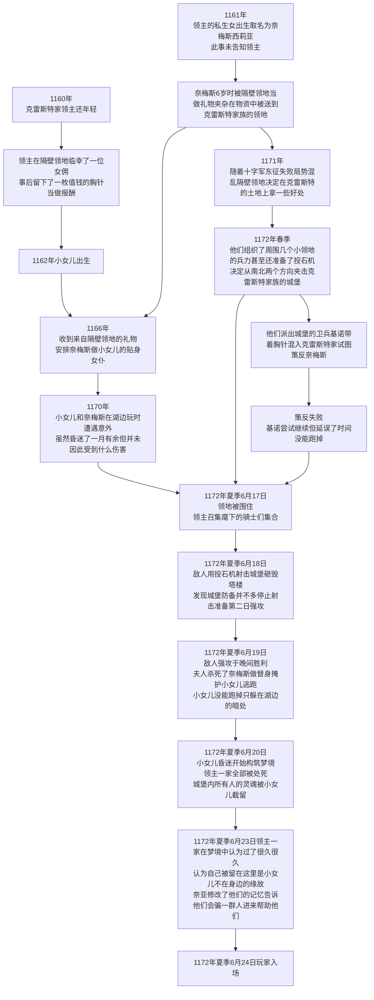

```mermaid
graph TB
    start[1160年<br/>克雷斯特家领主还年轻] --> action1[领主在隔壁领地临幸了一位女佣<br/>事后留下了一枚值钱的胸针当做报酬]
    action1-->action50[1162年小女儿出生]
    action50 --> action2[1166年<br/>收到来自隔壁领地的礼物<br/>安排奈梅斯做小女儿的贴身女仆]
    othorAction1[1161年<br/>领主的私生女出生取名为奈梅斯西莉亚<br/>此事未告知领主] -->othorAction2
    othorAction2[奈梅斯6岁时被隔壁领地当做礼物夹杂在物资中被送到克雷斯特家族的领地]-->action2
    othorAction2-->othorAction3
    action2 --> action3[1170年<br/>小女儿和奈梅斯在湖边玩时遭遇意外<br/>虽然昏迷了一月有余但并未因此受到什么伤害]
    othorAction3[1171年<br/>随着十字军东征失败局势混乱隔壁领地决定在克雷斯特的土地上拿一些好处]-->othorAction4
    othorAction4[1172年春季<br/>他们组织了周围几个小领地的兵力甚至还准备了投石机<br/>决定从南北两个方向夹击克雷斯特家族的城堡]-->action4
    othorAction4-->othorAction5[他们派出城堡的卫兵基诺带着胸针混入克雷斯特家试图策反奈梅斯]
    othorAction5-->othorAction6[策反失败<br/>基诺尝试继续但延误了时间没能跑掉]
    othorAction6-->action4
    action3 --> action4[1172年夏季6月17日<br/>领地被围住<br/>领主召集麾下的骑士们集合]
        action4-->action5[1172年夏季6月18日<br/>敌人用投石机射击城堡砸毁塔楼<br/>发现城堡防备并不多停止射击准备第二日强攻]
        action5-->action6[1172年夏季6月19日<br/>敌人强攻于晚间胜利<br/>夫人杀死了奈梅斯做替身掩护小女儿逃跑<br/>小女儿没能跑掉只躲在湖边的暗处]
        action6-->action7[1172年夏季6月20日<br/>小女儿昏迷开始构筑梦境<br/>领主一家全部被处死<br/>城堡内所有人的灵魂被小女儿截留]
        action7-->action8[1172年夏季6月23日领主一家在梦境中认为过了很久很久<br/>认为自己被留在这里是小女儿不在身边的缘故<br/>奈亚修改了他们的记忆告诉他们会骗一群人进来帮助他们]
        action8-->stop[1172年夏季6月24日玩家入场] 
```