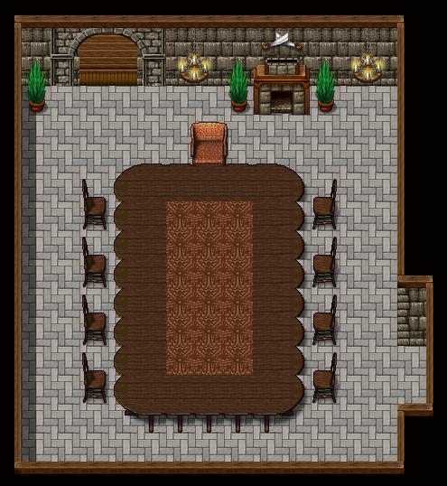
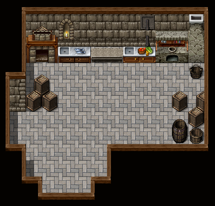
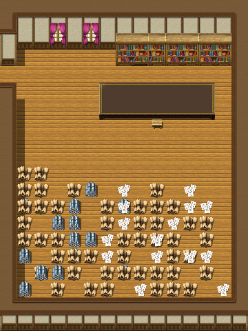
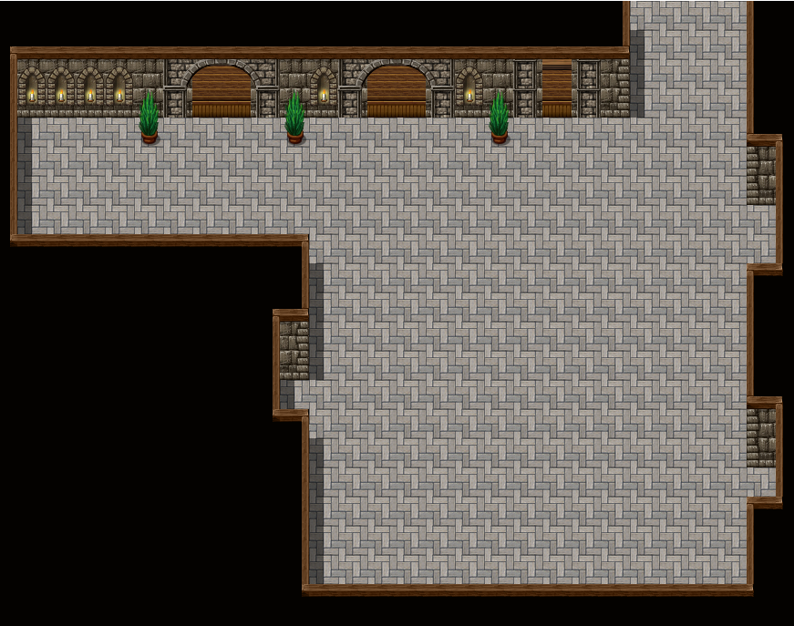

# Ullswater

> 前言：如果KP对自己的能力和你的PL们很自信，那么这个文件中就包含你需要的所有东西。
>
> 如果KP你自认为很强，但担心PL们无法准确带入这个时代，你应该复制《历史信息》文件中的部分在开团导入时一并交给PL
>
> 如果你觉得没太看懂故事剧情，没关系。文章最后一段《游戏内所有时间轴和支线》会帮到你，里面包含有所有的时间轴、预定走向、支线故事设定。

## 开团信息

```
【模组名】:ullswater
【kp】：
【平台】：QQ。
【规则】：COC 7版。
【人数】：4人。
【时代】：1172年英国北部
【购点以及上限】：(KP自行补充)
【身份限制】需要3名扈从与1名骑士。骑士信誉高于50正面职业，扈从信誉低于50任意职业。
【物品限制】任何人不得携带装甲、武器。骑士进本后配发中型佩剑·锁子甲
【特殊规则】：(KP自行决定)
【时间】：晚10点-12点开。文字团大约5-7天。
【ps】：推理为主
【背景】：你们是中世纪，位于英国的一名骑士和他的扈从，在战乱年间，骑士失去了他的封地，带着他最后的几位扈从逃了出来。由于没有自己的领地和稳定的收入来源，你们生活的极度困苦，连泥巴都有好几天没能吃到了。好在隔壁领地的领主伊什尔·米力马尔伯爵找到你们说，他的邻居：克雷斯特伯爵前些日子被人攻击了。作为邻居他虽然和对方地位相等，但还是应该表示友善的派几个人过去。他的部队无法那么快出发，希望你们先过去报个到算是卖个面子。
要求玩家一天内到克雷斯特家族的城堡报道，否则算为任务失败。
```


## 剧情梗概

1172年的英国，北部湖ullswater边，屹立着一座城堡。这座城堡是领主祖先传下来的，克雷斯特家族在这里定居约有几十代人了（那个年代人的平均寿命短）。

领主的祖上曾经和黑巫师有过来往，得到过一些古书。其中有与撒托古亚有关的书籍。但他们最终也没用上这些书，而且这件事传到领主这代早就没人知道了（整件事情也不是撒托古亚安排的），相关的书籍堆在图书馆的角落。

城堡原本的主人是一家四口，包括领主（伊利马福）、领主夫人（莱萨莎迪雅）、姐姐（温蒂尔）、妹妹（温莱尔），外带加起来30个左右的卫兵和仆人、7-8个领主家内骑士生活在这里。

相邻的领地为了讨好本地的伯爵，赠送了很多金银珠宝、食物、仆人。其中包括一位小女仆名叫奈梅斯.西莉亚：她是领主早年间在外风流的结果。由于奈梅斯继承了自己母亲的紫色头发和紫色眼睛，因此领主一时间也没认出来。她从小被领地的人瞒着，只知道自己是私生子。

夫人靠着自己的路子得知了这件事，一直对这位小女仆的存在心怀不满，但她又担心她的存在会影响到自己的家庭，因此故意瞒着自己的丈夫不让他得知真相。

小女仆因为与这家的小女儿温莱尔年龄相仿，便成了要好的玩伴。从小一起长大的她们宛如亲姐妹一般和睦，只是她们并不知道她们之间真的有血缘关系。为此温莱尔还恳求自己的母亲同意奈梅斯住到三楼去。

随着她们长大，两人经常出去玩，城堡后侧风景秀丽的ullswater便成了首选。她俩在湖边3点钟方向支起了帐篷，自称为秘密基地。她们在那边一起唱歌、画画，这样开心的度过每一天。

ullswater是一个天然的与幻梦境存在联系的入口，这种联系并不强，因此99%的情况下这都只是一座普通的湖。虽然很多与幻梦境有关的神都注意到过它，比如奈亚、阿特拉克、诺登斯等，但也仅仅是在漫长的历史长河中有过那么一瞥而已。

>  这里希望KP注意到，这座湖并不是什么传奇场所。也没有很多个神在这里互相争斗，甚至于这个本玩家除了初期会遇到诺登斯的化身外，就再也没有任何神话生物出场了。

> 如果你不喜欢这种很多神的调调，那么这几个神你都可以当祂们不存在，祂们仅仅是背景而已，PC直到结团都无法感受到祂们的存在

她们在湖边经常玩，两个小女孩又精力充沛，她们无意间在湖边碰到了阿特拉克留下的一丝灵感。伟大存在的强烈意志几乎完全摧毁了她们的灵魂，但可能是因为这丝灵感太久远也太随意了，两人靠着幸运和意志力居然真的活了下来。

即使活下来了，她们也昏迷了接近一个月。她们在湖边靠近城堡的地方被人发现，谁也不知道她们是从哪走到这边的。她们被抬回城堡仔细照顾了一个月后醒来，夫人发怒的将奈梅斯赶回一层仆人区居住，又过了一个月才在温莱尔的多次请求下松了口。

又过了几年，随着十字军东征的吃紧与王室在教会上的逐渐失利，王室要求克雷斯特家的大批士兵被支援东征。隔壁的很多领地认为这是一个美妙的机会，他们组织了庞大的联军从南北两侧翻山越岭杀向城堡，甚至还筹钱弄了一辆投石机，力求杀死城堡内的所有人。措手不及的领主带领卫兵和仆从英勇奋战，但最终寡不敌众，一家人磕磕绊绊地逃到了湖边，已是无路可退。

一家人在危难关头，亲情战胜了人性。虽然名声在外的大女儿无论如何都无法逃走了，但女主人为了保护自己的小女儿毅然决定将小女仆当做替身杀死，以图让自己的小女儿逃出生天。她掐死了小女仆，并将她抱在怀中，装作安慰吓坏了的小女儿的样子。指示亲卫将小女儿带离。

最终小女儿没能逃得太远，只得藏在岸边的一处小洞里，在恐惧与不甘中一日一日的虚弱下去。

很显然，这一家人包括城堡里的所有人全都被处死了，匪徒没有怀疑那被抱在女主人怀中的女孩是不是小女儿温莱尔，便没再检查。

只可惜，温莱尔一时间没能找到机会逃走，她在那小洞中失去意识，。强大的精神力作为主导，诱使城堡内所有被杀死的人，包括自己的家人在内共同构筑了两个巨大的梦境。一个梦境复现了他们还和平生存的时候，一个梦境则不断地在战争发生的当日循环往复。

一家三口人被杀死后，他们发觉自己来到了一个间于现实和冥界之间的世界，这里没有匪徒，但也没有其它人。他们以为自己到了死后的世界，因为莫名其妙的原因无法前往天堂。

让他们感到不安的是，他们发现被自己杀死的小女仆的灵魂跟着他们一起到了这个世界，还真的把自己当成了温莱尔，并忘记了追杀最后时刻发生的事情。领主一家都对这个“小女儿”又怕又恨，但也没办法泯灭她的灵魂，只能把她关在漆黑的塔楼里，不知道真相的小女仆奈梅斯感觉非常委屈。

与此同时，他们对小女仆无可奈何，只得将其关在塔楼中，唯有大女儿温蒂尔会去送饭并看望她。

> 在现实中，隔壁领地的领主伊什力.米力马尔伯爵还不知道自己的部队战况如何，之前给他的情报只说是优势。于是他决定骗一拨人过去看看，如果打输了那他就只是去帮助不及时(面子工程)，打赢了就顺道接收战果，去把克雷斯特一家的人头拿回来。他在马车上放了信物，他的部队一看到马车就知道是怎么回事了。

领主一家人坚信自己被困在这里是因为温莱尔没和他们在一起，只要把温莱尔找回来就可以前往天堂。同时也也为了摆脱奈梅斯灵魂的纠缠，他们开始祈祷能否得到帮助。

这种想法影响到了外界，诺登斯察觉到了这件事，他认为这是一个绝佳的机会对这个湖进行一次试探。于是他截取了玩家们的马车并将玩家们在半路引到梦中。

一家三口人还困在梦中，他们认为自己无法去天堂是因为小女儿逃了出去导致的，领主决定寻回小女儿的灵魂。而在这期间，三人又产生了巨大的分歧：

- 领主本着一不做二不休的态度，既然他们已经利用了这个女孩一次，就未尝不可利用第二次，只要能把自己的女儿找回来，什么都是可以做的。

- 夫人认为自己做的事情有愧，既然死都死了，也希望加倍的偿还对奈梅斯的亏欠。但与此同时，她认为自己的女儿没有来到这里也意味着她可能还活着，她并不希望自己的丈夫计划成功，但又不敢直接反对他，更不愿意再去伤害被哄骗来的人，只能不断地试图赶走、拖延他们的调查。

- 温蒂尔既同情奈梅斯的遭遇，又渴望着升入天堂。她决定脱离自己的父母单独寻找出路，她既会在女仆的问题上显得善意、忍让。又会在能解决问题的关键点上显得激进、强势。

与此同时，仆人们虽然蒙昧一直记不清究竟发生了什么，但在接连不断的记忆重置过程中，他们也察觉到了异常。

骑士长阿瑟利尔提醒他们可以去图书馆找找有没有什么线索，于是哈利在图书馆找到了与撒托古亚有关的献祭步骤。哈利看不太懂，就交给阿瑟利尔看，阿瑟利尔本来并不是邪教徒，但那张写有献祭的羊皮纸上本身就有控制人的法术。

作为骑士长的阿瑟利尔显然是识字的，他下意识的看懂了这纸上的东西并瞬间被夺取了心神。被控制的他以骑士长的身份私下安排仆人们准备献祭的方方面面。

哈利因为想复活奈梅斯，艾尔伯特因为目睹了基诺的死，玛莎因为对局势知道的更多一些，艾尔米亚斯因为也识字，他们四人对献祭这件事深信不疑。

基利安、米奇对这件事持可有可无的态度，他们决定旁观，如果这件事可以成功的话他们很乐意也参与进去，如果没成功的话他们就会明哲保身。

汉娜基于对弟弟米奇的关心，越来越觉得自杀这种事太可怕了。她靠着这一点挣脱出了控制，但她自己一个人的力量没有办法揭穿所有事情，甚至不敢和PC们明说，只能拐弯抹角的试探。

> 事实上，外面的温莱尔耗费如此心力构筑一个梦境，只是想让自己的家人反省，让奈梅斯得救，仅此而已。

> 注意，温莱尔在现实中其实只维持了4-5天的梦境，但梦境内时间流速非常快，在领主他们眼中，已经一百多年了。

## 前置时间线：


## 预设调查员动机

因为失去了家园，穷困潦倒已经快饿死了。只能前往侯爵的领地碰碰运气看能否拿到那笔钱。不然就直接饿死在荒原上了

---

## 导入

### 提示

由于玩家们外界的肉体一直昏迷且灵魂一直处于幻梦境中，因此此模组做如下模组内特殊设定：

- 开始时，请KP务必记下所有人起始的san值
- 1号场:所有玩家们每过一天，需要掉1d3的生命，若第2天未能阻止献祭，掉血从原本的每日`1d3`变成`2d3`。但同时在1号场饮用湖水将感到十分畅快，视为一次70技能的精神分析。成功后的san值回复量在规则书基础上\*2
- 2号场:当收到伤害时伤害量\*4。但优先扣除san值而不是血量（这种扣san不会导致疯狂），在san值降低到自己理智值的一半前不掉血。在这里奈梅斯会为玩家治疗，治疗直接恢复血量，且在规则书基础上*2
- 结团后，san值变动值为{(起始san值-结团时san值)/10}


但此副本中非自杀死亡均视为脱离，不过脱离这件事务必到结团后再说。

### 导入内容

#### 第一日:到达城堡

> 请先为玩家扮演导入部分，适当即可。以困、累、饿为由拒绝玩家在马车上探索、问话。以地位为由避免玩家和委托伯爵发生太多对话。

对玩家朗读下段内容：

```
你们又困又饿又累的爬上了伊什尔·米力马尔伯爵给你们准备的马车后就睡着了，经过半天的车马劳顿，你们终于在狂风暴雨中看到了城堡的轮廓。
不幸的是，通往城堡的那一条道路旁的山壁因为暴雨冲刷发生了坍塌，虽然你们都有惊无险地经过了这条小道，但是那可怜的马和车夫估计是没救了（sc0/1d3）。
看着马车的残骸和堵死的道路，你们认清了一个现实，你们估计是很难回去了。
```

`侦查周围地形`这附近地势平坦，没有什么值得马车倾覆到这种程度的危险。⼭⾕质地坚硬，不应该这样容易坍塌。

`侦查马车本身`:马车被撞得非常散碎，没有任何可用的东西可以拆下来了

`侦查马车夫`:这个老人年纪很大了，你们坐上车后他什么话也没说过一直安静的赶车。有`骑术`的⼈或者`骑⼠`通过成功的`灵感`检定可以发现他的⻢鞭好好地缠在腰上，⻢也没有套上缰绳，⽽这⻓胡⼦⽼头身上也什么都没有。

> 若PC坚持自己会驾车，那么形容为车夫PC发觉自己的记忆只到半路就没了，后来的暴风雨、塌方、倾覆的过程全都完全不记得了。

大雨滂沱，调查员唯一的去向就是前往城堡（如果拖延时间过长可能掉血，这里kp用于平稳血线，血高的掉）

一行人冒雨穿过了如下图这样的一个大门


到了如下图这样一座城堡面前


```
你们在⾬幕中看到⼀个有些残破的城堡，但还算气派而且肯定没有荒废掉。雨水汇聚成水流，沿着那因时光侵蚀而斑驳凹凸的浅蓝色瓦片和灰色外墙流淌而下，是这附近最显眼的地标了。
这城堡共有三层，一层没有窗子，二层三层都两者灯光，你可以从灯光中看到一些人影。正门是个沉重的木门，它现在关着。（侦查：城堡有一些经历过战火的痕迹，城堡西北侧有个塔楼，塔楼已经坍塌了。）
```

`聆听`：听到守卫的交谈：他们提到领主吩咐过，会有一批人在今晚来到城堡，但他们对此很不确信

在轻轻敲门后，城堡大门打开。卫兵会以非常强硬的态度和仆人说话，又以谦和的态度和骑士说话（形成反差）。

众人简单交涉后进入城堡，可以看到二层站着两个卫兵。其中一个装备明显好一些，穿着一身锁甲拿着一般骑士才会使用的铁质长矛，他带着头盔，高大且强壮。另一个棕色头发的守卫则没那么显眼，只在腰间别着一把剑，他看到你们的到来紧紧闭着嘴不假辞色。


此时为玩家展示以下地图：

##### 大厅：

###### toPC:


###### toKP:


你们进入城堡，大厅在各处熊熊燃烧的火盆映照下洋溢着温暖、光明的气息。一块华丽的红色地毯从门口铺到尽头，覆盖着通往二楼的大楼梯一路向上。

你们看到有个大概20岁，一头红发，身材很好，脸上有一丁点雀斑但还算漂亮的女仆正在卖力的擦拭着四周的雕像，它们大多是战士的雕像而非像普通贵族家里的雕像那样，一副无病呻吟的优雅身姿。那女仆看到你们吓了一跳有些慌乱，赶紧缩在雕像后不敢动了。

你们听到二楼突然有动静，下意识的看去，有个衣着华丽的女人从二楼匆匆走过，她看到了你们但没有搭话，而是和那装备更好一点的守卫小声交谈了几句便离开了。待你们回过头时，发现那个红头发的女仆不知哪去了。

没一会，你们看到那个守卫走下楼梯，他喊了一下另一位同伴，那人下来后消失在楼梯后面了。而后他便径直朝你们迎了过来。他没有管其它仆人，而是向骑士行了个礼“大人，我家主人邀请您先到客房换身衣服休息片刻，稍后他会在宴会厅等您。”于是他师徒带着骑士向二楼去。

过了一会，从楼梯后方走出一个大约27、8岁的金发女性，她盘着头并穿着一身得体、干净的女仆装。她对在场的所有人（包括仆人）行礼“夫人看到你们浑身湿透了很冷的样子，特地命我给你们送来一些衣物，我先带你们去各自的房间，换下湿衣服来暖和一下，稍后领主大人说要邀请你们所有人”

---


##### 守卫艾尔米亚斯带骑士前往二楼房间。

那守卫带骑士走向二楼，边走还在客套“啊朋友，真是对不起。我们不知道你们会这么晚过来，便没有遣散那些脏兮兮的仆人结果冲撞了您。不过您放心，我们晚上会鞭打那女仆以示责罚的”

同时向玩家展示以下地图：

##### 二层：

###### toPC:


###### toKP:


---

##### 玛莎带仆人们从楼梯后的暗门进入

你们到了一个狭小的走廊，这里虽然打扫的很干净，但由于过于简陋还是给人一种很寒酸的感觉。这里因为非常窄而显得很压抑。

##### 仆人区

###### toPC:


###### toKP:


玛莎带着你们你一路向左拐走到尽头处说“三位先生，真是不好意思。我们没想到除了骑士大人外还有这么多人，我们一时间没有那么多空房间，可能还有一位先生要委屈一下和我们的人同住了。另外，尽头的这个房间虽然是空的，但里面的被褥也许久没有清洗了。等各位宴会结束回来时，能否来一趟我的房间，到时我为各位打理床铺。”

> 房间的摆放和哈利房间相同

选择同住的人推开门进入哈利的房间，这是一个有着两张床、两个柜子、一张桌子的小宿舍。一个矮个子的棕发男人正躺在床上。


他起初对你是谁感到非常好奇与戒备，但一听是领主找来的人，便恍然大悟的催促你尽快换好衣服别让领主多等，领主本来就不太喜欢仆人，若是等的不耐烦了可是大大的不好。

若玩家有女性且执意要求女性单独睡，则汉娜会搬到米奇在外面的住所睡，而PC和玛莎一起睡。若玩家为2名女性，则多出来的人去和米奇在外面睡。

> 玩家们此时可以进行简单的行动，一位仆人会在房间中遇到哈利进行简单对话，骑士来到二层后艾尔米亚斯会离开，他可以简单的换好衣服后走走看看。

#### 第一日:宴会

等待了一小会后，艾尔米亚斯和玛莎亲自过来请你们前往宴会厅。来到宴会厅门口，看到仆人搬着箱子（食材）走进厨房，若玩家向带他们来的亲卫追问“这些箱子中是什么？”亲卫会犹豫一会便如实相告“以前都是通过塔楼运送，现在塔楼出了些问题，只能绕远路，让客人看到实在不好意思。”而后问到如何坍塌，却是脸色有些尴尬和不悦，摆摆手不再说话了。

门是半掩着的，亲卫走过去敲了敲门。门没有很快的打开，而是等了大概1-2秒之后，由一个侍者从里面来开了。

这时玩家可以看到宴会厅内部，kp应向玩家朗诵以下内容：

```
你可以看到明亮的黄色琉璃吊灯将整个房间照的明亮温馨，一条长长的宴会桌摆在中央，洁白的餐补、宴会桌上装饰性的金质的烛台、红色的幕布如花瓣般将大厅托在中央。
整个大厅的摆放位置也很讲究，桌子的长度刚好到房间的一半多点的位置，方便主人张开双手欢迎贵客。既不会让贵客感到过远而尴尬，也不会让这里的主人殷切的像个下等的泥腿子。
大约十来张椅子摆在宴会桌两侧，看上去使用的次数并不多，仅仅是用于招待尊贵的客人使用
```


##### 宴会厅



这里主要用于第一天晚上领主招待玩家们，后续便不再开放，但并不锁门，也无人把守。

```
宴会厅只有一个正门，你们可以看到另一侧有一扇小木门，它虽然并不难看，但比起这大厅来可逊色太多了。

进入宴会厅后，一位大约30岁出头的老领主坐在宴会厅的正席，他的头发是极深的棕黑色，眼睛则是海蓝色的。一位穿着优雅的贵妇人（领主夫人）坐在旁边，你们看到她金发金眼华美异常。领主没有看其它人，而是单纯的邀请了骑士落座，骑士需坐在主宾位置，其余人靠着骑士坐一排。

领主见你们落座后，眼神放在宴会厅的门上几秒似乎在等待什么，但稍后他打消了念头抬起手来。很快，菜陆续被仆人们从那扇小门中端了出来。就在此时，一位英姿飒爽的女骑士自顾自的推开门走进来，她用感兴趣的眼神扫视了玩家们几秒，露出一个玩味的笑容，目光在领主和玩家们之间游弋了几秒，便坐到了玩家们旁边打量着你们（侦查：她似乎刚刚运动完，还有未干的汗渍），领主皱起了眉头（心理学：对大女儿这反常的表现有些奇怪）。
```

在宴会上，领主向你们表示，非常感谢你们接受他们的委托，并对自己的爵位、家族、家人进行简单的介绍。

攀谈一小会之后，他开始正式发布任务了:

```
“说来惭愧”老领主低沉着声音
“我征战十几年，名声在外。但老了老了，却教女无方。坐在那边的，是我的大女儿温蒂尔，她虽然性子有些莽撞但也算是合我心意，一直以来都以继承这片领地为目标跟在我身边学习。”
说着他停顿了一下，你们可以看到他的眼睛看向了那个女骑士，目光中透着肯定和满意。接着他话锋一转
“不过，我还有一个小女儿名叫温莱尔。她出生的很晚，所以我们一家一直对她关爱有加，但这也搞得她太过顽皮，竟在三天前赌气出走了！我和温蒂尔在这种时候不便离开城堡，手下的骑士们又只懂得打仗，这几日苦寻也没能找回她来。还好你们来了，我希望你们尽早动身，将这周围仔细的搜查一遍，将我那女儿带回来”
```

当他说完后，会正常的回答玩家们的提问

可能的以下问题：

1. 问他有没有找过：他派手下的骑士去简单找过，但是没有找到
2. 为什么不派人地毯式搜索：因为战乱频繁，他没法分出太多人手出去，而且他手下的人打仗有一手，但其他方面，就太过无能
3. 会不会走远了：进城堡只有你们进来的那一条路，平时那边都是有卫兵把守的。我的女儿虽然顽皮但又不傻，肯定不会跑出去的，领地的另外几侧都是悬崖绝壁，绝不可能跑到那边去。
4. 继续询问: 会告诉你们，如果你们尽力去找了，我会给你们合适的报酬
5. 谈到路堵了：领主并没有太过担心，甚至松了口气，说这样这里可能还安全些
6. 问到残破：前不久刚经历了一场战火，详细问下去会露出不悦的神色
7. 问有没有大致的方向：他的小女儿喜欢往湖那边跑，可以看看是不是在那边
8. 问时隔这么长时间，温莱尔她会不会饥饿：这似乎是一次有所准备的离家出走，因为发现杂物间的食物大量丢失
9. 你对你的女儿了解吗？：很抱歉，我的精力都放在温蒂尔身上。也许我的……（你看到他的眼神停在夫人身上片刻，但犹豫了一下还是移开了）大女儿会和她妹妹比较熟悉，你们去问她吧。

大概玩家问4-5个问题后，夫人会尝试规劝你们今天先休息，明天再做搜寻。这会引起领主和大女儿的轻微不满，但他们还是同意了。

> 宴会结束后安排玩家进行游戏内10-15分钟的行动内容，kp尽可能将时间缩短。尤其外面在下雨不允许出去

------

## 自由探索部分:1号场

### 城堡内:一楼

#### 塔楼（木门）

##### 第0天晚上

晚上有一个守卫坐在木门边打瞌睡，他睡的不沉，手里抱着一柄长矛。塔楼门口有个铁栓，虽然没锁但显然打开是要发出声响的。

如果趴在塔楼门口观看，可以得到以下情报

- 里面很黑，似乎是因为1楼没有窗户的缘故
- 听不到任何声音，就连小动物的声音也没有
- 就着窗口的那一丁点光亮，可以隐约看到地上有蜘蛛网
- 如果询问地上是否有积水，可以得知是完全没有积水的，很干燥

在玩家看完信息之后，为玩家宣读以下内容

```
借着你身后摇曳的一丝火光，你勉强看清了那木门后的场景，它本应只是个普通的暗室，就好像地窖一样。
但那一瞬间你仿佛看到了你自己投下的影子在火光中支离破碎，温暖迅速的离你而去了，而那塔楼后的安静中似乎隐藏着绝望的嘶吼。
猛地，一股流动的阴影趴在那小窗边似乎在窥视你，它仿佛盯紧猎物的毒蛇一般审视了你片刻
在你几乎要大叫出声的时候，旁边的火把似乎又有了温度。你晃了下神，发现那只不过是个普通的木门，门后只是简单地一片黑暗。
```

##### 第1天晚上

所有仆人睡觉后过一个聆听，成功后听到以下内容。

```
夫人：玛莎，你来这做什么？
玛莎：夫……夫人？！实在抱歉，我晚上有些睡不着。考虑到老爷许诺骑士大人找二小姐后会给他一笔财富。我想其中应该也有吃的，就想去地窖清点一下，需要时便可直接交出。
夫人：想的倒是挺好……成吧，你也别太晚了。
玛莎：倒是夫人您这么晚了为什么从那废塔楼里……
……
玛莎：啊对不起对不起！我多嘴了，夫人您慢走！
夫人：无妨。这塔楼我年轻时候经常和丈夫一起上去观景，这虽然塌了，但我还有些想念。哪怕上不去，站在一层看看也好。不过到底年纪大了呀，天有些凉，我就先回去了。
```

这时如果你们出来，可以发现这里**没有守卫**

##### 第2天白天

发现木门边站着4个骑士。询问可得知早上维尔斯塔来岗时发现塔楼的门被打开了，领主很生气，所以让他们看守。

如果玩家和温蒂尔提起了这4个骑士的事情，温蒂尔会将这4个骑士调走恢复到没有守卫的状态，但只有一次。

##### 塔楼内部

###### 一层


> 这里KP注意，不单人剧情，就超游让其他人知道，但不允许其它人使用这里得到的线索

```
塔楼上去后发现反而没有雨水的痕迹，从一层向上看去黑漆漆的。塔楼中间有根立柱，楼梯绕着立柱右旋向上。
```

当PC来到大约2层的高度时，发现这里有很多箱子，大概是这样的

###### 二层


```
它们摞了4-5层高，完全堵住了后面的门。而靠近立柱的一侧仅有一条小缝，你们再三尝试发现无法举着火把挤过这么小的缝隙。
```

玩家熄灭火把后，`kp暗骰操作`，必须有且只能有一个人上去。如果PC非要孤注一掷，看KP你是否希望，可以让最多两个人上去。

> 建议kp选一个比较有能力但不是骑士的人上去

###### 三层


四层和三层完全一样，左下角为上来时的楼梯，经过一个平整带地面的转角从右侧有继续向上的楼梯，楼梯是完好的。

这里有一个窗户，窗户没有任何格挡，从窗户可以看到外面天完全黑了，天上有很多星星（回忆下午的天气是阴天没有星星），此外没有其它任何线索，从三楼到五楼每一层都有窗户，且探出头向上看去可以看到完整的塔楼，有高度变化。

###### 四层


这里和三层完全相同，有一个窗户，窗户没有任何格挡，从窗户可以看到外面天完全黑了，天上有很多星星（回忆下午的天气是阴天没有星星），此外没有其它任何线索，从三楼到五楼每一层都有窗户，且探出头向上看去可以看到完整的塔楼，有高度变化。

左下角为上来时的楼梯，经过一个平整带地面的转角从右侧有继续向上的楼梯，楼梯是完好的。


###### 五层

玩家来到5层，可以看到这里有一扇小木门，门缝中隐约透出光亮，窗子应该在门那边。如果对门过一个`聆听`，可以听到门后有轻微的呼吸声。

.png)

玩家推开门后，可以看到是一个牢房，牢房非常坚固以玩家的装备无法破坏，虽然有锁但锁极其复杂无论如何也不可能打开。牢房中坐着一个棕黑色头发、紫色眼睛、身着白底红边、大约9岁左右、1米2身高的女孩，她醒着而且注意到了玩家。

如果玩家靠近她，会感觉到以下内容

```
你靠近了这个女孩，她一脸天真的看着你，眼神毫不作伪
你感觉一种温暖笼罩着你，这几天缠绕在身上的疲惫与阴冷一扫而空了。不过你隐约觉得这股温暖和之前那些古怪阴冷的感觉，都是
```

.png)

- 你是谁？：她用和善的语气自我介绍“我是温莱尔·克雷斯特，你们是谁？”
- 你父亲说你走丢了，你为什么在这里？：我父亲他在那场战斗后不知为什么就好像变了一个人，他把我关在这里很少理我，就连妈妈来给我送饭时也很害怕我的样子。姐姐极偶尔也来看我，但也总是一副害怕我的样子。
- 你的贴身女仆呢？：妈妈说梅奈斯她跑丢了，她明明那么聪明，平时总带着我去周围玩对附近很熟悉，怎么可能呢。
- 我们带着你去见领主说清楚好不好？：我……我不敢见他，爸爸每次见到我脸色都非常可怕，非常吓人的样子。
- 对之前那场战斗的最后时刻有印象吗？：没……没有印象（心理学可以得知她谈及这个问题内心非常迷茫，但又有种害怕。当然她现在自己都不知道这种恐惧感来自哪里）

玩家准备离开时，她会和玩家说她很担心奈梅斯的情况，她不相信奈梅斯会失踪。因此她委托玩家帮助她寻找奈梅斯，如果能够找到的话，她愿意去见自己父亲。

玩家结束后准备回去，走到四楼时会强制被一个硬质的细东西捅在背部进而推出塔楼（实际是温蒂尔）。掉到湖中后不但没有感到窒息和死亡，反而被一种温暖的力量包裹着渐渐失去了意识。

PC体验完一周目，回来和她说起试图唤醒她记忆的话，确实可以让她的记忆有些松动，但她还是坚信自己是温莱尔，并对那天父母做的事情极为不满。并要求PC说：**想证明他们确实有能力回到那一刻，或者是证明自己真的见过奈梅斯、温蒂尔之一的话，就唱一首只有她们两人会唱的歌。**

> 当玩家第二天晚上进入塔楼后，与哈利同住的玩家过`聆听`，通过后可以感觉到哈利离开了起来了，如果跟过去，可以看到仆人们进入了杂物间，靠近可以听到祈祷声。祈祷的内容是正规但有些遗漏的教会祷文，一般在文化水平不高的仆人身上很常见这种错误。

- 如玩家就塔楼的事情去找领主，参见书房部分
- 如玩家就地窖的发现去找领主，详见地窖部分

#### 各个仆人的房门前

第一天经过仆人房偷听仆人聊天，`聆听`可以得到以下内容：

```
“他就是老爷找来的人吗？”
“恩是呀，希望他能找到小姐”
“嗯，小姐太可怜了，但愿她能平安无事”
“咱们要不要晚上也去帮帮他们？”
“你可歇歇吧，咱们还有自己的事要做呢，再说……而且今天不是还有人看着过道呢吗”
“反正就这一天”
“那你要去你去，我只希望他们不要惹出什么事来才好，尤其是还有个人和哈利住到一起去了……咱们还得指着哈利呢”
```

##### 玛莎的房间


###### 找玛莎

和玛莎对话的话,她会用和善的态度向玩家询问，是否需要什么帮助。当玩家的问题较多时，会被请到屋里说话，因为门外有卫兵

你进了房间，看到这个房间非常简陋，只有两张床、三个衣柜、一个小桌子

此外，如果玩家们中没有女性，汉娜应该也在房间里。她刚被鞭打过不太愿意搭理玩家，而她床下也没有藏着任何编织品。

对话线索:

```
“之前呀，二小姐还有个玩伴”
“那孩子据说是很小就被送过来当做仆役的，因为和二小姐她很合得来，就一直在贴身照顾二小姐”
“但后来的一次战争中，她失踪了。打那之后二小姐就一直不太高兴，私自往外跑的次数也变多了，不过每次都是跑的不远，我们几个做仆人的也能找到”
“但谁也没想到，这次她跑的谁也找不到了，偏偏还赶在这种不安稳的时候，唉……希望主可以庇护二小姐呀”
```

场景线索

- 玛莎的两个柜子里有一个是以前奈梅斯住这边时留下的
- 柜子里有一些破旧的小号女仆装，明显和屋里住的几个仆人体型不符
- 柜子里有很多绷带，质地两极分化严重，绝大部分绷带都很破旧脏污是很低等的人才会用的东西连下人都不想用。甚至于一些脏乱的绷带堆在下层看起来和垃圾堆一样。不过。有一两卷绷带质地特别好，完全不像是下人用得起的东西。
- 在绷带堆的深处，几乎一团乱麻像是垃圾的绷带中，你可以摸到一个硬硬的东西`需要侦查或RP将所有绷带翻找一遍`，拿出来后你可以看到一个镶金的宝石胸针，上面有一个领主的徽记，徽记看起来有些旧了。
- 玛莎的床下仔细看的话有很多木头碎屑，不是大原木的碎屑而是小的木枝条的碎屑。
- 如果玩家特别明显的趴下去玛莎床底找的话，可以看到很多用木枝条编织成的工艺品。
- 一个`神秘学`\\`博物学`可以发现这些东西是象征着**回归**、**升迁**的饰品，而且有一些神秘学层面的作用。

###### 找汉娜

说话有些尖酸刻薄但为人并不恶毒，只要好言相谈就可以较为轻松地得到以下信息，她对离开城堡的人去什么方向记得比较清楚，但去做什么了就不太确定。

如果聊得好的话，她会趁机他偷偷提醒玩家要小心玛莎。

- 奈梅斯和温蒂尔平时都去哪玩？有没有跑远过？：不太清楚，但一般也就是在城堡附近，最多就是湖边玩玩。不过具体在湖边哪里，也许艾尔伯特应该知道。
- 奈梅斯后来去哪了？：听说在战争中走失了，许是死了吧？那孩子人还蛮不错的。（这里一定要扈从来问才有下面这一段）但说来也奇怪，温蒂尔明明和奈梅斯那么要好，就算走丢了领主他们也应该派人找一下，否则二小姐肯定要闹起来的。
- 她以前有过这样的行为吗？：经常有呀，她还是蛮调皮的，以前不打仗的时候闹这么一出我们出去找找也就算了，非赶这个节骨眼上，唉。


##### 哈利的房间


哈利是个矮个子男人，大概24-25岁，一头略显暗淡的金发并有些瘦弱，平时穿着仆从的服装，但服装很是干净能看出他对自己的形象非常在意。

他有些多疑，会对玩家过多的询问产生反感，并试图反问玩家查找的进度，如果玩家不回答或者虚假的回答被拆穿，那么哈利之后的回答也会有较多隐瞒或虚假。他的能提供的信息大多是奈梅斯自身的信息，因此玩家若不主动提起奈梅斯来，他所知甚少。

询问后可以得到的线索：

- 奈梅斯是从隔壁领地被当做礼物送过来的
- 夫人好像不太喜欢奈梅斯，经常责骂她，因为这里只有她是从小被领过来抚养的，所以夫人偶尔会骂她野种。
- 她人很好，有着紫色的头发和眼睛，非常漂亮。性格乖巧善良乐于照顾人。
- 她以前有什么奇怪的事情吗？（NPC过一个`灵感`）：最奇怪的……就是以前她消失了快一个月，回来后呢又被赶回了我们这边一起住，那段时间她好像精神也不是很好。不过没过太久就又搬回三楼了，剩下的事情就不太清楚了。

可以`侦察`到的线索：

他的衣柜衣服下方塞着一本书，是教如何识字的，简单的阅读可以基本识字，但完全识字必须要花一整个行动轮来研读。

第2天晚上，他会在玩家睡着后离开房间，玩家需要过一个`聆听`来察觉他的动作，玩家可以跟踪他来到杂物间门前看到他进去后没有出来。


##### 基利安的房间


基利安是一个有些粗鲁的中年男子，他有着木棕色的头发，并蓄着大胡子。他身上总是穿着一身有些脏的厨师服。他会和男性玩家聊一些低俗的玩笑，是有关汉娜和玛莎的，如果玩家显得很正直则会招致他的恶感，尽量不和这名玩家搭话。

他和守卫维尔斯塔住在一起，房间略显杂乱但没什么值得注意的地方。唯一不同之处在于：由于维尔斯塔对仪式一事毫不知情，所以基利安也不敢做东西，他的床下灰尘很多，任何时候去他房间都不会看到他在编织饰品。

他会根据自己的见闻和猜测糅合后给玩家半真半假的消息，但所有的消息他自己都是发自内心相信的。他所知道的信息有点偏城堡上层一些，因为他是城堡内的大厨偶尔会和领主一家打交道，在二层走动也比较多。

如果和玩家关系不好的话，他会跟玩家说玛莎挺正常的没什么问题。倒是汉娜一直疑神疑鬼的有很久了，让玩家小心点汉娜。

如果和玩家关系好的话，他会说玛莎最近是有点不太对劲，但他也说不上来哪里不对。

- 二小姐有什么亲近的人吗？：二小姐和我们接触的很少，除了家人之外，似乎也就和她的贴身女仆关系比较近了。
- 那奈梅斯平时都和你们一样穿着仆人的装扮吗？（这个一定要主动问才给）：不一定吧，好像二小姐给过她一些旧衣服，穿着应该比女仆装舒服多了
- 之前这边打过仗吗？：打过呀，可吓人了塔楼都被砸塌了，那天夜里我还去灭火了呢。不过具体打得如何了……我就不太清楚了，那是领主老爷和骑士大人的事情嘛

##### 玩家的房间

为玩家安排的房间，两张床，一张桌子，两个柜子。

两个柜子都是空的，但有一个柜子中可以找到一些墨水遗撒留下的痕迹。

------

### 城堡内:二楼

#### 二楼大厅

##### toPC:


##### toKP:


大小姐，骑士们，骑士PC中午一起吃饭的地方。和骑士交流，得知战乱方面的信息（提到塔楼的时候，痛心疾首视为荣誉上的污点，这里给一个**信息：当时他们错误的把那些杂物堆在塔楼，现在想想肯定是不合适的**）

**在第二天及以后去餐厅吃饭的话，会被大女儿堵住，邀请前往她练剑的地方比划比划，只触发一次。**

#### 客房


领主给骑士预备的房间，虽然到不了奢侈的等级，但也相当的体现了一个贵族侯爵的财力。天鹅绒的大床四周垂着红色的帷幕，书桌上还放着纸笔以供骑士随时使用。

房间有两个窗子，向北的窗子可以看到巨大的ullswater，湖面宁静祥和让人由衷的感到安心、温暖。东边的窗户可以看到下方的训练场。

#### 宴会厅


```
你可以看到明亮的黄色琉璃吊灯将整个房间照的明亮温馨，一条长长的宴会桌摆在中央，洁白的餐补、宴会桌上装饰性的金质的烛台、红色的幕布如花瓣般将大厅托在中央。
整个大厅的摆放位置也很讲究，桌子的长度刚好到房间的一半多点的位置，方便主人张开双手欢迎贵客。既不会让贵客感到过远而尴尬，也不会让这里的主人殷切的像个下等的泥腿子。
大约十来张椅子摆在宴会桌两侧，看上去使用的次数并不多，仅仅是用于招待尊贵的客人使用
```

这里主要用于第一天晚上领主招待，后续便不再开放，但并不锁门。

第0天晚上来时，可以看到仆人搬着箱子（食材）走进厨房，若玩家向带他们来的亲卫追问“这些箱子中是什么？”亲卫会犹豫一会便如实相告“以前都是通过塔楼运送，现在塔楼出了些问题，只能绕远路，让客人看到实在不好意思。”而后问到如何坍塌，却是脸色有些尴尬和不悦，摆摆手不再说话了。

#### 宴会厅厨房



```
  你可以看到这是一个蛮宽敞的厨房，可以允许5-6个仆役在这里做菜，不过旁边堆着很多很多木箱显得非常突兀、杂乱。一侧有一个木门看起来有段时间没有使用过了。
```

  靠近左上角的木门其实是塔楼的门，PC尝试推一下的话会发现木门已经从背后被堵死，只能推开一条小缝，从小缝看过去可以看到塔楼的一层，也可以看到一层的地面很干燥。

在第一次前往厨房的时候，若已了解到东西丢了，询问厨师基利安，他会向你表示的确丢了东西，他猜测是二小姐离家出走前带走的。（`心理学`得知有所隐瞒，且没有说实话，to kp：实际是他们挪用作为祭品）


#### 图书馆



```
  一个小型的贵族领主自家的读书室，放满了领主的私人藏书，大女儿学习贵族教育也是在这个地方，书拜访很整齐但是没有分类，大部分是贵族礼仪、艺术、兵法一类书籍。
  图书馆深处有一些积灰已久的旧书，许久没人翻过了，由于过于古老大多都是未装订的羊皮纸卷轴，数量极大对玩家的检索产生了极大困难
```

简单的RP或一个`图书馆`可以看到《贝奥武夫》（300多年历史了）、《高文爵士和绿衣骑士》（还很新）之类的书籍，此外还有大部分的浪漫传奇故事，主要都是歌颂英雄们的勇敢、美德、忠贞的。

如果要求寻找旧书堆会因为太多而被当时在的NPC拦住“我女儿/妹妹从不看那些东西我很清楚，你们没必要去浪费时间”（4惩罚投，或需要至少2天时间的检索），通过可以得到一本旧书，书名已模糊看不清楚,序章用玩家能看懂的语言写了这么一段话`“希望，是有代价的”`

> 这本书kp动态调整难度，应该是1号场玩家血量都接近底线时才发放

书的效果：

```
- 献祭2人以上，把这些人所有剩余的属性、技能、血量、san值交给某一个人（kp只把这一条给PC，注意NPC即使说服参与献祭也无法提供属性）
- 交给的意思是说，被献祭者可以持有所有人的人物卡，在进行检定时任意选取某一个人的数值进行检定。
- 如果是PC间一致要求某个人留下来，他不会死。
- 被献祭的人灵魂被吸进书里，还能通过意念和最后的一个人进行思维交流。这种交流是瞬间的，周围人听不到的。
- 值得注意的是，书必须由被献祭者启动，目标人是无法启动的。
- 如果只有2个人想献祭，另一个人不同意的话，献祭成功后，不同意的那个人仍将被杀死，且直接撕卡不算做脱离。
- 如果最后的那个人完成了副本得到了非bad end，则主动献祭的所有人复活。
```

##### 玩家上午过来

温蒂尔上午会出现在这里读书，这时骑士见到她也会触发下午一起去练习的邀请。

对话可能得到的线索：

- 您知道您妹妹经常去哪里玩吗：经常去湖边玩，但我很少跟着，毕竟你看我为了继承领地每天要学要练习的东西很多。一直以来我都选择做一个好女儿，却忽略了做一个好姐姐。
- 问起奈梅斯：那孩子是从小被送到这里来，当时我妹妹和她年龄相仿。我父亲觉得一个小孩子不懂事没什么可担心的，就让她陪着我妹妹做贴身女仆。一直以来她都在照顾我妹妹。说来惭愧，也许在温莱尔眼中，那孩子才是她真正的姐姐吧。
- 问起之前一次寻找二小姐的行动:去问问阿瑟利尔吧，他是骑士长，当时就是他带着人去找的。一般他都在骑士那个大屋外，只有晚上他有守门的任务。

##### 玩家下午过来

夫人会在图书馆独自看书，她会关心玩家的身体状况、环境是否满意等，但绝口不提找人的事情。若玩家主动提起也只是含糊其辞，并告知玩家某几个书架是她女儿经常看的故事，其中也许会有可以找到的东西。

若玩家进行`图书馆`则难度+1，搜查则需要2个行动轮时间，事实上这里毫无线索。

对话可能得到的线索：

- 问起奈梅斯：那个孩子……我之前不是很喜欢她，她来路不明就陪在我女儿身边，明明是个下人却和我女儿这么亲近，我很难对她抱有好感。更何况她还天天拉着我的女儿向湖那边跑每天脏兮兮的回来。不过既然人已经没了……仔细想想之前我对她也有些过分，如果你们真的想问她的事，也许那群下人会了解的更多一些。
- 听说奈梅斯消失过一个多月，当时发生什么了您知道吗：她以前和我的女儿在湖边晕倒了，两个人都昏迷了接近一个月才醒过来，我气不过就把她赶回下等人该去的地方了。不过耐不住温蒂尔……就只能让她再上来了。
- 这个胸针：（夫人的脸色有些难看）好了没事的，我知道。那是我丈夫给那个……那个女人的，我知道，放心，不干这次的事。你拿着吧，我不喜欢它，没有为什么，你拿着吧。

------


### 城堡内:三楼

#### toPC:



#### toKP:


#### 书房


###### PC队友掉进湖里后

领主则是说：我不让你们上去，是因为城堡的塔楼被摧毁是我能力不足导致的，这是一个污点。我不希望你们去看那里，但你们还是违背我的命令去了，我很不高兴。那人我已经抓起来关进地窖了，但看在你的面子上我不会杀死他，只要你解决了这次事件，我就放他出来。

###### PC去了2场回来后

用那边的信息逼问领主，领主会逐渐透露信息：

他只记得自己打了一场败仗，但最后的部分自己也不记得自己做了些什么，再清醒过来时发现自己还在城堡中但出不了城堡，他怀疑自己已经死了，这里就是冥界，但死后本应上天堂的，他不知自己为什么被困住了。

后来城堡里来了一个老人，他说自己是因为全家不齐才无法让灵魂继续前往天堂，那个人说他会介绍一批可以帮自己的人，他起初有些将信将疑，于是只和你们说自己的小女儿走丢了

但现在看来你们确实很有能力，他询问你们有没有找到他的小女儿。

- 如果你们说找到了，他会说“既然你们已经找到了，我就不问具体细节了，我希望你们可以将她带回来这里或者告诉她这里一家人都需要她回来。如果你们能做到的话，我可以给你们一大笔财富（每个人2D6的信用评级）”
- 如果你们说没找到，他会显得很不高兴，并认为你们在骗他，拒绝和你们继续谈这件事，并认定你们已经拿到了线索只是不愿意说。
- 如果你们提到和塔楼的奈梅斯有关，他的建议通常是诉诸暴力、去拷问奈梅斯。而大女儿和夫人则分别通过一个暗投来决定是否出声劝阻，但最多也只是语言劝阻。

后续问温莱尔和梅奈斯的歌谣，他说他不清楚这些，他是希望你们找他女儿而不是来学什么唱歌。

##### 白天前来

领主处理公务的地方，在PC需要领主帮助的时候，领主会在书房接见PC。

领主可能回答的问题：

- 温莱尔长什么样？：极深的黑棕色长发，紫色的大眼睛，大约1米2左右的身高。平时总喜欢白色红边的裙子。
- 为什么您的妻子和大女儿都是金发蓝眼，您的小女儿却是棕发紫眼？：“我自己是棕发，不过年纪大了头发有些发白而已。不过紫眼……”他犹豫了一会“你只需要知道，我很确定温莱尔肯定是我的女儿就行了，别的与你无关”
- 她平时喜欢去哪？：平时喜欢在城堡后的湖那里玩，但也就是坐在草地上唱歌画画那样。
- 她以前有这种突然跑丢的经历吗？：从来没有，有个贴身女仆一直跟着她，去哪都是知道的。
- 那个贴身女仆是谁我们可以找到吗？：很抱歉，这个贴身女仆在之前的一次战斗中走失了，多半是没命了，我也猜测她就是因为这件事才离家出走的。
- 您为什么不亲自去寻找她呢？：最近这边局势一直有些紧张，我担心离开城堡亲自寻找的话这边会危险。但我的骑士们打架是把好手，找人就一个比一个蠢。
- 她会不会去找那个奈梅斯了？：有可能，但不可能跑太远，你们也都看到了，我这个地方的几个主要出入口都有卫兵把守，她不可能跑出去的，而且她这点分寸还是有的。更何况，那奈梅斯也未必还活着了呀，搞不好尸骨无存，她到哪去找呢
- 这个奈梅斯怎么来的？：是隔壁领地送过来的，很小就送过来了，才刚刚懂事。
- 这个胸针：（你看到那个钢铁一般的男人第一次流露出一丝温情）…………那不关你的事，你给我……不，不，还是算了，你留着吧。……奈梅斯？是的，她……她是应该有这东西，不过没关系，我知道，我都知道，你记得不要对别人说就行了。

> 因为领主知道这个世界不对，所以对玩家的到来也很重视。即使玩家有口头上轻微的冒犯，他也会适当的忍让，不会轻易对玩家4人下死手。

##### 晚上前来

晚上的行动轮，领主会离开这里回房间休息，PC来可以通过一个`侦查`在领主办公桌左下方的第二个抽屉里找到一本日记，前面都是写的一些普通的政务，最后一页写了如下内容：

```
6月18日：那群卑劣的渣滓在我们的门口叫嚣，一群贪得无厌的老鼠！凭几段故事就胆敢诋毁我和我的家人，我会真的送他们去见那个什么神！
6月19日：愿撒旦带走他们！那群愚蠢的老鼠拿着他们肮脏主子给的攻城器械玷污我光荣的堡垒！不过没关系，他们的鲜血将是我们洗清污点的最好手段，明天就见分晓了。
```


#### 温莱尔的房间


```
这是一个用粉色布匹细细贴过的温馨房间，非常少女。一个带着莎帐的公主床摆在中央，旁边还有个小桌子上面整齐的码放着染色的蜡笔，房间一侧立着一个大大的衣橱。
```

房间看起来非常整洁（极难侦查：看上去已经很久没有使用过了），里面是一些女孩日用之物，可以通过`侦查`或rp，在桌子的抽屉底部找到一些小女孩的涂鸦，看上去有两个人的笔迹。

##### 衣橱

里面有很多华美的衣服，里面绝大部分的衣服都是白底红边的外衣，看起来温莱尔十分中意这个款式，一个`侦查`可以在衣橱后面发现还有一件藏起来的女仆装，看起来上面有些脏污不是温莱尔玩闹穿的而是真正仆人穿过的，女仆装看起来不大也像是个小孩子穿的类型。

##### 书桌

在温莱尔失踪后已经被领主夫人检查过一遍，领主夫人收走了她的日记。

桌子上可以看到一瓶墨水、还有羽毛笔，看起来有使用的痕迹，但没看到任何可以书写的纸、本。


#### 奈梅斯的房间


```
在温莱尔房间旁边有一扇小门，里面是奈梅斯的房间。里面比较简陋，一张床一个柜子再无他物。
```

##### 床底

也有着和温莱尔房间内类似的涂鸦，可以看出是出自同样两人之手。

##### 柜子

这边也有柜子，可以从里面找到一些质地较好的衣服，大多是深色的。此外也有一些绷带，但量比楼下的少了很多很多，而且质地都非常好。


#### 温蒂尔的房间


  门口一直有守卫，几乎无法进入。是一个正常的年轻女士的房间，有一些贵族修养方面的书籍，也藏了一些青春期女孩喜欢看的冒险故事。

#####   柜子

如果温蒂尔拿走了那副画，这幅画应该在温蒂尔的柜子里。


#### 领主的房间


可以看到领主的房间有桌子、衣柜、书架等。

- 每天上午夫人会在这里
- 晚上的行动轮领主和夫人都会在房间里。

可以看到房间一侧摆着厚实的板条甲和两把大剑，即使是PC骑士自认也很难自如的使用这套装备。

##### 书架

若下午的行动轮进来，房间内空无一人，可以在书架处侦查得到温莱尔的日记本

##### 桌子

若上午的行动轮来找夫人，会看到桌上有一本合上的书用纸盖在下面看不清封皮。夫人会搪塞不希望玩家看这本书。


#### 艾尔米亚斯(亲卫)的房间


有正常的床铺、柜子、武器架。

##### 柜子

可以看到和仆人房间中一样的编织品

------


### 城堡外

###### toPC:


###### toKP:


##### 杂物间

toPC:


toKP:


杂物间就在外侧是一个独立的小房间，没有窗户有些黑。里面除了摆放着各种各样的食物、葡萄酒外还有个地窖，地窖的门本身是没有锁的。


###### 第0、1日

| 时间 | 看守者   |
| ---- | -------- |
| 上午 | 比尔博   |
| 下午 | 阿瑟利尔   |
| 晚上 | 阿瑟利尔 |

这里平时有骑士看管。当试图进去时会适当劝阻并提到：玛莎叮嘱我，里面放着很多物资，不适合外人进入。其实也就是些食材、工具之类的东西，地方不大。

```
比尔博上午会在这里，如果周围没什么人他会专心练剑，如果被人抓到他在这里专心练习并没有好好看门，那么他会视对方地位、态度来决定是赔笑通融还是恼羞成怒。
正常情况下他话很少，他只是公事公办的让骑士可以进去看，但不要呆太久而已。
```

阿瑟利尔会和玩家闲聊几句，哪怕是PC仆人他也会笑脸相迎，大概意思就是吐槽一下领主对等级制度太过看重之类的，**他会提到艾尔米亚斯这个人可以说得动，卖点好处也许他会允许你们上去二楼也说不定**。

**此外他会允许仆人在第1天的下午和晚上进去地窖**，那边当时看起来还很正常。不过他会叮嘱说只此一次他勉强放过，不要有下次进去了，毕竟都是战争物资一旦丢了那领主要怪罪下来的，出来后还会记得搜仆人的身。

> 如果是骑士可以直接进去(其它人通过话术之类的技能也可以进去)，`侦查`发现这里只有蔬菜和面食。找不到那天的肉类和葡萄酒。`极难侦查`可以找到很黑暗的一角有一块地板可以掀起来，下面是地窖。里面堆着成袋的肉干，还有一些直径10-15cm粗的木桩，它们有长有短。据玛莎描述，那是因为城堡有些老旧，有时支撑使用。

###### 第2日

会发现仆人们都消失了，他们这时都在地窖举行仪式。而阿瑟利尔会在上午一直守在门口严禁别人下去，下午阿瑟利尔会消失，其它骑士也不知道他去哪了。

如果玩家依靠说服，或者通过骑士身份进入，会看到很多木箱堆在一起。远看就只是箱子堆而已，但仔细观察可以发现它们只是围成一圈。要搬开箱子需要至少2个人过`联合力量`或一个人`力量极难`成功。

搬开箱子后看到里面不过是块空地，但简单的搜索（不一定过`侦查`）即可发现地窖的入口。


##### 地窖

###### 正常情况下:


###### 献祭中:

.png)

地窖隐藏在杂物间，是一扇沉重的铁门开关都会发出声响。因为杂物间很黑且有很多东西，默认是一眼看不到的。

第一次进入时向PC宣读以下内容

```
你进入了地窖，这是储存食物的地方，因为挖在底下所以颇为阴冷
你打了个寒颤，总觉得冷风在顺着你的毛孔钻入你的五脏六腑，它并不刺骨，却在不断地夺去你的体温。
```

所有有名字的仆人如玛莎等和艾尔米亚斯、阿瑟利尔会在第2日凌晨进入这里（汉娜除外，她无论如何也不会参与），整个第2日的上午和下午他们都在这里度过。第2日下午行动轮结束时献祭成功，所有人都把自己绑在了木桩上点燃了自己。旁边摆着葡萄酒和手工制作的硬面饼，地上画着一个奇怪的法阵，它不属于教会祈祷时可能用到的东西。

###### 阻止献祭

你们看到，那些木桩被拼成了十字架的形状。所有人都呆愣愣的站在十字架旁手里举着火爆，房间周围摆着大量的用灌木枝条编制的饰品，同时还有大量的硬面饼、葡萄酒摆在十字架周围。一个奇异的图案画在地窖中央，上面有一张纸摆在图案中心。

- 如果玩家对法阵过神秘学，会感觉到法阵确实有一种奇异的力量，不过那力量是从那张纸中传递过去的。

  ---

  玛莎和阿瑟利尔听到玩家们来了后会向玩家们靠过来

- 玛莎来到仆人们面前，她会反常的好像没看见骑士一样优先和仆人们说话，无论骑士说什么她都不作反应。
- 阿瑟利尔来到骑士面前，告诉他这是正义的事业，如果你有荣誉感的话就出去，他稍后会向领主解释。(`心理学`说谎，而且他的精神状态不太正常)

她和仆人们说话大概会表述以下意思

- 她感觉到这里很奇怪，她们都这样感觉，只有领主一家和骑士大人们显得一往如常
- 她觉得这是领主大人对他们过错的考验，你们来到这里，一定也是犯了错的(只要仆人没有和玛莎交恶，她就会拿出纸来邀请仆人们一起通过考验)
- 她提到哈利找到了一些东西，是一张残页，她会将这纸递给仆人们

阿瑟利尔会和玛莎说相似的话，不过作为骑士他更多是站在高位的角度去表述。此外一旦有玩家试图离开地窖或者喊人，他就会开始对玩家进行攻击。不过一旦KP判断玩家可能有生命危险，汉娜就会找到机会冲下来用声明挡下攻击，PC趁此机会可以冲过去撕碎纸条。

战斗结束后可以用一个来自玛莎的急救来判定汉娜是否有存活下来。如果汉娜死亡那么接下来米奇虽然对玩家没有恶意，但米奇会尽可能不提供信息，只机械化的为玩家服务，并在第3日晚独自自杀。

> 阿瑟利尔的属性值和装备、技能可以在靠近末尾的:《主要登场人物简介-骑士-阿瑟利尔》中找到

------

PC下意识的看向纸后立刻会被控制，KP应按照如下顺序对阅读纸张者进行判定

- 判断对方是否识字（如骑士，或*简单读过哈利房间书的人*），若不识字，则增加`1奖励投`，否则增加`1惩罚投`

- 若对方识字，判断对方识字量（如骑士，或*花费了一个回合阅读哈利房间中书的人*），若未通过，则增加`1奖励投`，否则增加`1惩罚投

- 过教育检定，若失败则获得`1奖励投`，否则增加`1惩罚投

  > 奖励骰之间叠加，最高为完全不识字、且教育未通过则增加3奖励骰。最低为完全识字、教育通过则3惩罚投几乎是必然心控。这里是越蒙昧越无法理解高深的知识，懂得越多的人越容易被拽住心灵。

使用以上方法`意志检定`：

- 若通过则解除疯狂，并意识到这纸张是控制这些人的源头。
- 若未通过，则进入心控状态
  - 优先试图抢夺纸张
  - 若抢夺纸张失败直到有其它人进入地窖，则立刻咬舌自尽。

若玩家以任何形式撕毁纸张，则所有还活着的人恢复意识，并感到极其虚弱需要半个行动轮才可以自由行动。

> 阿瑟利尔无论和玩家如何战斗，只要纸张被撕毁，他就会发出一声痛苦、惊恐的尖叫后软倒在地没气了。

------

玛莎她们会这样说

```
“天啊我……我这是怎么了？那书……难道？
所有人都显得惊惧异常
“哦先生，真是万分感谢您！如果没有您的话我们恐怕就死定了”
```

PC若上前询问究竟发生了什么，她们会回忆许久后回答

```
“我也不记得了，我记得是……是哈利……不对，是阿瑟利尔先生。是他提出要让哈利去图书馆找找有没有什么线索，一开始都很好。但后来哈利找到了那个卷轴……他就变得坚定起来，他说这一定可以帮到大家！”
旁边哈利也气若游丝“阿瑟利尔先生一直是个好人，和那些贵族老爷们不一样。直到看到那卷轴……不……是我害了他。”
他喘息了好久才没有昏过去“书上都说领主大人是神派到人间的天使，我以为图书馆里的书也都是神圣的……我认的字不多，便把它交给了阿瑟利尔先生，之后的事情……我不记得了，后面的我就都不记得了”
```

所有人都状态不太好，他们知道的也不是很多，他们请求PC暂时不要告发他们，先让他们回到房间，再去向领主通报阿瑟利尔的事情。


只要PC不告发他们，什么他们都愿意做。而领主在得知阿瑟利尔的这件事后会对玩家大加赞赏，如果之前玩家提出了一些有些过分的要求、不当的用词导致了关系紧张，那么这次一并拉回来，他会对玩家较为信任。

> 若玩家确实没有告发他们，他们可以自行离开。整个晚上的行动轮都在自己房间中昏睡。大小姐如果来助战的话，她会主动倾向于不告诉领主这件事。
> 第四天上午，他们会找到玩家，提出愿意提供力所能及的一切帮助。玩家因此可以不限人数、不限时间的上二楼，并且每回合可以有一个人在仆人的掩护下前往三楼。
> 仆人会为玩家寻找到奈梅斯的吊坠、图书馆的献祭书。玩家主动提出后他们虽然也会找，但只会按照书>吊坠的顺序提供一样物品。

###### 献祭成功

如果献祭后来到这里，并进行`侦查`的话，可以得到几封信，里面都写着这样的话

```
我们这是要祈求父的原谅，我们身上有罪，所以我们才会来到这里。但我们会向主祈祷、奉献。敬圣子的血肉到神的面前祷告，向他祈求，这样主就会赦免我们，从今以后收留我们作他的儿子，坚固我们的信心，使我们不再离开他。
```

`极难成功的侦查`可以发现，他们是自愿献祭自己的，但献祭的过程中他们似乎又反悔了有剧烈的挣扎。


##### 骑士的宿舍

###### toKP:


###### toPC:


骑士的宿舍有7-8人住着，他们每天会在外面练习。骑士长叫阿瑟利尔，是个年纪看起来不小的家伙。每天会有2-3个人轮流看守地窖里的物资，毕竟这算是战略储备。

大多数骑士都只顾着训练，练累了回来倒头就睡。中午会到城堡的2层去一起吃饭，大部分的谈话都是吹嘘之前的战斗经历如何英勇过人。只有在谈及找二小姐这件事时会略显尴尬的提到没有

**值得注意的是骑士长阿瑟利尔和他的学徒比尔博**


###### 比尔博的房间


比尔博的房间里没有任何异常，但比尔博本人会在每天白天看守杂物间，有时会在那边趁着没人看到专心练习，每天晚上回到骑士的宿舍休息。

询问比尔博可以得知:他是阿瑟利尔的学徒，跟了阿瑟利尔先生有一段时间了。那是一个真正的好人，光明磊落，经常教导自己要与邪念、诱惑作斗争，他常说魔鬼并不在外面，而是住在人们心里。人来到世间是一场考验，做一个好人才是神明想要看到的答卷。

###### 阿瑟利尔的房间


在第0日和第1日期间，阿瑟利尔每天上午都会在自己房间里。贴着门聆听也听不到祷告的声音，但骑士的房间都是有铁栓的无法直接打开。强行打开后可以看到他坐在床上，双手抱紧自己的样子不知在做什么，对此他也不会生气，而是嘱咐几句便揭过了。与此同时，他下午会在外面正常练习，晚上去看守杂物间的门。这期间他的房间是无人看管的状态，只要有`潜行`的人都可以进入

这期间如果强行潜入的话，可以通过`侦查`看到他床下有很多木质的编制品。

##### 艾尔伯特的宅子

艾尔伯特是这家的花匠之一，他一头黑发长的瘦高，年纪不大18、9岁吧，穿着一身有些破烂的衣服，大多都是被树枝刮破的。

###### toPC:


###### toKP:


房间内放着很多木枝条，可以认出都是修剪下来的。此外还有很多园艺的器械堆满了房间的一角，让这房间没法再住下第二个人了。

艾尔伯特在房间中时不会允许玩家四处查看，并无论如何都言辞禁止玩家进房间查看，如果玩家强行进入会主动把事情闹大。

侦查那些枝条可以发现，他们长短较为整齐而且毛刺都被小心的修剪过，应该是故意收集有作他用的。

若傍晚进入艾尔伯特的房间，会发现他在编织一种奇异的饰品，生活在那个时代的玩家可以得知那个饰品包含：回归、晋升方面的含义，当然也可以朴素的解释为祈祷离家的人归来，自己的生活状态可以变好这样。

`神秘学`可以得知这个饰品确实是有神秘学功效的。

##### 米奇的宅子

与艾尔伯特的房间摆放相同，只是没那些园艺的工具导致可以摆下另一张床。

红发的米奇是汉娜的弟弟，但他平时在马厩，对奈梅斯的事情不太清楚。他还是会主动提起自己姐姐的，尤其是会为自己姐姐的暴脾气为玩家道歉。

房间里也放着很多很多编织品，他不太懂事如果玩家要进去的话他会犹豫一会后要求玩家在外面等，自己先进去整理。

##### 基诺的宅子

基诺的宅子完全荒废了，天花板有大片的坍塌。由于来的那天下雨地板上全是水而且都已经泡糟了，绝对没办法睡人。

##### Ullswater

```
你从岸边看过去，发现这是很大、很深的一座胡，平静祥和，优美的让你不忍挪开视线，你甚至从湖水中隐约感受到一丝阳光的温暖。湖边有一圈灌木，大概到你胸口这么高，借助这湖水的生命力沿着湖岸逐渐远去。
除了城堡这一侧之外，其它大部分的湖岸都在山脚下，群山环绕，而且你可以明显看出这些山壁很陡峭成年人都几乎不可能爬上去，遑论小孩子了
```

> ​	注意湖水，会发现湖水明明是阴天却给你一种异常温暖的感觉。它好像散发着生机，你喝一点下去感觉舒服多了，但你的身体在催促你继续渴求它。喝一大口下去，你感觉之前的阴霾似乎都离你远去了，视为一次70的精神分析，通过后san回复视为规则书基础的两倍。

###### 上午

上午艾尔伯特会在这里修剪灌木丛，他看到玩家到来还算热情“先生，您来到这边是有二小姐的线索了吗？也许您应该向西北方走远一些，我经常看到二小姐她们向那个方向去。具体哪里？这我就不知道了呀。不过我建议您，也许骑上一匹马会更方便一些，毕竟您看到这湖挺大的。”

但无论玩家如何询问，他都会试图将玩家支走。如果玩家靠近灌木丛强行`侦查`，可以看到有很多剪下来的枝条用布包好整理在一起，艾尔伯特对此比较不满，他说自己是基于一些爱好收集这些枝条的。

###### 下午

下午艾尔伯特和米奇都会在这里，你看到他们沿着湖岸一路修剪出去将灌木丛剪得很低。（这种过度的修剪是为了获取材料）

##### 湖边树屋

PC跑到湖的10钟方向时，给一个灵感，感觉周围的草丛似乎有些低矮

若PC过去查看，翻开草丛看到有很多枝条折断的痕迹，他跟着痕迹一路追到一个奇怪的地方

这里有一个小小的空地，可以看到熄灭的篝火`一个成功的侦查可以在篝火里看到半块劣质的干粮`。此外旁边还有一大堆树枝，明显超过了扎个营所需的量。这些树枝堆在一起很高，隐隐的展现出一些规律。

> 下面这张图在认出来后才发放


仔细查看，发现那原本是个小木屋，搭建的手法非常稚嫩不像是大人搭建的。

`侦查`可以看到一个残缺的画着十一条横线中间点缀着点与勾的奇怪纸张，歪歪扭扭会用炭笔写的，但因为过于残缺，你完全无法唱出里面的内容。一个`乐理`你看到这几个音符之间的排列非常杂乱，和你以前所知的乐理完全不符，很难唱出来。

> 这是一种乐谱，是五线谱的雏形，在十六世纪才定型成现在常见的五线谱，目前为十二世纪

`极难成功的侦查`可以找到一个小木盒，打开后可以找到一副画

```
画上有两个女孩，一个穿着粉红连衣裙一个穿着女仆装，她们坐在湖边眺望湖中心，在湖中心有音符冒出来，女孩们的头顶也有音符冒出来，穿着女仆装的女孩头顶上的音符明显更多一些。天上很多星星，但星星中还用线条画着很多胡乱的痕迹。
```

在湖岸边`侦查`可以找到坑洞

##### 坑洞

在湖岸下凹陷进去，站在岸边是完全看不到的，必须要人跳下去才能看到

> 如果前面那组人没有回来，新下去的人会发现无法沉下去，只是普通的溺水而已。

洞不深，大概也就刚好够一个小孩子藏进去的大小。`侦查`可以看到洞底有小孩子的脚印，似乎在里面呆了很长一段时间，但看不清楚进来或离开的痕迹，毕竟这里很潮湿泥泞。


##### 训练场

这是一个露天的训练场，简单的被围了起来。旁边架子上摆着一些木制武器，绝大部分都是细剑类型。

大小姐温蒂尔每天下午会在这里练习，并乐于邀请骑士来练手，不过她在练手前会提出一个要求：

```
“你也看到了，我父亲对你们还……不太信任，尤其是对你手下那群人。一定挺麻烦的吧？也许我可以帮你。”
她拿起木剑，也扔给你一把木剑，意思是不要真的下狠手。
“来吧，你每打中我一次，我就答应帮你做一件事。我每打中你一次，你就必须回答我一个问题，三局为限。”
```

打中后可以提问到的：

- 夫人和温莱尔的关系：爸爸和我关系比较好，妈妈和我妹妹关系比较好
- 温莱尔经常去哪里玩:经常去湖边玩，她们经常早上出去很晚才回来
- 有发生过什么意外吗？：有的，我妹妹8岁时被人发现和她的女仆一起晕倒在湖边。后来她们昏迷了1个多月，把我们都吓坏了。好在醒来后没什么后遗症，反而身体好了很多。我和爸爸都认为这是件好事，为此还去过教堂捐赠。
- 提到塔楼上的杂物，她会说如果那时人们多利用一下里面的装备，也许打得能好很多吧。
- 那个胸针是什么？：那个……好像是我父亲的东西，但很久很久没见他带过了，这个你是从哪里找到的？
- 这个是奈梅斯那里找到的？：什么？！那我得好好调查下，你把它还给父亲吧，剩下的我会办好。不过这个事情和我妹妹肯定没有关系，毕竟这个胸针她应该从没见到过。
- 如果问到PC们，还有这里的人都是活人还是死人。她苦笑了一下没有答话，一个困难成功的社交技能她会说：我不能说，但这城堡内的大多数人其实也确实不知道，你们别深究了，这并不重要。

被打中后温蒂尔会问的：

- 关于奈梅斯有找到什么？：如果PC和大女儿说了胸针的事情，她会尝试去和父母、仆人求证，和仆人聊天时会知道最近大小姐一直在关注这件事，因此PC和仆人谈话时也能得到更多的信息。
- 湖那边有发现什么:如果提到了具体位置，大女儿会敏锐的察觉到你们发现的东西很有价值，当晚她会独自去寻找树屋，并拿走那副画。
- 提问其它仆人有没有异常：如果提到地窖以及仆人的异常，她会打开地窖的锁，因此看到了献祭法阵，她会擦掉法阵但不向领主汇报，第二天你会看到她一直若有所思。PC第二天前往地窖只会看到一片杂乱的地面。仆人们态度都很冷淡不愿意和PC们说话了。
- 如果提起仆人的异常时还提到了阿瑟利尔:她会感到非常惊讶，并且思考许久后和PC说阿瑟利尔一直是个好人，正直且虔诚，不应该会做这种偷偷摸摸的事情。并高速PC，如果之后再发现阿瑟利尔有哪里不对，可以随时到三楼或训练场来找她，她会出面来解决这件事。
- 提问塔楼相关：如果PC提到塔楼守卫的问题，接下来的一个行动轮她会尝试帮你支走仆人（哪怕后面领主又派了仆人看守）。

PC二号场的一周目回归后，从塔楼奈梅斯那里得知了“那首歌”，她说她也不会唱，好像听奈梅斯唱过但非常非常难。

------

无论胜利还是失败，她会很自然的谈起以前打仗的事情：

```
6月18号的晚上，和几个骑士、骑士侍从一起击退了敌人。
只记得那天有位说话带有奇怪卷舌音的骑士带着自己的侍从一直在和她并肩作战，数次为她挡住敌人的攻击，这才让实战经验不足的她没有受伤。
她很感谢那位骑士，但太晚了没看清自己人的样子，战争结束后也没能再见到他，直到最后都不知道他长什么样。如果能找到的话一定好好感谢他。
```

如果骑士追问是什么声音，她会说和骑士的声音很像，如果你再卷着舌头说话还真未必能分清呢。

##### 马厩


```
可以看到一个两排4*2的马厩，非常宽敞，其中中铺着很多干草，干草堆很大很大，几乎到你胸口那么高。旁边还有很多杂物，譬如马鞍、马铁、毛刷、草叉等，里面只有3匹马。
```

一个`侦查`可以发现马的状态不是很好有些萎靡不振，但还是可以骑乘的。

因为Ullswater非常大，如果PC提出要去Ullswater边检查，领主会从这里调匹马给PC，但必须骑士亲自前来或提供足够强有效的证明才会借出。

在这里他也会提到自己姐姐，他会对玩家说自己的姐姐平时脾气很爆，也有些太过敏感了。她从小就带自己来这里讨生活受了很多苦，有些疑神疑鬼的被害妄想症一样，希望玩家不要介意。


## 剧情进入:2号场


> ​	**注意，这里开始ullswater的湖水不再提供回san！**

二号场分为2天时间，时间轴和一号场保持一致，对应如下:

| 1号场 | 2号场       |
| ----- | ----------- |
| 下午  | 6月18日下午 |
| 傍晚  | 6月18日傍晚 |
| 上午  | 6月19日上午 |

任何落入湖中（包含“游泳失败且没被营救+幸运失败”、故意沉下去、被推下去等）的，转为单人剧情

> tokp:如果你熟悉自己的PC，知道他们不会轻易把PC知道但PL不知道的信息进行超游使用的话，可以这部分放在1场第三天跑完之后，2场单独带着所有人去跑单人剧情，否则的话，就只带着进场的一个人跑


###### toPC:


###### toKP:


### 6月18日

#### 马厩

PC会在马厩中醒过来，发现自己躺在干草堆中，这时发现温莱尔穿着一身有些朴素但质地还不错的衣服在那里整理物品。
她见到你会本能地关心你，并在看到你身上的衣服绣有自家徽记时提出为你安排一个房间不要睡在马鹏

PC和她交流中表现出认为她是二小姐的态度或用词后，她会礼貌的介绍自己：

```
她被你的话逗乐了，提起裙角行了个礼介绍自己
“抱歉您认错了，我是二小姐的贴身女仆奈梅斯·西莉亚。您可能没见过二小姐吧，我们虽然年龄相仿，但远没到熟人都分不清的地步”
```

她会带你离开马厩，若6月18日入2场，PC可以看到塔楼是完好的。向远方看去，可以看到有很多很多人/火把`.sc 0/1d3`

原因：

```
之前让你流离失所的战斗也才十几人，但目前远远一看只觉得成百上千，你一辈子都没见过这么多杀气腾腾的人，只是看到他们就让你有些双脚发软
```


#### 城堡大厅

骑士会遇到温蒂尔遭到盘问，`困难话术`或RP中提到**卷舌音**则直接通过。否则会被温蒂尔关进地牢直到战斗中才被打昏扔进湖里回到1号场。

扈从被安排到右侧尽头的房间并得到简单的`医术`

#### 基诺的住宅

晚上过去的话，你看到一个矮个子男人已经在床上睡着了，`困难侦查`/`人类学`发现他的右手、腰部、腿部肌肉发达，应该是长期使用长矛的结果。

他的柜子里有很多衣服，翻找或进行`侦查`则发现他的衣服下还放了墨水和笔。在这个时代一个花草匠是不该识字的。

#### 6月18日晚塔楼

夜晚塔楼被攻击失火，PC跟着去救火的PC跑去塔楼时，因为人很多，*以下的所有难度等级-1,当难度降职普通以下时+10成功率*

如果PC提议清走塔楼，按照以下原则：

1. 正常一个`力量对抗`
2. 如塔楼已损毁，需要一个成功的话术或RP确保NPC仆从会听从自己的要求，成功则难度等级保持原状。否则难度等级+1
3. 如PC是扈从，需要额外一个幸运来确保周围有足够多的人随自己前来，成功则难度难度等级保持原状，否则难度等级+1
4. 如果KP希望降低PC难度，可以在这个过程中发放武器，但绝不可给弩箭，且在PC离开2场时武器不随身去1场

#### 领主房间、宴会厅

因为正在紧张备战，这两个区域是不开放的，是有人看守还是锁门KP自行决定。除非玩家拿着胸针去求见领主

领主会这么说：

```
不可能，你是从哪得到这东西的？奈梅斯？不，她……她的眼睛，确实，确实，我怎么一直……啊抱歉，你做的很好，非常好，我会记住你的功劳的。
```

### 6月19日

#### 上午

##### 温莱尔房间

有卫兵长期值守不允许进入，但一段RP或`社交技能`可以得知温莱尔白天的大部分时间在图书馆

##### 图书馆(仆人无法进入)

第二天早上温莱尔在这里看书，奈梅斯不在这里，PC询问可以得知这么一段话：

```
“妈妈说我们很快就要赢了，还准备奖励我们呢~她说到了晚上，我就可以随便吃糖了……对了，还把梅奈斯带去了，说给她漂亮衣服穿！她一定很开心！”
```

而问其它战斗内容时温莱尔一概不知，或者说的也非常模糊

PC这边和小女儿闲聊了几句，可以看到梅奈斯推门进来

```
她穿了一身和小女儿一模一样的长裙，发型也梳的和小女儿几乎相同。这一刻，她俩好似真的是亲姐妹了。
你看到她低着头推开门进来，洁白的贝齿用力咬着下唇，小手用力捏着裙角微微有些颤抖，但当她抬起头时看到你时，这一切又仿佛只是你的错觉。她匆忙把二小姐拉到自己身后，又重新鼓起勇气面对你这个陌生人
```

一个`心理学`可以感受到她的不安和恐惧以及——坚定

但你和她闲聊的话，她会更加的毒舌一些以掩饰自己内心的恐惧，不过只要PC因为毒舌而生气的话她还是会立刻乖乖道歉的。

##### 地窖

如果PC在二场探索时来到这里，可以看到地窖，里面虽然非常阴冷但没有什么特殊的东西。

##### 湖边

可以看到一个不认识的仆人也就是基诺，他在湖边张望远方。

对话可得知如下内容：

- 在提到奈梅斯的时候有些隐藏的不满，甚至有些怨恨。

- 提到争吵：那是一个愚蠢的女人，根本不懂得，也不配懂得什么叫亲情。

- 提到为什么一直追着她：那是她的命！但她却不以为然，真是荒谬！

- 此外还有一些不安，他反复提到这里不太安全了。问你们既然是外来的，有没有什么计划离开，他希望一起离开。

- 然后提到奈梅斯的身世，他有所隐瞒，恐吓可以知道他和奈梅斯的其它家人有联系。

- 问到领主，如果提问的人是扈从，说：那个领主祖上呀，还搞过那些乌七八糟的东西，就是和黑巫师呀，黑魔法呀那些东西，邪门的很（你能感觉到他提到领主时语气中没有别的仆人那种尊重和敬畏）

#### 下午

##### 骑士

你刚吃完饭，就听到外面传来一声高吼“开战了！”

这时你已经吃完午餐，准备往外走时可以看到几个亲兵向领主房间去了，PC跟上去的话发生如下对话

```
“朋友，你不和他们一起去追求自己的荣誉吗？我们是要去三楼保护夫人和小姐，你们尽管去吧，后面有我们守着呢”
```

`心理学`，你会发现他还是很渴望出去和领主并肩作战的，一个成功的话术可以说服其中一人前往前线，只剩你和一个骑士去保护夫人

```
骑士旁边的扈从问道“这位大人，之前一直没见过呀，他会不会……”然后他被自家骑士抽了一巴掌，那骑士转过头来对你说“朋友请别在意，像你这样英武的骑士，荣誉必是无可置疑的”
```

你会跟着前往三楼，将夫人、温蒂尔、奈梅斯接下来前往宴会厅，这里较容易逃脱

##### 扈从

你刚吃完饭，就听到外面传来一声高吼“开战了！”

大家乱糟糟的跑向各自的岗位，虽然你看到有亲兵向宴会厅走去，但你跟上的话会被呵斥要求去做好自己的事情

你转过身来一个`幸运`成功则发现有个鬼鬼祟祟的身影靠近了二楼的楼梯，失败则会走到大厅后被偷袭。

> 以下人物属性可以从下方的<战斗NPC>部分找到，此外KP请务必确认上方的<导入-注意事项>部分

战斗轮：**1刺客**

若PC陷入劣势，可通过一个`幸运`引出宴会厅的骑士来支援。

胜利后骑士会将PC带到宴会厅，让骑士带他到宴会厅，奈梅斯会给PC进行`医术`或`急救`。

#### 傍晚

这里非常宽敞，夫人带着温蒂尔坐在桌边很不安。`心理学`可以得知夫人除了不安还有些犹豫，奈梅斯在一边安慰温蒂尔。

PC在这里守卫，直到傍晚，听到敲门声，开门后发现是个传令兵，他过来趴在夫人旁边说了几句，夫人脸色瞬间煞白，她说:

```
“先生们，这边我还有一事相求。自从我嫁给伊利马福，我便想过有一天会在战争中死去，我的大女儿温蒂尔也难逃厄运。但，我还有一个小女儿，她还只是个孩子。虽然逃跑可能有损各位的荣耀，但还是希望各位在关键时刻可以以护着她逃走为优先”
```

骑士跪地应诺，骑士开始根据塔楼障碍物的清理情况选择路线。

##### 战斗轮

> 以下人物属性可以从下方的<战斗NPC>部分找到

若塔楼清理完毕则对战`1d3`轮刺客，每轮不超过`1d3`个，结束时额外一个`1d3`刺客+`1d3-1`个敌方佣兵。

若塔楼未清理完毕则对战`1d3`轮刺客，每轮不超过`1d3`个，结束时额外两轮`1d3`刺客+`1d3-1`个敌方佣兵。

在随行骑士存活时，敌人不会选择PC作为目标

> 当你们冲出城堡时，一个骑士自愿断后脱离队伍，尽可能选择血量较多的一个脱离队伍。如先前已经支了一个，则此时身边没有骑士了。

##### 湖边

来到湖边，这时身上中了一剑的领主也带着大女儿一路杀了回来，他们看到家人安好松了口气，你们试图一起逃走，但最终发现敌军太多了

领主咬了咬牙，他把自己最小的女儿推给了另一个骑士（如没有骑士则推给你），并告诉你，护着她逃，越远越好。

在谈话时，PC过一个`灵感`（如果没过就再补一个`侦查`）。如果成功则发现领主在有意的用身体挡住你的视线，那边是剩下的人，如果PC去看的话，可以发现夫人正趁着这边领主托付女儿的时候，掐住了梅奈斯的脖子，虽然脸上也有不忍和悔过，但没有松手。而二女儿这时就已经吓傻了。

###### 这时剧情选择：

1. 如果是一周目，则无论如何PC都只来得及看到没机会救下小女仆，一路逃到小木屋那里然后落湖，回到1号场。如果这里玩家从始至终没有通过灵感或回头查看奈梅斯的情况，则下一次还视为一周目剧情不允许玩家救援。
2. 如果是二、三周目，PC试图做出反应。领主会尝试进行攻击但不以杀死玩家为目标，每次攻击后都会有大量时间停顿，KP注意引导玩家尝试跑向夫人那边，其间领主还会尝试进行攻击。一共3回合，第3回合大小姐也会进行一次攻击。如果其间玩家被打到重伤则进入2号结局。如果玩家胜利则1号结局。
3. 如果是二、三周目，PC试图做出反应，且玩家交给过领主那个吊坠后，领主会不攻击，大小姐也会不攻击。直接导向1号结局
4. 如果是二、三周目，PC选择继续冷眼旁观，则进入3号结局。
5. 如果是二、三周目，PC出手救人且成功后立刻拉着两个小女孩试图逃离，进入1号结局。

###### 如是一周目进2号场，则固定按照以下进行

领主回头看到了这一切（如果骑士在，你会看到他痛苦的闭上眼睛，不过是因为忠诚让他选择视而不见），不过还是要求你立刻跑。

你们一路逃跑，那个亲兵自发断后，你带着小女儿一路奔逃，最终还是被人围在湖边，温蒂尔年纪也不小了，明白发生什么了，这时虽然泪流满面但还是忍住没有出声。

她带着你沿着湖岸走到自己的秘密基地附近，因为她很熟悉这附近地形，你们没有惊动拆掉小木屋正在生篝火的敌人。

她将你带到那个坑边，自己钻了进去并招呼你也钻进去，正在这时敌人发现了你。敌军会出于想要你身上这身铠甲而束手束脚，最终逼迫PC自己落入湖中渐渐沉没（回到1场）。

## 结局

### 1号结局

PC在二三周目成功救下小女仆，并带着两人试图逃跑

等跑到湖边，虽然对方还没直接找到你们，但你们还是发现走投无路了，周围人非常多，想直接突破是很难的

这时小女仆喊住你说“这边我知道，湖岸附近有个凹陷，你们躲在里面，大概能逃过一劫，不过……”拉起你的手，把你的剑抵在自己脖子上“前提是，他们得找到二小姐的尸体”

如果PC没有立刻动手，过一会她会说“先生请快一点，您应该也杀过不少人的吧？请提起勇气来，不然……我的勇气也快没有了”这时她已经是哭腔了

如果PC动手，她会在死前为了给自己鼓起勇气，轻声哼唱那首歌谣，玩家也将因此记住那首歌。

如果PC选择不动手

```
她会露出开心的笑容，对PC说“先生，在最后就让我为您唱首歌吧。”她会双手握在胸前认真的唱歌，玩家在这种条件下听到歌声后结团时可以学习法术：精神交换术。她唱到一半时突然停下，指着湖对面的星空说“先生，您请站到这里来。这首歌还有一个特殊的作用，就在这最后的时刻……当做给您的礼物吧”
你按她的要求面向湖站到湖边，她继续歌唱，在结束时你感到她在你背后用力推了一把。你跌入湖水中，当你挣扎时你看到她冲出了灌木丛迎向那些围捕她的人。你沉入湖中了。
```

你回到了一号场，你脑海中还记得刚才发生的一幕幕。此外，你发现自己还清晰地记着小女儿轻哼的歌谣。

带着歌谣向塔楼顶的小女仆回复，她会想起来一切，并要求你带夫人过来。记得是只带夫人。奇怪的是夫人听到你这么说并没有任何犹豫就答应了你，她劝阻了自己的丈夫只身来到塔楼。奈梅斯会把你赶出去和夫人密谈很久，而后两个人一起出来。

一行人来到地窖，小女仆站在地窖中央再次唱起那首歌。随着歌声渐起，她的身体上冒出火焰，整个人便随着歌声化为尘埃。

#### 结团语

你们从马车上醒来，发现马车夫已经不见了，但马车就停在峡谷外。峡谷目前还没有塌方，天上也没什么暴雨。

你们下了车，发现马车夫的座椅上放着一个徽章，下面压了个字条让你带上它，骑士看出这是伊什尔·米力马尔的笔记。

你们带上徽章来到城堡，发现这里一片大战刚刚结束不久的景象。很多伊什尔·米力马尔的军队住在城堡里，他们见到你们时险些出手攻击，但看到徽章后不由得笑了起来。

他们热情的招待了你们一行人，并告诉你们，其实这家领主根本没遇到什么麻烦，他已经死了。米力马尔先生派你们来是为了查看战果的，如果他们打赢了你们就接收战果，如果他们打输了你们就是支援克雷斯特的援军——一手贵族式的好外交

他们放心的将好几个大布口袋交给你，告诉你带着它们回去即可，他们还要在这里逍遥几天。你们拿了东西就赶紧回去吧。虽然不是什么值钱的玩意但你们还是最好招办，不然小命难保哦~

你打开口袋，确实不是什么值得拿了跑的之前玩意。

那是克雷斯特一家的人头，哦，还有奈梅斯的，她的小脑袋就压在温蒂尔下面，一双紫色的眼睛还没完全闭上正无神的望着你。

##### 1号结局的奖励结局

你们后来带着那一兜子人头回到了米力马尔的领地，他确实给了你们一笔可以让你们安身立命的金钱。后来的日子里你们没再遇到什么大灾大难并在远方安了家，年轻时发生的这一场梦似乎真的只是一场梦罢了。

只有当你们老了，儿孙环绕的时候，才偶然听起。米力马尔伯爵和那附近的几个领地，被一个使用着魔鬼邪术的女人单枪匹马的消灭了。等圣骑士们赶到时那周围的一大片领地都只剩下废墟，对方没有抓活口、没有举行献祭、甚至没有拿走财宝，谁也不知道那女人从哪来的为什么杀死他们。

### 2号结局

你试图救下小女仆，但领主的突然反击和大女儿的含泪反击（或是骰娘恶意）让你最终没能成功。

这时你拉着小女儿跑时，大女儿从背后喊了声你，扔给你一个吊坠，并流着泪对你笑了笑，并没有说话。

PC最终还是没能逃离，被敌兵围在湖边不得不跳下去后，听到二女儿绝望的哭喊、里面夹杂着悲伤和恨意。

PC回到一号场后，给大女儿出示吊坠，大女儿会说她知道发生什么了。并把PC带到地窖，这里有一条暗门，需要侦查大成功或者大女儿亲自打开。

PC此时可以选择脱离，也可以选择使用道具，拼了再打第三周目。

若玩家脱离，则结局见**1号结局**的结团语

### 3号结局

如果PC选择 冷眼旁观，在拉着二女儿逃走到湖边时，突然一切都静止了。二女儿露出了了然的微笑，说：

“我终于醒过来了，你就是父母派来找我的人？无需这么费力，回去告诉他们，只要梅奈斯死掉，我立刻就可以回去，这场闹剧终于该结束了。”

PC回去后领主并不知情，PC可以选择直接向领主复命还是使用道具打第三周目。

如果PC复命的话，则领主直接抓走塔楼的小女仆处刑，但献祭的结果只有一声遗憾和怨恨的叹息，玩家看到无数的怪物从湖中涌出。玩家也被怪物包围后失去意识

#### 结团语

你们最终不慎激怒了温蒂尔，她放弃了自己的家人也放弃了自己，所有人的灵魂都坠入了奈亚的手中。但还好奈亚对你们的表演感到满意，他放了一你们一马。

你们后来在马车上醒来，车夫早已不见了，因此事情也没办成。你们找了找身上，至少出发时给你们的口粮还在，虽然极少，但大概能因此活下来了吧。你们各自又找了份活计，开始了新的人生。

### 4号结局

如果玩家真的在2场活到最后都没死也没被找到，可以脱离模组，但这个我认为可能性为0

## 奖励

> 所有结局，存活下来的人可以成功过的技能有一次en

### 1号结局

- 温蒂尔、奈梅斯的友谊。
  - 并告知玩家，当他们的PC年老的时候听说“已经毁灭多年的克雷斯特领周围的几家领地，都被一个神秘的女人用奇怪的方式单枪匹马的击溃消灭了。那神秘的女人完成这一切后没有留下接受领地而是前往远方了。”
- 克苏鲁学识1D3
- 法术：精神交换术
- 信誉评级2D6
- 意志获得一次en
- 魅力成长1

> 注意，此模组中任何NPC决不可带出模组，无论以任何形式任何神明帮助。

### 2号结局

- 意志获得一次en

### 3号结局

- 你们不是已经达到目的了吗？

## 主要登场人物简介

### 领主：伊利马福·克雷斯特

| 属性 | 技能 |
| ---- | ---- |
| 力量 | 90   |
| 体质 | 80   |
| 体型 | 80   |
| 敏捷 | 55   |
| 外貌 | 45   |
| 意志 | 70   |
|      |      |

**DB=1D4**

**双剑:每回合2次攻击**

| 技能名 | 成功率 |
| ------ | -----: |
| 心理学 |     60 |
| 剑术   |     85 |
| 闪避   |     70 |

| 武器类型       | 技能 | 伤害     | 射程 | 贯穿 | 每轮 | 装弹量 | 故障值 | 常见时代   | 价格20s/现代($) |
| -------------- | ---- | -------- | ---- | ---- | ---- | ------ | ------ | ---------- | --------------- |
| 大型剑(马刀)*2 | 剑   | 1D8+1+DB | 接触 | √    | 1    | ——     | ——     | 1920s,现代 | 30/75           |

| 防具类型   | 护甲值 | MOV 惩罚 | 覆盖位置     | 使用物种               | 防利器 穿刺 | 防护等级 （冷兵器/一般枪械/穿透,爆炸性武器） | 常见时代 |
| ---------- | ------ | -------- | ------------ | ---------------------- | ----------- | -------------------------------------------- | -------- |
| 古罗马头盔 | 3      | 0        | 头顶+面颊    | 人类、有明显头颅的生物 | √           | 正常防护/无法防护/无法防护                   | 古代     |
| 板条甲     | 5      | 1        | 除头部、全身 | 人类、人型生物         | √           | 正常防护/无法防护/无法防护                   | 古代     |

> 这是一位大约30岁出头的老领主,他的头发是极深的棕黑色，眼睛则是海蓝色的.他穿着一身做工考究的薄皮衣，一袭浅灰色的马裤很是贴身，哪怕没有什么过多的装饰也让你感觉价值不菲，他整个人像一把利剑插在地上一样，给你一种虽不夺目但却锋利而危险的感觉。

> 他倨傲的扫视了你们一眼，只有看到骑士是露出了很少的一丝笑意，面对其它人则如同看到空气一般毫不理睬。

> 他邀请骑士一行人来到这里进行调查，但又对他们的能力存疑，因此他不会给直接的帮助而是持续观望，并试图考验玩家是否值得信任。

### 女主人：莱萨莎迪雅·克雷斯特（以前姓克莱尔）

| 属性 | 技能 |
| ---- | ---- |
| 力量 | 30   |
| 体质 | 40   |
| 体型 | 45   |
| 敏捷 | 40   |
| 外貌 | 65   |
| 意志 | 40   |
|      |      |

| 技能名 | 成功率 |
| ------ | -----: |
| 心理学 |     50 |
| 聆听   |     60 |

| 武器类型               | 技能 | 伤害   | 射程 | 贯穿 | 每轮 | 装弹量 | 故障值 | 常见时代   | 价格20s/现代($) |
| ---------------------- | ---- | ------ | ---- | ---- | ---- | ------ | ------ | ---------- | --------------- |
| 小型刀具(弹簧折叠刀等) | 斗殴 | 1D4+DB | 接触 | √    | 1    | ——     | ——     | 1920s,现代 | 2/6             |

  **锁血不死**

> 金色带卷的长发从脑后披到胸前，她和蔼的笑着就如同迎接自己邀请来的客人。同样金色的眸子闪着审视的光芒，她穿着一身红色且装点着玫瑰流苏的华丽长裙，端庄典雅。

> 她认为自己的女儿没有来到这地狱，也意味着她还没有死或者死了已经去天堂了，那么丈夫的行动对自己的女儿是有害的，但她又不敢反抗自己的丈夫，因此会以和善的态度尽可能的诱导调查员们浪费时间最终调查失败，当然无论如何她不会付诸武力。

### 大女儿：温蒂尔·克雷斯特


#### 

| 属性 | 技能 |
| ---- | ---- |
| 力量 | 60   |
| 体质 | 60   |
| 体型 | 50   |
| 敏捷 | 80   |
| 外貌 | 65   |
| 意志 | 40   |
|      |      |

| 技能名 | 成功率 |
| ------ | -----: |
| 心理学 |     40 |
| 潜行   |     50 |
| 剑术   |     75 |
| 闪避   |     85 |
| 斗殴   |     60 |

| 防具类型   | 护甲值 | MOV 惩罚 | 覆盖位置 | 使用物种 | 防利器 穿刺 | 防护等级 （冷兵器/一般枪械/穿透,爆炸性武器） | 常见时代 | 价格20s/现代($) |
| ---------- | ------ | -------- | -------- | -------- | ----------- | -------------------------------------------- | -------- | --------------- |
| 剑格、护手 | 20     | ——       | ——       | 剑       | √           | ∞/正常防护/无法防护                          | 古代     |                 |

| 武器类型           | 技能 | 伤害   | 射程 | 贯穿 | 每轮 | 装弹量 | 故障值 |
| ------------------ | ---- | ------ | ---- | ---- | ---- | ------ | ------ |
| 轻剑(击剑、剑杖等) | 剑   | 1D6+DB | 接触 | √    | 1    | ——     | ——     |

> 受到良好教育的大小姐，继承了母亲的金发和父亲的蓝眼睛。
>
> 因为与骑士们经常打交道，性格更趋向男性。她的立场会随调查员自身的表现而改变。当调查员表现的好一些她会倾向于给予助力，当调查员表现得不好她倾向于独立侦查


### 小女儿：温莱尔·克雷斯特


| 技能名 | 成功率 |
| ------ | -----: |
| 潜行   |     40 |
| 侦查   |     60 |
| 绘画   |     10 |

| 属性 | 技能 |
| ---- | ---- |
| 力量 | 60   |
| 体质 | 20   |
| 体型 | 40   |
| 敏捷 | 40   |
| 外貌 | 70   |
| 智力 | 60   |
| 意志 | 90   |
|      |      |

二号场：

一个被一直保护着的妹妹，胆小而又懦弱。同情心微微有些泛滥，长相甜美很容易引起他人的保护欲。虽然和小女仆一样大，但她显然还是温室里的花朵。

一号场：

不存在于死后世界

### 女仆：奈梅丝·西莉亚


| 技能名 | 成功率 |
| ------ | -----: |
| 心理学 |     60 |
| 急救   |     70 |
| 医术   |     50 |
| 聆听   |     50 |
| 歌唱   |     70 |

| 属性 | 技能 |
| ---- | ---- |
| 力量 | 40   |
| 体质 | 40   |
| 体型 | 40   |
| 敏捷 | 50   |
| 外貌 | 65   |
| 智力 | 90   |
| 意志 | 40   |
|      |      |

死后由于小女儿的主观美好印象app+10，这里加完是75

二号场：

即是二小姐的保姆+女仆，也是大小姐的闺中密友。所以她在任何危难时都不会丢下这一家人不管。虽然她被夫人当做替身杀死，但其实并不对此感到怨恨。甚至为了保护自家小姐也做好了牺牲的准备。

一号场：

死后的她显得惊慌无措，她不知道为什么家人对她的态度有如此大的变化（以为自己是二小姐），觉得很委屈，但她内心中的坚强支持着她。有时她也感到很神奇，她坚信自己是在经历劫难后成长了许多，不再胆小懦弱，而是更加自信了，似乎对什么都了如指掌。

智力90是因为神秘事件的所得，也因为这个设定，这个NPC严禁带出副本

### 骑士

#### 阿瑟利尔

| 属性 | 技能 |
| ---- | ---- |
| 力量 | 65   |
| 体质 | 70   |
| 体型 | 65   |
| 敏捷 | 50   |
| 外貌 | 50   |
| 意志 | 50   |
|      |      |

| 技能名 | 成功率 |
| ------ | -----: |
| 侦查   |     60 |
| 剑术   |     85 |
| 闪避   |     70 |

| 武器类型     | 技能 | 伤害     | 射程 | 贯穿 | 每轮 | 装弹量 | 故障值 | 常见时代   | 价格20s/现代($) |
| ------------ | ---- | -------- | ---- | ---- | ---- | ------ | ------ | ---------- | --------------- |
| 大型剑(马刀) | 剑   | 1D8+1+DB | 接触 | √    | 1    | ——     | ——     | 1920s,现代 | 30/75           |

| 防具类型 | 护甲值 | MOV 惩罚 | 覆盖位置             | 使用物种       | 防利器 穿刺 | 防护等级 （冷兵器/一般枪械/穿透,爆炸性武器） | 常见时代 |
| -------- | ------ | -------- | -------------------- | -------------- | ----------- | -------------------------------------------- | -------- |
| 鳞甲     | 4      | 1        | 双臂、大腿、躯干、颈 | 人类、人型生物 | √           | 正常防护/难以防护/无法防护                   | 古代     |

阿瑟利尔31岁，金色的头发垂到耳边，一双蓝色的眼睛嵌在有些沧桑感的国字脸上让他看起来值得信任，平时他显得正直、和善、虔诚，哪怕是面对仆人他也会笑脸相迎。

他是第一个发现这个世界不对的人，于是他开始自己偷偷探索回忆究竟发生了什么。不巧的是他也错误的以为图书馆中存在领主的秘密了。于是他提醒哈利可以去图书馆中寻找，并确实找到了那篇写有如何召唤撒托古亚的羊皮纸

可惜，他因为识字的缘故更能理解那篇羊皮纸上的邪恶，他没能挺过来。于是他作为被那篇撒托古亚的邪恶典籍控制最深的人，以骑士的身份引导仆人们开始献祭。

无论如何，他都没得救了。

#### 比尔博

| 属性 | 技能 |
| ---- | ---- |
| 力量 | 55   |
| 体质 | 60   |
| 体型 | 55   |
| 敏捷 | 50   |
| 外貌 | 50   |
| 意志 | 40   |
|      |      |

| 技能名 | 成功率 |
| ------ | -----: |
| 剑术   |     30 |

| 武器类型       | 技能 | 伤害     | 射程 | 贯穿 | 每轮 | 装弹量 | 故障值 | 常见时代   | 价格20s/现代($) |
| -------------- | ---- | -------- | ---- | ---- | ---- | ------ | ------ | ---------- | --------------- |
| 中型剑(佩剑等) | 剑   | 1D6+1+DB | 接触 | √    | 1    | ——     | ——     | 1920s,现代 | 15/100          |

比尔博是个只有16、7岁的孩子，他一头黑色短发，棕黑色的眼睛，小圆脸不太高，身体很健壮但并不显得臃肿。

他是阿瑟利尔的骑士学徒，渴望着成为真正的、秉承正义的骑士。比尔博人挺不错的，识大体得分寸，尽可能的以骑士美德来要求自己。

当然他也有年轻人毛毛躁躁、冲动易怒的一面。

比尔博完全没察觉到哪里不对了，而阿瑟利尔起初是为了保护他才把他蒙在鼓里。而后来阿瑟利尔被控制后，就完全是在骗他了。

### 仆人

> 仆人属性全视为50即可

#### 汉娜

| 技能名 | 成功率 |
| ------ | -----: |
| 斗殴   |     10 |
| 聆听   |     50 |
| 侦查   |     50 |

汉娜大概20岁，一头红发，身材很好，脸上有一丁点雀斑但还算漂亮，平时穿着一身女仆装拿着扫帚扫地。她思考的时候喜欢用手指卷着头发捎一圈一圈的绕。

她有个弟弟叫米奇在马厩看马，两人都是很小就来了。但汉娜不是很爱说话所以她不会主动提起弟弟和奈梅斯小时候的事情。

她会知道小女儿的一些相关信息。但由于为人过于敏感，哪怕有一丁点让人不舒服的用词就会让她不高兴。如果玩家中有女性，她会搬去米奇在外面的屋中暂住。

#### 基利安

| 技能名 | 成功率 |
| ------ | -----: |
| 斗殴   |     60 |


一个有些粗鲁的中年男子，他有这木棕色的头发，并蓄着大胡子。平时总是穿着一身有些脏的厨师服，大大咧咧的有些低俗，会拉着PC谈论玛莎和汉娜的一些……低俗的事情。

如果玩家与其志趣相投，他会大大咧咧的说些自己的猜测，不过由于都是猜测他又是个二愣子，他能提供的信息半真半假。只有在丢食材这件事情上他说的是假话，其余的即使他说错了心理学检定也会得到是真的。

如果玩家显得假正经，他会对玩家有些意见，并且会和玩家少说话，轰玩家离开厨房。

#### 哈利

| 技能名     | 成功率 |
| ---------- | -----: |
| 心理学     |     50 |
| 潜行       |     30 |
| 斗殴       |     20 |
| 侦查       |     50 |
| 图书馆使用 |     60 |

哈利是个矮个子男人，大概24-25岁，一头略显暗淡的金发并有些瘦弱，平时穿着仆从的服装，但服装很是干净能看出他对自己的形象非常在意。当他觉得自己被玩家跟查户口一样问时会双手交叉抱紧搭在腿上，抿着嘴唇观察玩家的态度。

他生性多疑，玩家询问他时他会迟疑并尝试观察玩家的心理（心理学40），并在可能涉及自己的问题上隐瞒、说谎。

在关于奈梅斯（女仆）的问题上他知道的很多，因为他曾经暗恋过奈梅斯。而且他对于领主家的组上可能与黑巫师有过来往这件事有些了解，但不敢多谈。

#### 艾尔伯特

| 技能名 | 成功率 |
| ------ | -----: |
| 心理学 |     20 |
| 妙手   |     40 |
| 斗殴   |     20 |

艾尔伯特是这家的花匠之一，他一头黑发长的瘦高，年纪不大18、9岁吧，穿着一身有些破烂的衣服，大多都是被树枝刮破的。经常打理草木的他很有耐心，有点慢性子，但内心中戏很多。当他有如欺骗玩家向远处走这样的规划时，会垂下头摸摸鼻子。

基诺的失踪让他对这边产生了很多怀疑，因此他是玛莎计划的坚定支持者。

每天下午会带一些藤条回城堡，在城堡外交给其他仆人，主要负责收集材料，因此在故意的回避玩家，当然他并不会骗玩家，有时候会故意塞线索让玩家离开。

#### 米奇

| 技能名 | 成功率 |
| ------ | -----: |
| 骑术   |     40 |

红发的米奇是汉娜的弟弟，但他平时在马厩，对奈梅斯的事情不太清楚，人有些结巴。他还是会主动提起自己姐姐的，尤其是会为自己姐姐的暴脾气为玩家道歉。

他知道的不太多，但比较怯懦。他认出马厩中剩下的三匹马状态都非常差，由此对这里发生的事情有些猜测，因为他的胆小，比其他人表现的更为明显。

#### 玛莎

| 技能名 | 成功率 |
| ------ | -----: |
| 心理学 |     20 |
| 潜行   |     30 |
| 斗殴   |     10 |
| 急救   |     50 |
| 聆听   |     60 |
| 侦查   |     60 |

一个大约27、8岁的金发女性，她盘着头并常穿一身得体的女仆装。性格温和可靠，但有些倔强的女性。一旦遇到为难的问题喜欢用左手打着额头向上看，右手撑着腰，以这样的姿势思考。

她会提供基本的仆人需要的信息如哪位仆人平时在哪做什么，她与骑士交流时会尽可能的少说话并不提供信息。

此外因为她在主持仪式，所以相关问题她必定有所隐瞒。

#### 基诺

| 技能名 | 成功率 |
| ------ | -----: |
| 心理学 |     10 |
| 斗殴   |     70 |

基诺是个棕发的高个子，有些壮硕（尤其是右手），他性格高傲看不起其它仆人。但说话并不带刺，属于没有必要就不多说话的类型。他常穿一身质地还比较不错的衣服，右胸有自己锈的领主家的徽记，自称是自己来这里工作时带来的衣服。

和艾尔伯特一起工作，但实际上是隔壁领地派来策反奈梅斯的人，被奈梅斯拒绝后心存不满。但已经深处险地他也不敢造次，人还算热情不过对于神鬼之说比较深信，会疑神疑鬼的吓唬玩家。

#### 艾尔米亚斯

| 属性 | 技能 |
| ---- | ---- |
| 力量 | 65   |
| 体质 | 70   |
| 体型 | 65   |
| 敏捷 | 50   |
| 外貌 | 50   |
| 意志 | 50   |
|      |      |

| 武器类型     | 技能 | 伤害  | 射程 | 贯穿 | 每轮 | 装弹量 | 故障值 | 常见时代   | 价格20s/现代($) |
| ------------ | ---- | ----- | ---- | ---- | ---- | ------ | ------ | ---------- | --------------- |
| 矛、骑士长枪 | 矛   | 1D8+1 | 接触 | √    | 1    | ——     | ——     | 1920s,现代 | 25/150          |

| 防具类型 | 护甲值 | MOV 惩罚 | 覆盖位置             | 使用物种       | 防利器 穿刺 | 防护等级 （冷兵器/一般枪械/穿透,爆炸性武器） | 常见时代 | 价格20s/现代($) |
| -------- | ------ | -------- | -------------------- | -------------- | ----------- | -------------------------------------------- | -------- | --------------- |
| 鳞甲     | 4      | 1        | 双臂、大腿、躯干、颈 | 人类、人型生物 | √           | 正常防护/难以防护/无法防护                   | 古代     | N/A             |

| 技能名 | 成功率 |
| ------ | -----: |
| 矛     |     70 |
| 闪避   |     50 |

他是领主的亲卫，但为人和善有些市侩，搞不懂的东西就发出黑魂里洋葱哥那种爽朗的大笑声。平时总穿着一身鳞甲拿着骑士的长矛，带着头盔看不见他的相貌。

他是黑发，个子很高也很壮实，右手的肌肉比较发达因为经常用矛。

他平时住在三楼亲卫的房间，与他同住的还有好几个马赛克NPC亲卫。

他也参与了玛莎的计划，虽然很少说话，但他会尽量避免玩家在一楼经常晃悠而鼓励他们偷偷去二楼。

#### 维尔斯塔

| 属性 | 技能 |
| ---- | ---- |
| 力量 | 55   |
| 体质 | 60   |
| 体型 | 55   |
| 敏捷 | 50   |
| 外貌 | 50   |
| 意志 | 40   |
|      |      |

| 武器类型       | 技能 | 伤害     | 射程 | 贯穿 | 每轮 | 装弹量 | 故障值 | 常见时代   | 价格20s/现代($) |
| -------------- | ---- | -------- | ---- | ---- | ---- | ------ | ------ | ---------- | --------------- |
| 中型剑(佩剑等) | 剑   | 1D6+1+DB | 接触 | √    | 1    | ——     | ——     | 1920s,现代 | 15/100          |

| 技能名 | 成功率 |
| ------ | -----: |
| 心理学 |     20 |
| 聆听   |     60 |
| 剑     |     50 |
| 闪避   |     40 |

维尔斯塔是个普通的卫兵，他向往骑士阶级并因此特别重视荣誉、规矩。他不希望仆人PC上二楼，但只要艾尔米亚斯发话他也会遵守。

他一头棕发，沉默寡言，拿着中型的佩剑。

他和基利安住在一起，没参与也不知道玛莎的计划。

### 战斗NPC

#### 骑士(我方)

| 属性 | 技能 |
| ---- | ---- |
| 力量 | 65   |
| 体质 | 70   |
| 体型 | 65   |
| 敏捷 | 50   |
| 外貌 | 50   |
| 意志 | 50   |
|      |      |

| 武器类型     | 技能 | 伤害  | 射程 | 贯穿 | 每轮 | 装弹量 | 故障值 | 常见时代   | 价格20s/现代($) |
| ------------ | ---- | ----- | ---- | ---- | ---- | ------ | ------ | ---------- | --------------- |
| 矛、骑士长枪 | 矛   | 1D8+1 | 接触 | √    | 1    | ——     | ——     | 1920s,现代 | 25/150          |

| 防具类型 | 护甲值 | MOV 惩罚 | 覆盖位置             | 使用物种       | 防利器 穿刺 | 防护等级 （冷兵器/一般枪械/穿透,爆炸性武器） | 常见时代 | 价格20s/现代($) |
| -------- | ------ | -------- | -------------------- | -------------- | ----------- | -------------------------------------------- | -------- | --------------- |
| 鳞甲     | 4      | 1        | 双臂、大腿、躯干、颈 | 人类、人型生物 | √           | 正常防护/难以防护/无法防护                   | 古代     | N/A             |

| 技能名 | 成功率 |
| ------ | -----: |
| 矛     |     70 |
| 聆听   |     50 |
| 斗殴   |     40 |
| 闪避   |     50 |

#### 卫兵(我方)

| 属性 | 技能 |
| ---- | ---- |
| 力量 | 55   |
| 体质 | 60   |
| 体型 | 55   |
| 敏捷 | 50   |
| 外貌 | 50   |
| 意志 | 40   |
|      |      |

| 技能名 | 成功率 |
| ------ | -----: |
| 聆听   |     40 |
| 剑     |     40 |
| 闪避   |     50 |

| 武器类型       | 技能 | 伤害     | 射程 | 贯穿 | 每轮 | 装弹量 | 故障值 | 常见时代   | 价格20s/现代($) |
| -------------- | ---- | -------- | ---- | ---- | ---- | ------ | ------ | ---------- | --------------- |
| 中型剑(佩剑等) | 剑   | 1D6+1+DB | 接触 | √    | 1    | ——     | ——     | 1920s,现代 | 15/100          |

#### 刺客(敌方)

| 属性 | 技能 |
| ---- | ---- |
| 力量 | 55   |
| 体质 | 45   |
| 体型 | 50   |
| 敏捷 | 55   |
| 外貌 | 40   |
| 意志 | 40   |
|      |      |

| 技能名 | 成功率 |
| ------ | -----: |
| 潜行   |     70 |
| 斗殴   |     40 |
| 闪避   |     40 |

| 武器类型               | 技能 | 伤害   | 射程 | 贯穿 | 每轮 | 装弹量 | 故障值 | 常见时代   | 价格20s/现代($) |
| ---------------------- | ---- | ------ | ---- | ---- | ---- | ------ | ------ | ---------- | --------------- |
| 小型刀具(弹簧折叠刀等) | 斗殴 | 1D4+DB | 接触 | √    | 1    | ——     | ——     | 1920s,现代 | 2/6             |

#### 佣兵(敌方)

| 属性       | 技能 |
| ---------- | ---- |
| 力量       | 75   |
| 体质       | 65   |
| 体型       | 75   |
| 敏捷       | 45   |
| 外貌       | 35   |
| 意志       | 50   |
| **DB=1D4** |      |

| 技能名 | 成功率 |
| ------ | -----: |
| 心理学 |     70 |
| 潜行   |     40 |
| 斗殴   |     20 |

| 武器类型           | 技能 | 伤害   | 射程 | 贯穿 | 每轮 | 装弹量 | 故障值 | 常见时代   | 价格20s/现代($) |
| ------------------ | ---- | ------ | ---- | ---- | ---- | ------ | ------ | ---------- | --------------- |
| 大型刀具(大砍刀等) | 斗殴 | 1D8+DB | 接触 | √    | 1    | ——     | ——     | 1920s,现代 | 4/50            |

# 游戏内所有时间轴和支线（非必读）

这是主要事件的时间线，玩家在模组中开辟自己路线的时候，时间线可以让KP有一个参考的框架。**注意**以下所有内容都不是必读的。

## 图描述

------

#### 第0日


------

#### 第1日


------

#### 第2日


------

#### 第三日


------

## 文字描述

#### 第0日

> 第0日玩家刚刚到来，简单的向玩家介绍委托内容、安排房间、引荐NPC即可，傍晚让玩家可以发现仆人似乎有些异常但不严重，让玩家发现木门后是干燥的这件事情即可。

#### 领主

傍晚，领主感觉到有人进到这片世界，心知是有人来了。他安排了守卫看住塔楼以防骑士一行人过早的发现异样被吓跑。并宴请这群人向他们提出自己的小女儿跑丢了，希望他们协助寻找。

#### 仆人们

发现这群人来有些敏感，因此暂停了一天的仪式准备，将他们做好的饰品、面饼藏在床下，熬夜继续制作饰品。

#### 温蒂尔

得知这群人的到来已经很晚了，她刚给关在塔楼上的妹妹送了饭后就急匆匆的赶下来。

#### 夫人

正常参加宴会，但会以旅途劳累和太晚为由尽力阻止玩家立刻开始调查，同时会对玩家尽可能的提供生活上的帮助

#### 仆人

此时所有仆人的行为都相似，留在房间内编织装饰品。

#### 塔楼守卫（亲卫）

会在门口睡觉，塔楼门打开会被吵醒，对任何试图接近塔楼并询问的人持有敌意，但不会直接发起攻击。

#### 第1日

> 第1日玩家应从各个NPC处了解到温莱尔、奈梅斯两人的相貌，经常去湖边玩的情况。在图书馆得知夫人的态度，在下午训练场与温蒂尔交手得到关于那次战斗的一些信息。发现塔楼没有积水的异常，发现仆人们的嫌疑加重。并且在第1日结束时探查塔楼的PC落入湖中。

#### 领主

在书房召见骑士，详细的回答自己女儿的相关情况，他会在书房一直待到下午的行动轮结束才回房间休息。

#### 夫人

上午会带着大女儿前往图书馆翻找自己女儿的故事书，并会邀请玩家也翻找这些她女儿经常看的书籍，但其中并无线索。下午夫人会独自回到三楼的房间。

#### 温蒂尔

会在下午独自前往训练场练剑，如果上午她碰到了骑士则会邀请骑士下午和她比试，期间会提供关于当年那场战争时的线索。

晚上的行动轮如果有任何人上去，无论怎么小心她都会在自己的房间里靠近塔楼的一侧墙壁处听到这个事情，她一定会想办法前往塔楼，当玩家见过小女儿温莱尔并返回时将其从四层窗口推下。

#### 汉娜

在一层大厅扫地一整天，晚上的行动轮在房间中休息，第1天晚上其它人睡觉后会前往地窖

#### 哈利

哈利会很早离开房间去二楼打扫，下午前往大厅与汉娜一起打扫，晚上的行动轮在房间中休息，第1天晚上在同屋的人彻底睡着后会尝试起来前往地窖。

#### 艾尔伯特

早起出去修建湖边灌木并悄悄收集枝条作为材料，晚上的行动轮会带着几包枝条回承包进行分发。当玩家询问时他会尽量让玩家向西北方走远一点，并会尝试阻止玩家靠近灌木丛以免找到其中的包裹。第1天晚上其它人睡觉后会前往地窖。

#### 玛莎

早上会叫玩家起床，一整天都呆在城堡里，晚上的行动轮在房间中休息。第1天晚上其它人睡觉后会前往地窖。

#### 米奇

上午打扫马棚，下午随阿尔伯特一起在灌木丛中搜集材料。傍晚回到房间后休息，第1天晚上其它人睡觉后会前往地窖。

#### 艾尔米亚斯

全天看守一楼与二楼相连的楼梯，对玩家较为宽松，可以说服同伴通融仆人们在白天上二楼，第1天晚上其它人睡觉后会前往地窖。

#### 维尔斯塔

全天看守一楼与二楼相连的楼梯，态度较为死板但可以被同伴说服，所有人都睡觉后会回房间休息，他不参与仪式也不知道仪式。

#### 第2日

> 第二日玩家应发现夫人给出的方向都是错误的，进而对其产生怀疑。同时因为领主的谎言、加派二楼守卫的行为而对领主一样产生严重怀疑。对温蒂尔的信任逐渐加深并依靠温蒂尔尽早的解除塔楼的守卫。玩家应在第2日全天发现所有的仆人都不见了，在下午的行动轮结束之前撞破并阻止献祭。在第2日结束的晚间进入单人剧情的PC将回来但昏迷不醒。

#### 领主

在书房召见骑士，如果第1日晚上有人去过塔楼，则会告诉骑士那人被囚禁在地牢了，但不会杀死他，如果骑士们可以完成任务，可以放他活着离开。

#### 夫人

持续之前的动作

#### 温蒂尔

继续之前的动作，一旦从玩家处得到塔楼的信息会尝试支走塔楼的守卫，一旦从玩家得知湖边小屋的确切位置则会独自前往查找，她会带走画并将木盒扔在那里。

再过后一天她发现自己无法利用这幅画了，才会把这幅画又扔回营地那边，但不会放进木盒里去了。

#### 仆人

所有仆人上午都不会出现，并在下午的行动轮结束后献祭成功，死在地窖里。玩家掉血改为`r2d2`

若被玩家打断并规劝成功，会为玩家在城堡内的行动进行掩护，此时玩家可以随意往来于1、2楼，前往3楼时他们会尽量帮助掩护。

#### 阿瑟利尔

阿瑟利尔会上午也看守杂物间的门，问为什么换人了就用各种谎言搪塞过去。

下午会也进入杂物间，杂物间变成无人值守的状态，并在下午的行动轮结束的时候死在地窖里。

#### 掉入湖中的玩家们

进行单人剧情，这部分单人剧情KP可以自行选择待其余人第二日剧情结束后大家一起过，也可以完全单独过，`这里如果单独过推荐使用文字带，事后可以为其他人提供log代替玩家之间的交流`

在这里玩家们可以得知塔楼上的人是奈梅斯而不是温蒂尔，得知两个女孩在之前的神秘事件中遇到了什么（消息很模糊），得知战争失败，得知奈梅斯替死的情况

#### 塔楼:温莱尔（实际是奈梅斯）

会待在塔楼，她不太记得战争后续发生什么事情，只会提供一些真实的关键信息，并拒绝跟出塔楼，玩家也没有能力带她出来

#### 第3日

> 第3日，单人剧情的PC醒来可以交换情报。得知塔楼上的并不是温莱尔而是奈梅斯，得知战争的真相。制定计划准备再次前往湖中，在前往湖中之前玩家会尝试获得更多资源。如果阻止仆人献祭成功，会从仆人处得到图书馆处的书。

#### 领主

如果仆人献祭成功，他会非常生气的不见玩家。

如果仆人献祭被阻止，他会因为玩家解决这次事件而很高兴，之前的所有不愉快一笔勾销。在这个前提下，如果单人剧情的人存活返回，他会透露其实战争失败了，这里的人都已经死了。需要玩家找小女儿的灵魂回来，并重申自己会给出的奖励

#### 夫人

让玩家多思考一下，但既不建议玩家伤害女仆，也不建议玩家跳湖

#### 温蒂尔

如果玩家需要帮助且局势不太好，kp看情况发放奈梅斯身世线的吊坠。如果玩家还未找到书的话，温蒂尔可以根据玩家表现发放献祭书。

#### 仆人

若玩家未从温蒂尔处拿到东西，仆人至少会带书给玩家。

#### 第4日

> 这一日按最好情况应开始进行2场剧情
>
> 内容详见2场时间轴

## 2号场时间轴


从1号场到2号场这个过程，要求PC扣除自己总血量的一半，血量不足则过湖失败，不扣血返回。

二号场分为2天时间，时间轴和一号场保持一致，对应如下:

| 1号场 | 2号场       |
| ----- | ----------- |
| 下午  | 6月18日下午 |
| 傍晚  | 6月18日傍晚 |
| 上午  | 6月19日上午 |

任何落入湖中（包含“游泳失败且没被营救+幸运失败”、故意沉下去、被推下去等）的，转为单人剧情

> tokp:如果你熟悉自己的PC，知道他们不会轻易把PC知道但PL不知道的信息进行超游使用的话，可以这部分放在1场第三天跑完之后，2场单独带着所有人去跑单人剧情，否则的话，就只带着进场的一个人跑

## 总结

玩家共有3次机会进入湖中：

- 第1次强制进入。
- 若第一次玩家进入后未能了解到温莱尔、奈梅斯最终发生了什么的真相，则失去一次机会，因为如果不是提前知道是来不及阻止夫人杀死奈梅斯的。
- 若玩家未能阻止仆人献祭，则失去一次机会，因为后续的加强掉血会让玩家没有足够的血量重新进入湖中。
- 若玩家未能在2场战胜领主，则只能获得2号结局。

> 这个剧本的主要游戏性在于，推理型玩家通常会基于较为保守的推理心理而不直接前往塔楼进而被迫留在1场。他们会在塔楼人身份、仆人线中获得多次推理的推翻重来的感觉，这是1号场推理型玩家的主要乐趣

> 而掌控激进型玩家喜欢对剧情更有把握、更多的战斗。因此2号场在模组内为他提供一个超游开卷的机会，如果这部分KP用单人剧情带，则他可以体会到整个团队中只有他提前了解剧情发展的快乐。

------

## 游戏内需要安排的事件或者说支线

#### 仆人支线

由于温莱尔和仆人、卫兵、亲卫们的关系较远，对他们只有一些刻板的了解。因此温莱尔没有刻意的保护他们的灵魂，他们的灵魂也因为蒙昧而过于脆弱，因此在所有仆人、卫兵、亲卫的眼中，距离上一次战争只过了一周时间。

不过这样日复一日对时间的错乱还是让他们察觉了。当然，贵族阶级在那个年代的他们眼中就是神，是天使，是不可能害人的。于是他们开始思考自己是不是做错了什么事情，导致陷入了某种"神的考验"中。而领主大人不说破这一点，是要求他们自己通过考验证明自己的虔诚和愿意为主牺牲的精神。

骑士长阿瑟利尔原本是个好人，他主动愿意帮助仆人并提到了图书馆。因此哈利才从图书馆里一堆很久很久没人翻看的旧书堆中，发现了一本邪教徒的典籍（领主祖上有与邪教徒接触的经历）。哈利看不懂它立刻交给阿瑟利尔，而阿瑟利尔因为看懂了反而被法术影响控制，他开始欺骗仆人们说这是神圣的献祭，并不断地对那些没被控制的仆人施加暗示。

在这个时代的仆人将高贵的领主视为天神派下凡间统治他们的天使，根本没有去想会是一本邪恶的书。于是他们将书偷偷藏了起来，拿给仆人中唯一一个勉强认识一点字的仆人:哈利去辨识，他们在字里行间看懂了神、祭品、获得等字眼，于是他们认为这是天使大人给他们的考验，要让他们自发的献祭自己才可以去天堂。

于是，几个仆人开始了自己的计划，他们偷偷瞒着其他所有人在地窖绘制出了一个法阵，在第二天晚上开始准备献祭，于第三天下午行动轮结束时完成献祭。献祭的形式是用含有`回归、晋升`的饰品铺满房间，辅以大量的葡萄酒、硬面饼来代表圣子的血肉，最终把自己绑在十字架上焚烧。

很显然他们的献祭并没有用，错误的仪式最多只是令撒托古亚向这个小小的梦境一撇便不再理会，然而仅仅是一道目光，也使梦境压力骤然加大，温莱尔不再有能力维持足够稳定的梦境，每天玩家们的掉血量都会因此翻倍。

- 如果玩家没有自行解决这件事情，而是把献祭一事告知了领主，领主会亲自派卫兵解决这样一场事情，并在仆人中严查邪教。仆人会认为是玩家剥夺了自己通过试炼的可能性，也将不再与玩家进行必要之外的交流。
- 这场献祭发生在地窖之中，在献祭结束之前，仆人会将木箱堆在一起借用地窖的阴暗来避免被发现。通过`联合力量`搬开箱子，对箱子堆中间`侦查`才可以发现入口
- 如果玩家闯入地窖后，应按地窖章节内容进行判定。
- 如果玩家自主的毁掉了纸条、法阵来阻止献祭的同时没有伤害任何人，也没有将这件事告知领主的话，那么仆人会请求玩家不要将这件事告知领主，作为交换玩家将会得到城堡内所有仆人和卫兵的好感和帮助，因此在接下来的时间里可以随意前往城堡任意地点。
- 玩家如果未能及时阻止仪式完成，会感受到自己身边的世界犹如崩塌一般，`sc1/1d6`。温莱尔不再有能力维持足够稳定的梦境，每天玩家们的掉血量都会因此翻倍。

值得注意的是，仆人们又分为3派

- 玛莎、艾尔伯特、艾尔米亚斯、阿瑟利尔、哈利坚定支持
- 基利安、米奇摇摆不定
- 汉娜坚决反对但又不敢公开捅出来这件事，也不太能肯定他们一定就是错的

#### 女仆身世支线

奈梅斯是领主的私生女，醉酒后的露水情缘而已，对方是个普通的女佣。

领主扔下了一个镶金的宝石胸针便不再理睬这个被他当作玩物的女人了。直到后来奈梅斯被接进城堡，他也不是很清楚这件事。毕竟他只是个战争领主，心思都在打仗上。

反而是夫人依靠贵妇们的八卦网知道了这件事，一直瞒在心里对奈梅斯也心怀芥蒂。

- 大女儿、夫人知道
- 奈梅斯、小女儿、领主不知道

后来随着战争临近，那个女佣也早就已经去世了，但敌方领地的领主想起了奈梅斯的存在，认为可以是一个突破口。于是他派了士兵基诺带着胸针来这里试图奈梅斯搭上线，却被奈梅斯干脆的拒绝了。

基诺怀恨在心，但他又不敢没完成任务回去或者直接将这件事捅破，只能希望再做一次尝试。可惜他还没有成功，战争就已经到眼前了。

显然在这个年代的战争中，基诺没有能力在乱战中证明自己的身份或保全自己。

大家都知道基诺与奈梅斯不和，温莱尔也有所耳闻。因此她在构筑梦境时下意识的撕碎了基诺的灵魂，他并不会在1号场中出现，在2号场中也回显得尤为机械木然。

#### 温蒂尔的调查行动暗线

温蒂尔也经历了这一切并持有了所有记忆，只是因为母亲的态度不希望自己的女儿灵魂以这种形式回归而一直在阻止温莱尔。随着调查员到来，她终于可以开始自己的行动了。

她既不站在玩家这边，也不站在领主、夫人那边。她对玩家不是很信任，对父亲又有些恐惧，而面对母亲时则是有些失望。因此她决定自己解决这一切。

- 如果调查员展现出足够的能力，她会辅助调查员尽力提供帮助，包括调走卫兵、透露情报等。
- 如果调查员表现的过于愚蠢，她会窃取调查员的本应获得、已经获得的线索、信息尝试自己查证。

任何玩家的信息都将触发温蒂尔暗地里的行动，详情见训练场部分。

# 作者的话

最初的灵感来自于失落的黑莱尔视频中，新旧酒店同时出现的一幕。这给作为多年wow玩家，又刚刚决定AFK的我很大触动。我开始想要基于wow经典的内外场结构写一个模组，并强调团队间的配合。刚接触coc不久的我可能还没有融入coc特有的绝望、背叛、冷漠的氛围，我希望在剧本中找一种遵循良知的感觉。

抱歉题外话说的太多了……

故事大概发生于1172年的英国北部。我想尽力表现出一家三口人的三种态度，每个仆人在合作的同时也都有自己的小心思。希望KP尽可能将每个人都扮演的有血有肉有个性一点，辛苦各位了！

> 虽然我个人能力问题导致可能还是有很多NPC塑造不丰满，个别NPC还是存在脸谱化，但还请各位kp尽可能的表演填充，感谢！

本质上的游戏乐趣分为2条线

- 喜欢侦查、推理而相对保守的人留在一号场，不断地大幅度悬念、转折、剧情接连不断的发生会给玩家带来优秀的游戏体验
- 喜欢靠自己并追求对剧情掌控力的人通常会被送到2场，在那里他在剧本内得到了很多‘超游’的信息，让他可以以上帝视角来带领团队继续前进

最终，我希望能讲一个能打动人的故事。至少留下一个NPC在玩家心中，感谢各位KP的辛勤劳动，谢谢！

