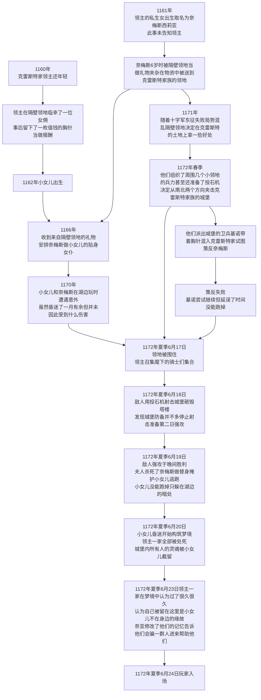
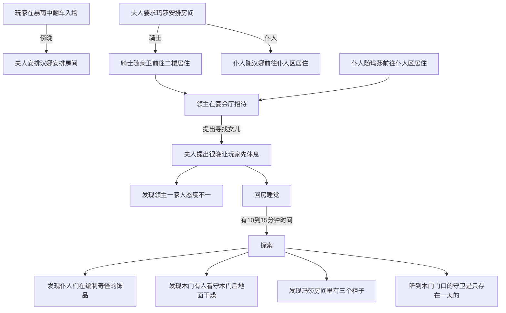
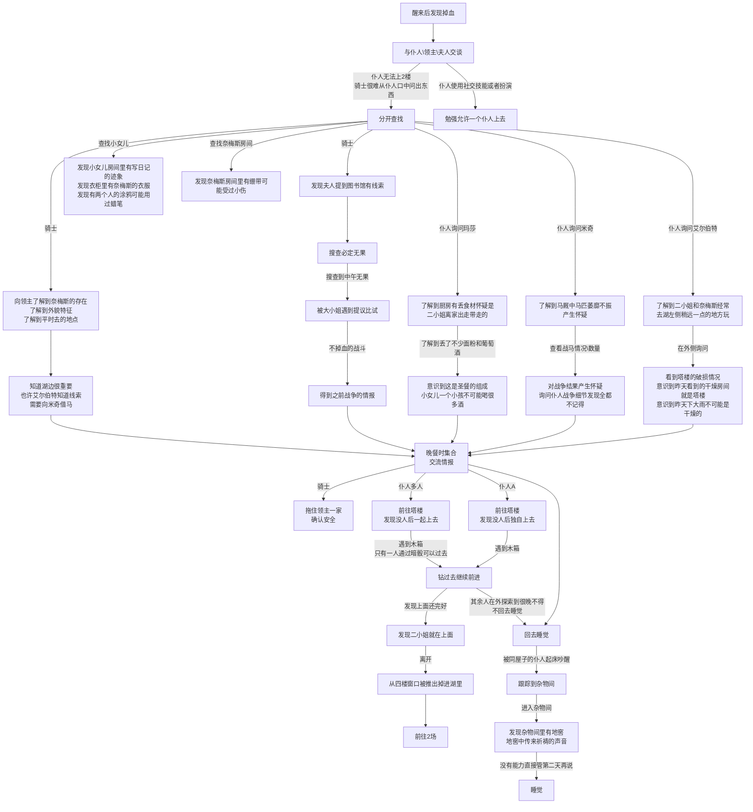
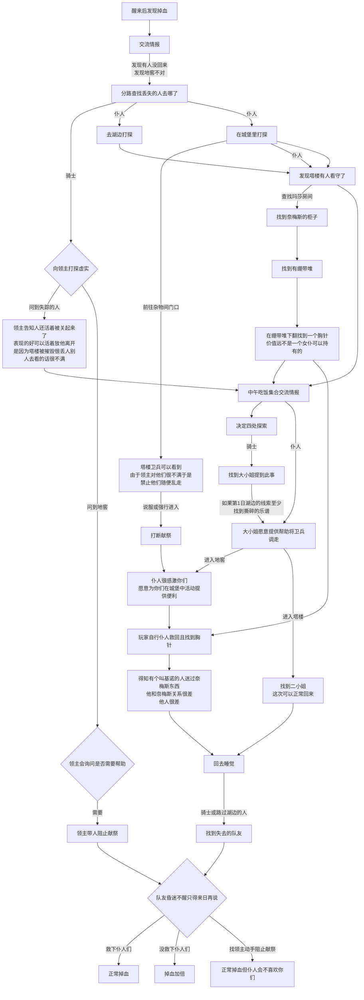
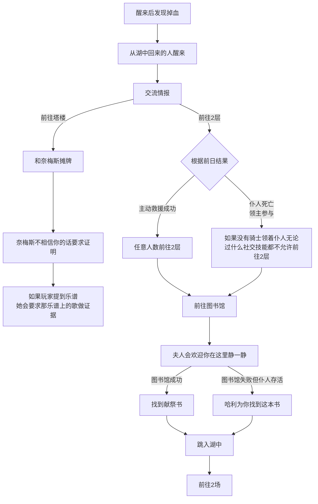

# 守密人信息

> 如果你口胡能力很强，希望有更高的自由度，这个文件你不需要看，ullswater文件更适合你。
> 如果你做kp的时间还短，希望对这个模组的剧情大致应该如何发展有个提前认识，请耐心读下去，读完再使用ullswater文件带。
> 如果你带的过程中遇到了一些……超过自己预料的事情，不知道怎么将剧情拉回来，这个文件可以帮到你。

以下内容包含：

- 游戏开始前时间线
- 游戏开始后时间线
- NPC人设
- 所有主线\支线\暗线剧情

## 剧情梗概

1172年的英国，北部湖ullswater边，屹立着一座城堡。

  城堡原本的主人是一家四口，包括领主、领主夫人、姐姐、妹妹（外带加起来30个左右的卫兵和仆人、7-8个领主家内骑士），生活在这里。

相邻的领地为了讨好本地的侯爵，赠送了很多金银珠宝、食物、仆人。其中包括一位小女仆：她是领主早年间在外风流的结果，夫人靠着自己的路子得知了这件事，一直对这位小女仆的存在心怀不满，但她又担心她的存在会影响到自己的家庭，因此故意瞒着自己的丈夫不让他得知真相。

小女仆因为与这家的小女儿年龄相仿，便成了要好的玩伴，从小一起长大的她们宛如亲姐妹一般和睦。这种关系直到她们一起在湖边经历了一场神秘事件（时间原因、经过未知）后也没有改变。她们在湖边被人发现，昏迷近一月才苏醒，令人欣慰的是两人都没在这次事件中身亡，相反还都获得了一些能力。小女儿的意志力和体质大幅增长，女仆的智力和外貌则有显著提高。当然这些增长都不是一蹴而就的。

又过了几年，随着局势混乱，隔壁的领地得到了一笔资助，对方要求他们攻陷领主的领地以实现自己的政治需求。他们组织了庞大的联军杀向城堡，力求杀死城堡内的所有人，措手不及的领主带领卫兵和仆从英勇奋战，但最终寡不敌众，一家人磕磕绊绊地逃到了湖边，已是无路可退。

一家人在危难关头，亲情反而战胜了人性。虽然名声在外的大女儿无论如何都无法逃走了，但女主人为了保护自己的小女儿毅然决定将小女仆当做替身杀死，以图让自己的小女儿逃出生天。她掐死了小女仆，并将她抱在怀中，装作安慰吓坏了的小女儿的样子。指示亲卫将小女儿带离。最终小女儿没能逃得太远，只得藏在岸边的一处小洞里，在恐惧与不甘中一日一日的虚弱下去。

很显然，这一家人没能逃过被杀死的厄运，被尽数杀死，匪徒没有怀疑那被抱在女主人怀中的女孩是不是小女儿温莱尔，便没再检查。

只可惜，温莱尔最终也没能找到机会逃走，她在那小洞中失去意识，其强大的精神力作为主导，诱使城堡内所有被杀死的人包括自己的家人在内共同构筑了两个巨大的梦境。一个梦境复现了他们还和平生存的时候，一个梦境则不断地在战争发生的当日循环往复。

一家人被杀死后，他们发掘自己来到了一个间于现实和冥界之间的世界，这里没有匪徒，但也没有其它人。让他们感到不安的是，他们发现被自己杀死的小女仆的灵魂跟着他们一起到了这个世界，还真的把自己当成了温莱尔，并忘记了追杀最后时刻发生的事情。领主一家都对这个“小女儿”又怕又恨，却无法泯灭她的灵魂，只能把她关在漆黑的塔楼里，不知道真相的小女仆奈梅斯感觉非常委屈。

与此同时，他们对小女仆无可奈何，只得将其关在塔楼中，唯有大女儿温蒂尔会去送饭并看望她。

领主一家人坚信自己被困在这里是因为温莱尔没和他们在一起，只要把温莱尔找回来就可以前往天堂。同时也也为了摆脱奈梅斯灵魂的纠缠，他们开始祈祷能否得到帮助，这种委托影响到了外界，让商人以为那是真实的委托。而在寻求救赎的期间，三人又产生了巨大的分期：

- 领主本着一不做二不休的态度，既然他们已经利用了这个女孩一次，就未尝不可利用第二次，只要能把自己的女儿找回来，什么都是可以做的。
- 夫人认为自己做的事情有愧，既然死都死了，也希望加倍的偿还对奈梅斯的亏欠。但与此同时，她认为自己的女儿没有来到这里也意味着她可能还活着，她并不希望自己的丈夫计划成功，但又不敢直接反对他，更不愿意再去伤害被哄骗来的人，只能不断地试图赶走、拖延他们的调查。
- 温蒂尔既同情奈梅斯的遭遇，又渴望着升入天堂。她决定脱离自己的父母单独寻找出路，她既会在女仆的问题上显得善意、忍让。又会在能解决问题的关键点上显得激进、强势。

但事实上，外面的温莱尔耗费如此心力构筑一个梦境，只是想让自己的家人反省，让奈梅斯得救，仅此而已。

> 注意，温莱尔在现实中其实只维持了4-5天的梦境，但梦境内时间流速非常快，在领主他们眼中，已经一百多年了。

## 主要登场人物简介

### 领主：伊利马福·克雷斯特

  STR:80,CON:80,SIZ:80,DEX:55,APP:45,POW:70

| 武器类型     | 技能 | 伤害     | 射程 | 贯穿 | 每轮 | 装弹量 | 故障值 | 常见时代   | 价格20s/现代($) |
| ------------ | ---- | -------- | ---- | ---- | ---- | ------ | ------ | ---------- | --------------- |
| 大型剑(马刀) | 剑   | 1D8+1+DB | 接触 | √    | 1    | ——     | ——     | 1920s,现代 | 30/75           |

| 防具类型   | 护甲值 | MOV 惩罚 | 覆盖位置     | 使用物种               | 防利器 穿刺 | 防护等级 （冷兵器/一般枪械/穿透,爆炸性武器） | 常见时代 |
| ---------- | ------ | -------- | ------------ | ---------------------- | ----------- | -------------------------------------------- | -------- |
| 古罗马头盔 | 3      | 0        | 头顶+面颊    | 人类、有明显头颅的生物 | √           | 正常防护/无法防护/无法防护                   | 古代     |
| 板条甲     | 5      | 1        | 除头部、全身 | 人类、人型生物         | √           | 正常防护/无法防护/无法防护                   | 古代     |

> 这是一个留着及肩的白头发略带一点棕色，眼睛是少见的紫色，嘴边还留小胡须的年长男子，莫约40多岁表情有些刻薄严肃。他穿着一身做工考究的薄皮衣，一袭浅灰色的马裤很是贴身，哪怕没有什么过多的装饰也让你感觉价值不菲，他整个人像一把利剑插在地上一样，给你一种虽不夺目但却锋利而危险的感觉。

> 他倨傲的扫视了你们一眼，只有看到骑士是露出了很少的一丝笑意，面对其它人则如同看到空气一般毫不理睬。

> 他邀请骑士一行人来到这里进行调查，但又对他们的能力存疑，因此他不会给直接的帮助而是持续观望，并试图考验玩家是否值得信任。

### 女主人：莱萨莎迪雅·克雷斯特（以前姓克莱尔）

  STR:30,CON:30,SIZ:30,DEX:40,APP:65,POW:40

| 武器类型               | 技能 | 伤害   | 射程 | 贯穿 | 每轮 | 装弹量 | 故障值 | 常见时代   | 价格20s/现代($) |
| ---------------------- | ---- | ------ | ---- | ---- | ---- | ------ | ------ | ---------- | --------------- |
| 小型刀具(弹簧折叠刀等) | 斗殴 | 1D4+DB | 接触 | √    | 1    | ——     | ——     | 1920s,现代 | 2/6             |

  **锁血不死**

> 金色带卷的长发从脑后披到胸前，她和蔼的笑着就如同迎接自己邀请来的客人。蓝色的眼睛好似水蓝色的宝石，她穿着一身红色且装点着玫瑰流苏的华丽长裙，端庄典雅。

> 她认为自己的女儿没有来到这地狱，也意味着她还没有死或者死了已经去天堂了，那么丈夫的行动对自己的女儿是有害的，但她又不敢反抗自己的丈夫，因此会以和善的态度尽可能的诱导调查员们浪费时间最终调查失败，当然无论如何她不会付诸武力。

### 大女儿：温蒂尔·克雷斯特


  STR:55,CON:55,SIZ:40,DEX:80,APP:65,POW:40

  剑术80，闪避85，斗殴60

| 防具类型   | 护甲值 | MOV 惩罚 | 覆盖位置 | 使用物种 | 防利器 穿刺 | 防护等级 （冷兵器/一般枪械/穿透,爆炸性武器） | 常见时代 | 价格20s/现代($) |
| ---------- | ------ | -------- | -------- | -------- | ----------- | -------------------------------------------- | -------- | --------------- |
| 剑格、护手 | 20     | ——       | ——       | 剑       | √           | ∞/正常防护/无法防护                          | 古代     |                 |

| 武器类型           | 技能 | 伤害   | 射程 | 贯穿 | 每轮 | 装弹量 | 故障值 |
| ------------------ | ---- | ------ | ---- | ---- | ---- | ------ | ------ |
| 轻剑(击剑、剑杖等) | 剑   | 1D6+DB | 接触 | √    | 1    | ——     | ——     |

> 受到良好教育的大小姐，但因为与骑士们经常打交道，性格更趋向男性。她的立场会随调查员自身的表现而改变。

### 小女儿：温莱尔·克雷斯特

STR:20,CON:20,SIZ:20,DEX:30,APP:70,POW:30


二号场：

一个被一直保护着的妹妹，胆小而又懦弱。同情心微微有些泛滥，长相甜美很容易引起他人的保护欲。虽然和小女仆一样大，但她显然还是温室里的花朵。

一号场：

不存在于死后世界

### 女仆：奈梅丝·西莉亚


STR:40,CON:40,SIZ:20,DEX:50,APP:65,POW:60

死后由于小女儿的主观美好印象app+10，这里加完是75

二号场：

即是二小姐的保姆+女仆，也是大小姐的闺中密友。所以她在任何危难时都不会丢下这一家人不管。虽然她被夫人当做替身杀死，但其实并不对此感到怨恨。甚至为了保护自家小姐也做好了牺牲的准备。

一号场：

死后的她显得惊慌无措，她不知道为什么家人对她的态度有如此大的变化（以为自己是二小姐），觉得很委屈，但她内心中的坚强支持着她。有时她也感到很神奇，她坚信自己是在经历劫难后成长了许多，不再胆小懦弱，而是更加自信了，似乎对什么都了如指掌。

### 仆人

以下房间为从上向下数1、2、3

#### 汉娜

`一层大厅清扫(左侧第3个房间）`

她会知道小女儿的一些相关信息。但哪怕有一丁点让人不舒服的用词就会让她不高兴。如果玩家中有女性，她会搬去杂物间暂住。一头红发，有个弟弟叫米奇在马厩看马，两人都是很小就来了。但汉娜不是很爱说话所以她不会主动提起弟弟和奈梅斯小时候的事情。

#### 基利安

`厨师（左侧第2个房间）`

一个糊涂虫，说的话真假自己瞎猜的全都有，但并不是他在骗人

#### 哈利

`二层清扫（右侧第2个房间）`

他生性多疑，玩家询问他时他会迟疑并尝试观察玩家的心理（心理学40），并在可能涉及自己的问题上隐瞒、说谎。

在关于奈梅斯（女仆）的问题上他知道的很多，因为他曾经暗恋过奈梅斯。而且他对于领主家的组上可能与黑巫师有过来往这件事有些了解，但不敢多谈。

#### 艾尔伯特

`靠近城堡一层湖边灌木的打理（左侧第1个房间）`

每天下午会带一些藤条回城堡，在城堡外交给其他仆人，主要负责收集材料，因此在故意的回避玩家，当然他并不会骗玩家，有时候会故意塞线索让玩家离开

#### 米奇

`上午进行马棚的清扫,下午与艾尔伯特一起打理灌木（右侧第1个房间）`

知道的不太多，但比较怯懦。他认出马厩中剩下的三匹马状态都非常差，由此对这里发生的事情有些猜测，因为他的胆小，比其他人表现的更为明显。红发的米奇是汉娜的弟弟，但他平时在马厩，对奈梅斯的事情不太清楚。他还是会主动提起自己姐姐的。

#### 玛莎

`照顾仆人们的日常起居（左侧第3个房间）`

她会提供基本的仆人需要的信息如哪位仆人平时在哪做什么，她与骑士交流时会尽可能的少说话并不提供信息。此外因为她在主持仪式，所以相关问题她必定有所隐瞒

#### 基诺

`靠近城堡一层湖边灌木的打理（右侧第3个房间）`

和艾尔伯特一起工作，但实际上是隔壁领地派来策反奈梅斯的人，被奈梅斯拒绝后心存不满。但已经深处险地他也不敢造次，人还算热情不过对于神鬼之说比较深信，会疑神疑鬼的吓唬玩家。

#### 拉帕亚

`厨房的帮工（左侧第1个房间）`

如果玩家中有女性，她会和汉娜住到一起把房间让出来给玛莎与玩家住。

#### 艾尔米亚斯

`一层守卫（右侧第1个房间）`

和艾尔伯特住一个房间，他也参与了玛莎的计划

#### 维尔斯塔

`一层守卫（左侧第2个房间）`

和基利安住在一起，没参与任何计划，住在左侧的第四个房间

## 前置时间线：

图描述:



------

## 文字描述：

1160年领主在外风流，上了隔壁领地的一个小女仆

1161年小女仆出生，为了不被人发现血缘关系，取名奈梅斯·西莉亚

1162年，温蒂尔·克雷斯特出生

1166年奈梅斯作为礼物被送到领地

1170年温莱尔和奈梅斯在湖边玩时遭遇意外，虽然昏迷了一月有余但并未因此受到什么伤害。

1172年6月17日，城堡被敌人围攻，他们找来了一架投石机从正面峡谷外攻击城堡，并命人从西北方的山脉处翻山越岭包抄后路

1172年6月18日，敌人围城一日，领主自己的部队分散在下属的各个领地中，实在无法及时赶到。尽管城堡内做好了战斗准备，但无论怎样调配人手都远远无法与敌人抗衡，当夜敌人用投石机射击城堡，刚好砸毁了城堡的塔楼。

1172年6月19日，敌人发起了进攻，毫无疑问领主一家毫无还手之力的就被打败了，最终一家人在湖边被杀死，只有夫人依靠奈梅斯的尸体做替身才换的小女儿温莱尔逃到湖边并躲藏了起来

1172年6月21日，温莱尔最终体力不支陷入昏迷，她构筑了两个梦境。

1172年6月25日，玩家到来并在不经意间直接进入了梦境世界。

## 玩家入场后时间线

这是主要事件的时间线，玩家在模组中开辟自己路线的时候，时间线可以让KP有一个参考的框架。

## 图描述

------

### 第0日



------

### 第1日




------

### 第2日



------

### 第三日



------

## 文字描述

### 第0日

> 第0日玩家刚刚到来，简单的向玩家介绍委托内容、安排房间、引荐NPC即可，傍晚让玩家可以发现仆人似乎有些异常但不严重，让玩家发现木门后是干燥的这件事情即可。

### 领主

傍晚，领主感觉到有人进到这片世界，心知是有人来了。他安排了守卫看住塔楼以防骑士一行人过早的发现异样被吓跑。并宴请这群人向他们提出自己的小女儿跑丢了，希望他们协助寻找。

### 仆人们

发现这群人来有些敏感，因此暂停了一天的仪式准备，将他们做好的饰品、面饼藏在床下，熬夜继续制作饰品。

### 温蒂尔

得知这群人的到来已经很晚了，她刚给关在塔楼上的妹妹送了饭后就急匆匆的赶下来。

### 夫人

正常参加宴会，但会以旅途劳累和太晚为由尽力阻止玩家立刻开始调查，同时会对玩家尽可能的提供生活上的帮助

### 仆人

此时所有仆人的行为都相似，留在房间内编织装饰品。

### 塔楼守卫（亲卫）

会在门口睡觉，塔楼门打开会被吵醒，对任何试图接近塔楼并询问的人持有敌意，但不会直接发起攻击。

### 第1日

> 第1日玩家应从各个NPC处了解到温莱尔、奈梅斯两人的相貌，经常去湖边玩的情况。在图书馆得知夫人的态度，在下午训练场与温蒂尔交手得到关于那次战斗的一些信息。发现塔楼没有积水的异常，发现仆人们的嫌疑加重。并且在第1日结束时探查塔楼的PC落入湖中。

### 领主

在书房召见骑士，详细的回答自己女儿的相关情况，他会在书房一直待到晚上的行动轮结束才回房间休息。

### 夫人

上午会带着大女儿前往图书馆翻找自己女儿的故事书，并会邀请玩家也翻找这些她女儿经常看的书籍，但其中并无线索。下午夫人会独自回到三楼的房间。

### 温蒂尔

会在下午独自前往训练场练剑，如果上午她碰到了骑士则会邀请骑士下午和她比试，期间会提供关于当年那场战争时的线索。晚上的行动轮她会尝试前往塔楼，当玩家见过小女儿温莱尔并返回时将其从四层窗口推下。

### 汉娜

在一层大厅扫地一整天，晚上的行动轮在房间中休息，晚上所有人都睡觉后会前往地窖

### 哈利

哈利会很早离开房间去二楼打扫，下午前往大厅与汉娜一起打扫，晚上的行动轮在房间中休息，在同屋的人彻底睡着后会尝试起来前往地窖。

### 艾尔伯特

早起出去修建湖边灌木并悄悄收集枝条作为材料，晚上的行动轮会带着几包枝条回承包进行分发。当玩家询问时他会尽量让玩家向西北方走远一点，并会尝试阻止玩家靠近灌木丛以免找到其中的包裹。晚上其他人睡觉后会前往地窖。

### 玛莎

早上会叫玩家起床，一整天都呆在城堡里，晚上的行动轮在房间中休息。可以睡觉后会前往地窖。

### 米奇

上午打扫马棚，下午随阿尔伯特一起在灌木丛中搜集材料。傍晚回到房间后休息，所有人都睡着后会前往地窖。

### 艾尔米亚斯

全天看守一楼与二楼相连的楼梯，对玩家较为宽松，可以说服同伴通融仆人们在白天上二楼，傍晚会前往地窖。

### 维尔斯塔

全天看守一楼与二楼相连的楼梯，态度较为死板但可以被同伴说服，所有人都睡觉后会回房间休息，他不参与仪式也不知道仪式。

### 第2日

> 第二日玩家应发现夫人给出的方向都是错误的，进而对其产生怀疑。同时因为领主的谎言、加派二楼守卫的行为而对领主一样产生严重怀疑。对温蒂尔的信任逐渐加深并依靠温蒂尔尽早的解除塔楼的守卫。玩家应在第2日全天发现所有的仆人都不见了，在下午的行动轮结束之前撞破并阻止献祭。在第2日结束的晚间进入单人剧情的PC将回来但昏迷不醒。

### 领主

在书房召见骑士，如果第1日晚上有人去过塔楼，则会告诉骑士那人被囚禁在地牢了，但不会杀死他，如果骑士们可以完成任务，可以放他活着离开。

### 夫人

持续之前的动作

### 温蒂尔

继续之前的动作，一旦从玩家处得到塔楼的信息会尝试支走塔楼的守卫，一旦从玩家得知湖边小屋的确切位置则会独自前往查找，她会带走画并将木盒扔在那里。

### 仆人

所有仆人上午都不会出现，并在下午的行动轮结束后献祭成功，死在地窖里。玩家掉血改为`r2d2`

若被玩家打断并规劝成功，会为玩家在城堡内的行动进行掩护，此时玩家可以随意往来于1、2楼，前往3楼时他们会尽量帮助掩护。

### 掉入湖中的玩家们

进行单人剧情，这部分单人剧情KP可以自行选择待其余人第二日剧情结束后大家一起过，也可以完全单独过，`这里如果单独过推荐使用文字带，事后可以为其他人提供log代替玩家之间的交流`

在这里玩家们可以得知塔楼上的人是奈梅斯而不是温蒂尔，得知两个女孩在之前的神秘事件中遇到了什么（消息很模糊），得知战争失败，得知奈梅斯替死的情况

### 塔楼:温莱尔（实际是奈梅斯）

会待在塔楼，她不太记得战争后续发生什么事情，只会提供一些真实的关键信息，并拒绝跟出塔楼，玩家也没有能力带她出来

### 第3日

> 第3日，单人剧情的PC醒来可以交换情报。得知塔楼上的并不是温莱尔而是奈梅斯，得知战争的真相。制定计划准备再次前往湖中，在前往湖中之前玩家会尝试获得更多资源。如果阻止仆人献祭成功，会从仆人处得到图书馆处的书。

### 领主

如果仆人献祭成功，他会非常生气的不见玩家。

如果仆人献祭被阻止，且单人剧情的人存活返回，他会透露其实战争失败了，这里的人都已经死了。需要玩家找小女儿的灵魂回来，并重申自己会给出的奖励

### 夫人

让玩家多思考一下，但既不建议玩家伤害女仆，也不建议玩家跳湖

### 温蒂尔

如果玩家需要帮助且局势不太好，kp看情况发放奈梅斯身世线的吊坠。如果玩家还未找到书的话，温蒂尔可以根据玩家表现发放献祭书。

### 仆人

若玩家未从温蒂尔处拿到东西，仆人至少会带书给玩家。

### 第4日

> 这一日按最好情况应开始进行2场剧情
>
> 内容详见2场时间轴

## 2号场时间轴

```mermaid
graph TB
    action3--投石机攻击塔楼,仆人们抢救堆在塔楼2层门口的皮甲和匕首-->action4
    subgraph 6月19日<!--  -->
    action7[上午夫人为奈梅斯换上了小女儿的衣服]
    action7-->action8[下午:和敌人交战,夫人\小女儿\奈梅斯\两名亲卫到宴会厅固守]
    action8-->action9[傍晚:失败后夫人一行从塔楼墙壁处逃出]
    action9-->action10[和领主会和后夫人杀死奈梅斯作为替身,剩余骑士带小女儿逃跑]
    action10-->action11[小女儿躲在10点钟方向坑洞,骑士牺牲]
    end
    subgraph 6月18日
    action4[上午:敌人的投石机从西北侧山脉中出现]
    action4-->action5[下午:领主发现敌人太多,无法主动出击,只能等待支援]
    action5-->action6[傍晚:领主叫奈梅斯检查马厩中马匹,是否可以带小女儿逃跑]
    end
    subgraph 6月17日
    action1[上午:领主附近领地的骑士都来到了城堡]
    action1-->action2[下午:敌人来到城堡前]
    action2-->action3[傍晚:大小姐领着刚来的几位骑士击退了敌人一小股部队]
    end
```

从1号场到2号场这个过程，要求PC扣除自己总血量的一半，血量不足则过湖失败，不扣血返回。

二号场分为2天时间，时间轴和一号场保持一致，对应如下:

| 1号场 | 2号场       |
| ----- | ----------- |
| 下午  | 6月18日下午 |
| 傍晚  | 6月18日傍晚 |
| 上午  | 6月19日上午 |

任何落入湖中（包含“游泳失败且没被营救+幸运失败”、故意沉下去、被推下去等）的，转为单人剧情

> tokp:如果你熟悉自己的PC，知道他们不会轻易把PC知道但PL不知道的信息进行超游使用的话，可以这部分放在1场第三天跑完之后，2场单独带着所有人去跑单人剧情，否则的话，就只带着进场的一个人跑

## 总结

玩家共有3次机会进入湖中：

- 第1次强制进入。
- 若第一次玩家进入后未能了解到温莱尔、奈梅斯最终发生了什么的真相，则失去一次机会，因为如果不是提前知道是来不及阻止夫人杀死奈梅斯的。
- 若玩家未能阻止仆人献祭，则失去一次机会，因为后续的加强掉血会让玩家没有足够的血量重新进入湖中。
- 若玩家未能在2场战胜领主，则只能获得2号结局。

> 这个剧本的主要游戏性在于，推理型玩家通常会基于较为保守的推理心理而不直接前往塔楼进而被迫留在1场。他们会在塔楼人身份、仆人线中获得多次推理的推翻重来的感觉，这是1号场推理型玩家的主要乐趣

> 而掌控激进型玩家喜欢对剧情更有把握、更多的战斗。因此2号场在模组内为他提供一个超游开卷的机会，如果这部分KP用单人剧情带，则他可以体会到整个团队中只有他提前了解剧情发展的快乐。

------

## 战斗NPC

## 骑士

STR:65,CON:70,SIZ:65,DEX:50,APP:50,POW:50

| 武器类型     | 技能 | 伤害  | 射程 | 贯穿 | 每轮 | 装弹量 | 故障值 | 常见时代   | 价格20s/现代($) |
| ------------ | ---- | ----- | ---- | ---- | ---- | ------ | ------ | ---------- | --------------- |
| 矛、骑士长枪 | 矛   | 1D8+1 | 接触 | √    | 1    | ——     | ——     | 1920s,现代 | 25/150          |

| 防具类型 | 护甲值 | MOV 惩罚 | 覆盖位置             | 使用物种       | 防利器 穿刺 | 防护等级 （冷兵器/一般枪械/穿透,爆炸性武器） | 常见时代 | 价格20s/现代($) |
| -------- | ------ | -------- | -------------------- | -------------- | ----------- | -------------------------------------------- | -------- | --------------- |
| 鳞甲     | 4      | 1        | 双臂、大腿、躯干、颈 | 人类、人型生物 | √           | 正常防护/难以防护/无法防护                   | 古代     | N/A             |

## 卫兵

STR:55,CON:60,SIZ:55,DEX:50,APP:50,POW:40

| 武器类型     | 技能 | 伤害  | 射程 | 贯穿 | 每轮 | 装弹量 | 故障值 | 常见时代   | 价格20s/现代($) |
| ------------ | ---- | ----- | ---- | ---- | ---- | ------ | ------ | ---------- | --------------- |
| 矛、骑士长枪 | 矛   | 1D8+1 | 接触 | √    | 1    | ——     | ——     | 1920s,现代 | 25/150          |

## 刺客

STR:55,CON:45,SIZ:50,DEX:55,APP:40,POW:40

| 武器类型               | 技能 | 伤害   | 射程 | 贯穿 | 每轮 | 装弹量 | 故障值 | 常见时代   | 价格20s/现代($) |
| ---------------------- | ---- | ------ | ---- | ---- | ---- | ------ | ------ | ---------- | --------------- |
| 小型刀具(弹簧折叠刀等) | 斗殴 | 1D4+DB | 接触 | √    | 1    | ——     | ——     | 1920s,现代 | 2/6             |

## 敌方佣兵

STR:65,CON:55,SIZ:65,DEX:55,APP:35,POW:50

| 武器类型       | 技能 | 伤害     | 射程 | 贯穿 | 每轮 | 装弹量 | 故障值 | 常见时代   | 价格20s/现代($) |
| -------------- | ---- | -------- | ---- | ---- | ---- | ------ | ------ | ---------- | --------------- |
| 中型剑(佩剑等) | 剑   | 1D6+1+DB | 接触 | √    | 1    | ——     | ——     | 1920s,现代 | 15/100          |

## 游戏内需要安排的事件或者说支线

## 仆人支线

仆人根据自己和周围人的情况，惊恐地推断出所有人其实已经死了，他们误认为自己现在在地狱，希望能够升入天堂。

某位仆人打扫图书馆时，从一堆很久很久没人翻看的旧书堆中，发现了一本邪教徒的典籍（领主祖上有邪教徒的经历），在这个时代的仆人将高贵的领主视为天神派下凡间统治他们的天使，根本没有去想会是一本邪恶的书。于是他们将书偷偷藏了起来，拿给仆人中唯一一个勉强认识一点字的仆人:哈利去辨识，他们在字里行间看懂了神、祭品、获得等字眼，于是他们认为这是天使大人给他们的考验，要让他们自发的献祭自己才可以去天堂。

于是，几个仆人开始了自己的计划，他们偷偷瞒着其他所有人在地窖绘制出了一个法阵，在第二天晚上开始准备献祭，于第三天下午行动轮结束时完成献祭。献祭的形式是用含有`回归、晋升`的饰品铺满房间，辅以大量的葡萄酒、硬面饼来代表圣子的血肉，最终把自己绑在十字架上焚烧。

很显然他们的献祭并没有用，错误的仪式最多只是令邪神向这个小小的梦境一撇便不再理会，然而仅仅是一道目光，也使梦境压力骤然加大，温莱尔不再有能力维持足够稳定的梦境，每天玩家们的掉血量都会因此翻倍

如果玩家成功用非暴力手段阻止了这一次愚昧的献祭，虽然仆人不会将这件事告知领主，但是玩家将会得到城堡内所有仆人和卫兵的好感和帮助，因此在接下来的时间里可以随意前往城堡任意地点。

如果玩家没有自行解决这件事情，而是把献祭一事告知了领主，领主会亲自派卫兵解决这样一场事情，并在仆人中严查邪教。仆人会认为是玩家剥夺了自己通过试炼的可能性，也将不再与玩家进行必要之外的交流。

这场献祭发生在地窖之中，在献祭结束之前，仆人会试图阻止玩家进入地窖（地窖入口位于杂物间，非常黑暗，需要主动对地面使用技能才能发现）。

如果扈从玩家在与仆人交流的时候，表现出了自己神秘学或者宗教方面的能力或兴趣，仆人会于第二天下午，主动邀请扈从前往地窖参与仪式，玩家如果未能及时阻止仪式完成，会感受到自己身边的世界犹如崩塌一般，`sc1/1d6`。

## 女仆身世支线

是领主的私生女，醉酒后的露水情缘而已。对方是个普通的女佣，领主扔下了一个镶金的宝石胸针便不再理睬这个被他当作玩物的女人了。直到后来奈梅斯被接进城堡，他也不是很清楚这件事。毕竟他只是个战争领主，心思都在打仗上。反而是夫人依靠贵妇们的八卦网知道了这件事，一直瞒在心里对奈梅斯也心怀芥蒂。

后来随着战争临近，那个女佣也早就已经去世了，但敌方领地的领主想起了这个事情，派了一个士兵带着胸针来这里试图奈梅斯搭上线，却被奈梅斯干脆的拒绝了。

## 温蒂尔的调查行动暗线

温蒂尔也经历了这一切并持有了所有记忆，只是因为母亲的态度不希望自己的女儿灵魂回归而一直未能动手，随着调查员到来她终于可以开始自己的行动了。

她既不站在玩家这边，也不站在父亲那边。她对玩家不是很信任，又对父亲的行为感到失望，因此她决定自己解决这一切。

相反，如果调查员展现出足够的能力，她会辅助调查员尽力提供帮助，如果调查员表现的过于愚蠢，她会窃取调查员的本应获得、已经获得的线索、信息尝试自己查证。

任何玩家的信息都将触发温蒂尔暗地里的行动，详情见训练场部分。